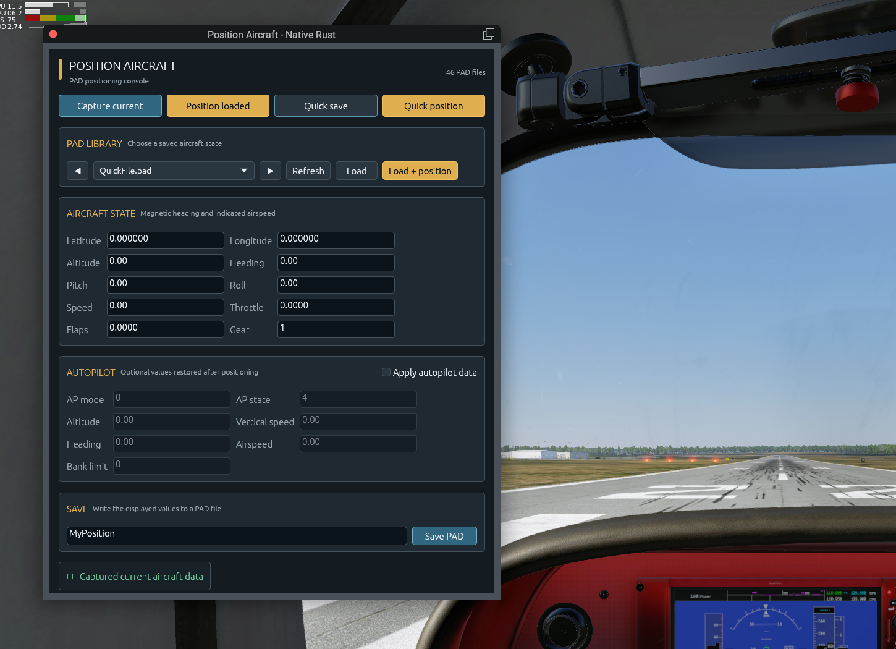
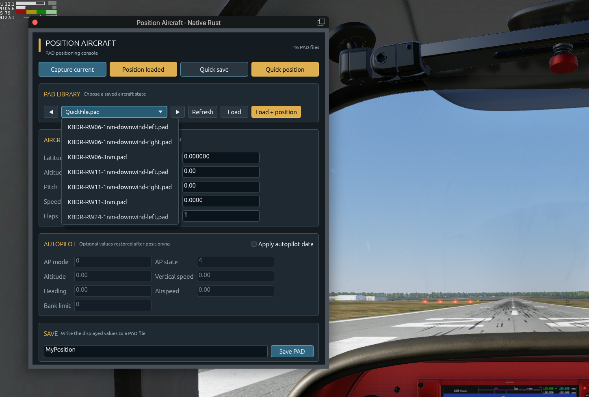

# Position Aircraft Native

Native Windows x64 X-Plane 12 replacement for Sandy Barbour's
[Position Aircraft plugin](https://web.archive.org/web/20130908120408/http://www.xpluginsdk.org/position_aircraft.htm),
written in Rust with an [egui](https://github.com/emilk/egui) interface. It reads and writes the original
`Resources/plugins/PositionAircraft/*.pad` files.

The plugin intentionally uses an XPLM 4.3 modern, decorated floating window
and leaves unhandled mouse/controller events to X-Plane. This is also a test of
X-Plane 12.4.3's native spatial VR window manipulation, which FlyWithLua's
always-consumed window input can interfere with.

## Screenshots





## Requirements

- Windows x64 and X-Plane 12
- Stable Rust with the MSVC target
- Visual Studio C++ Build Tools
- X-Plane Plugin SDK 4.3

## Build and install

Point the build at the SDK directory containing `Libraries/Win/XPLM_64.lib`:

```powershell
$env:XPLM_SDK_PATH = "C:\path\to\XPSDK430\SDK"
.\build.ps1 -BuildOnly
```

The release DLL is written to
`target/release/position_aircraft_native.dll`. To build, test, and install it
in one command:

```powershell
.\build.ps1 -XPlanePath "D:\X-Plane 12"
```

The installed plugin is
`Resources/plugins/PositionAircraftNative/64/win.xpl`. Restart X-Plane after
replacing the binary.

## Source layout

- `src/lib.rs` exposes only the five X-Plane plugin ABI entry points.
- `src/runtime/` owns plugin lifecycle, simulator state, commands, and the egui/XPLM window adapter.
- `src/pad.rs` owns the original PAD format, validation, and form conversion.
- `src/xplm.rs` contains the raw XPLM and OpenGL bindings used by the plugin.

## Commands

All commands are assignable in X-Plane's keyboard/joystick settings under
`PositionAircraftNative/`:

- `toggle_window`
- `capture_current`
- `position_loaded`
- `quick_save`
- `quick_load`
- `quick_load_and_position`
- `previous_pad`
- `next_pad`
- `previous_pad_and_position`
- `next_pad_and_position`

The FlyWithLua implementation is not removed or disabled by installation.

## Window controls

- Blue and amber controls are actions; amber marks actions that immediately
  move the aircraft. Dark outlined controls are editable fields.
- Click the current PAD filename to open egui's bounded-height library
  dropdown. It supports wheel scrolling and a standard scrollbar; Load and
  Load + position remain separate deliberate actions.
- Hover, focus, text selection, keyboard navigation, clipping, and control
  styling are provided by egui rather than a custom widget implementation.
- The status indicator at the bottom is green for normal results and red for
  errors.

## License

MIT
