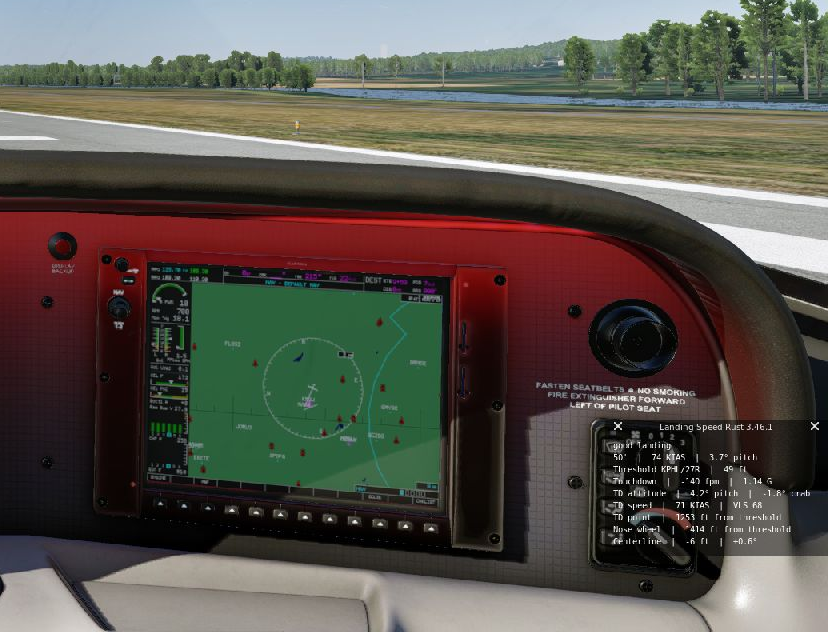
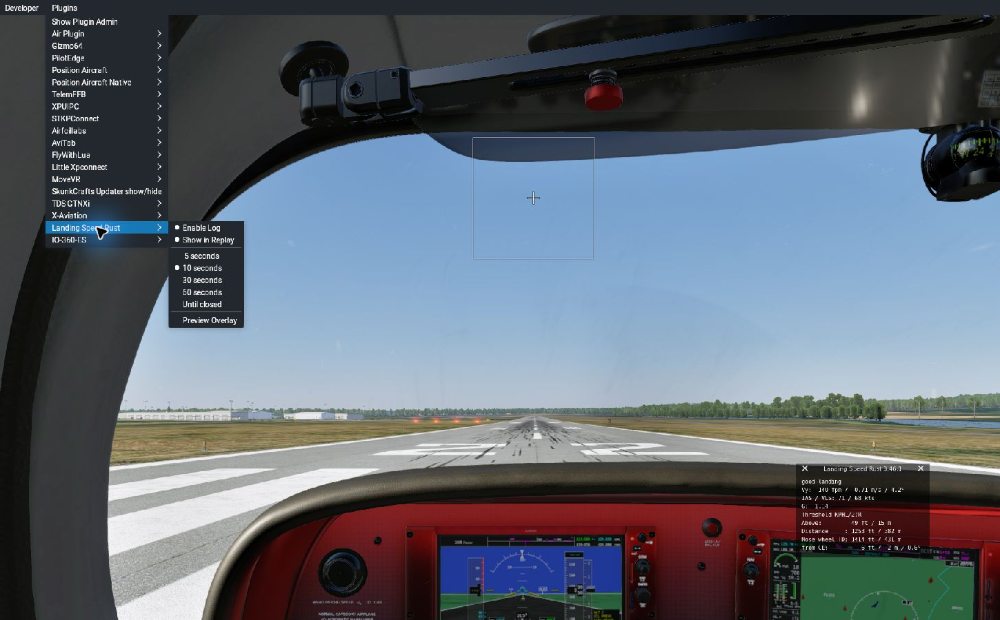

# X-Plane Native Rust Plugins

This workspace contains native Windows x64 plugins for X-Plane 12 written in
Rust:

- **Position Aircraft Native** — a VR-capable replacement for Sandy Barbour's
  [Position Aircraft plugin](https://web.archive.org/web/20130908120408/http://www.xpluginsdk.org/position_aircraft.htm),
  with an [egui](https://github.com/emilk/egui) interface and joystick-bindable
  commands.
- **XGS Rust** — a Rust recreation of hotbso's GPL-2.0-licensed
  [Landing Speed (XGS) 3.46](https://github.com/hotbso/xgs/tree/V3.46), including
  its translucent VR overlay, touchdown scoring, rating files, landing log,
  and selectable automatic hide time.

## Position Aircraft Native

Position Aircraft Native reads and writes the original
`Resources/plugins/PositionAircraft/*.pad` files.

Its **Traffic Pattern** tab positions the aircraft at five visual starting
points—on final, intercepting final, base, downwind, or a 45-degree entry—for
any runway in the active X-Plane scenery. Left/right traffic, approach angle,
downwind offset, base intercept, and final distance are adjustable. The
selected PAD supplies airspeed, attitude, throttle, flap, gear, and optional
autopilot state; the airport geometry supplies the generated position,
altitude, and magnetic heading. Runway calculations begin at the usable
threshold, including any displacement recorded in `apt.dat`.

The tab remembers its last airport, runway, configuration PAD, location,
direction, and dimensions in `Output/preferences/position-aircraft-rs.prf`.
Generated pattern points can also be saved as ordinary PAD files and reused on
the original tab.

The plugin intentionally uses a modern, decorated XPLM floating window
and leaves unhandled mouse/controller events to X-Plane. This is also a test of
X-Plane 12.4.3's native spatial VR window manipulation, which FlyWithLua's
always-consumed window input can interfere with.

## Screenshots


## Requirements

- Windows x64 and X-Plane 12
- Stable Rust with the MSVC target
- Visual Studio C++ Build Tools

## Build and install

```powershell
.\build.ps1 -Plugin position-aircraft -BuildOnly
.\build.ps1 -Plugin xgs -BuildOnly
```

The generated XPLM bindings and Windows import libraries come from the
`xplane-sdk-sys` crate, so a separate SDK download is not required.

The release DLL is written to
`target/release/position_aircraft_native.dll`. To build, test, and install it
in one command:

```powershell
.\build.ps1 -Plugin position-aircraft -XPlanePath "D:\X-Plane 12"
.\build.ps1 -Plugin xgs -XPlanePath "D:\X-Plane 12"
```

The installed plugins are `Resources/plugins/PositionAircraftNative/64/win.xpl`
and `Resources/plugins/XgsRust/64/win.xpl`. Restart X-Plane after replacing a
binary.

## XGS Rust behavior

XGS Rust targets the native XGS 3.46 plugin—not the disabled FlyWithLua script.
It uses X-Plane's translucent XPWidgets window and moves that modern widget to
`xplm_WindowVR` in VR. The overlay appears shortly after touchdown while the
plugin continues sampling vertical speed and peak G for 10 seconds, and it
automatically disappears after the selected display duration. It reports IAS
and pitch interpolated at the 50-foot crossing, plus touchdown pitch and the
signed crab angle between true heading and ground track (positive means the
nose points right of the track). The compact overlay follows the landing in
chronological order: 50-foot snapshot, threshold crossing, then touchdown. The
**Plugins > Landing Speed Rust > Preview Overlay** item allows the visual/timer
behavior to be tested without flying.

### Screenshots





On first run, `xgs-rs.prf` imports the installed legacy `xgs.prf`, preserving
window position, landing-log/replay choices, and display duration. The verified
installation retained its 10-second setting. Per-aircraft `xgs_rating.cfg`, aircraft type
mapping, displaced thresholds, touchdown distance, threshold crossing height,
centerline deviation, ToLiss lowest selectable speed (VLS) and gear handling,
and replay behavior follow the 3.46 source.

Do not leave the legacy native XGS and XGS Rust enabled together, or both will
report the same touchdown. After comparison, rename or remove the legacy
`Resources/plugins/xgs/64/win.xpl`; this installation retains it reversibly as
`win.xpl.disabled`.

## Source layout

- The root `Cargo.toml` defines a workspace with native plugins under
  `plugins/` and reusable infrastructure under `crates/`.
- `crates/xplane-airports` loads the active `apt.dat` scenery stack and owns
  shared airport, runway, displaced-threshold, geodesy, and touchdown helpers.
- `crates/xplane-plugin` owns shared dataref, command, flight-loop, window,
  widget, Plugins-menu, metadata, logging, path, and thread-local state
  utilities, plus the five-entry-point ABI adapter.
- Each plugin's `src/lib.rs` declares metadata and lifecycle hooks through that
  shared entry-point adapter.
- `plugins/position-aircraft/src/runtime/` owns datarefs, simulator state,
  commands/menus, lifecycle/window setup, pattern placement, and the egui
  adapter.
- `plugins/position-aircraft/src/pad.rs` owns the original PAD format,
  validation, and form conversion.
- `plugins/xgs/src/runtime/` contains the XGS detector, rating/settings loader,
  translucent widget, menu, and lifecycle code.
- `xplane-sdk-sys` supplies generated XPLM declarations; `windows-sys`
  supplies the WGL and Windows loader declarations.

To add another plugin, create a Cargo package under `plugins/`, depend on the
workspace's `xplane-plugin` crate for the shared SDK boundaries, and add its
artifact/install mapping to `build.ps1`. Cargo discovers plugin and utility
members through the root workspace patterns.

## Safety boundaries

- Plugin state is thread-local, matching XPLM's plugin-thread callback model;
  XPLM and OpenGL handles are never declared `Send`.
- Datarefs, commands, flight loops, windows, widgets, Plugins menus, metadata
  buffers, drawing operations, geometry conversion, and SDK paths are exposed
  through shared safe wrappers. Their raw calls, opaque handles, ownership,
  callback registration, and buffer pointers stay at the common FFI boundary.
- Plugin runtime code is safe Rust except for the Position Aircraft OpenGL/WGL
  renderer boundary; the shared crate documents each unavoidable XPLM call.
- The crate denies unsafe operations inside unsafe functions unless they are
  placed in an explicit, documented `unsafe` block.

## Commands

All commands are assignable in X-Plane's keyboard/joystick settings under
`PositionAircraftNative/`:

- `toggle_window`
- `capture_current`
- `position_loaded`
- `quick_save`
- `quick_load`
- `quick_load_and_position`
- `previous_pad`
- `next_pad`
- `previous_pad_and_position`
- `next_pad_and_position`
- `position_pattern`
- `previous_pattern_location`
- `next_pattern_location`

The FlyWithLua implementation is not removed or disabled by installation.

## Window controls

- Blue and amber controls are actions; amber marks actions that immediately
  move the aircraft. Dark outlined controls are editable fields.
- Click the current PAD filename to open egui's bounded-height library
  dropdown. It supports wheel scrolling and a standard scrollbar; Load and
  Load + position remain separate deliberate actions.
- Hover, focus, text selection, keyboard navigation, clipping, and control
  styling are provided by egui rather than a custom widget implementation.
- The status indicator at the bottom is green for normal results and red for
  errors.

## Licenses

`plugins/position-aircraft` is MIT. `plugins/xgs` is GPL-2.0-only because it is
a reimplementation of the GPL-2.0 XGS source. See each package for details.
