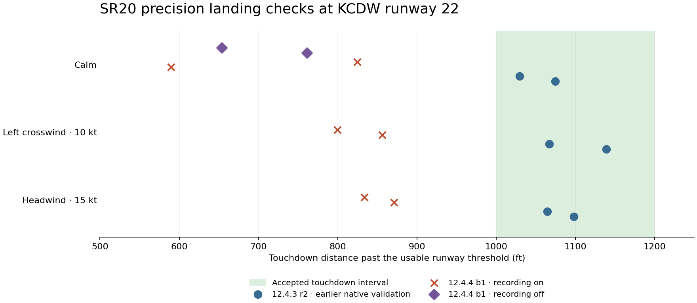
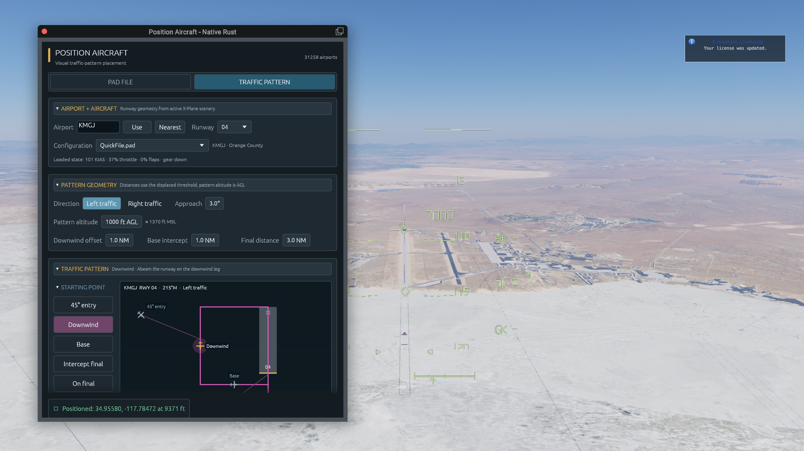
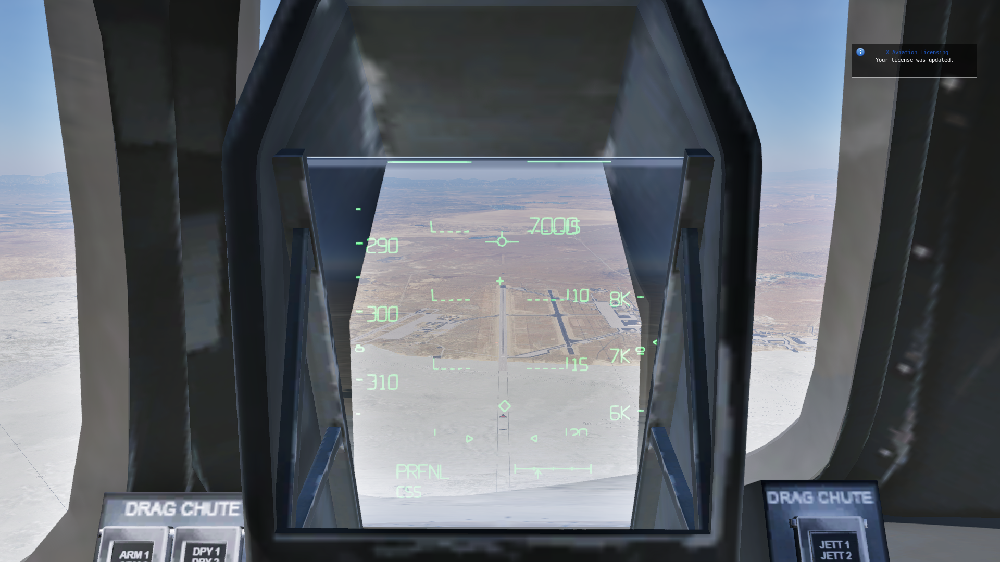
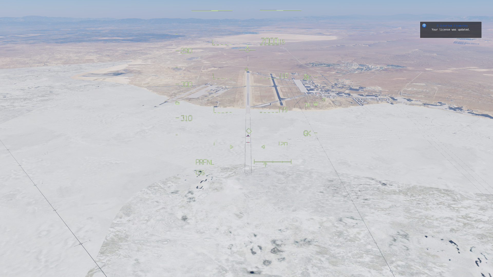
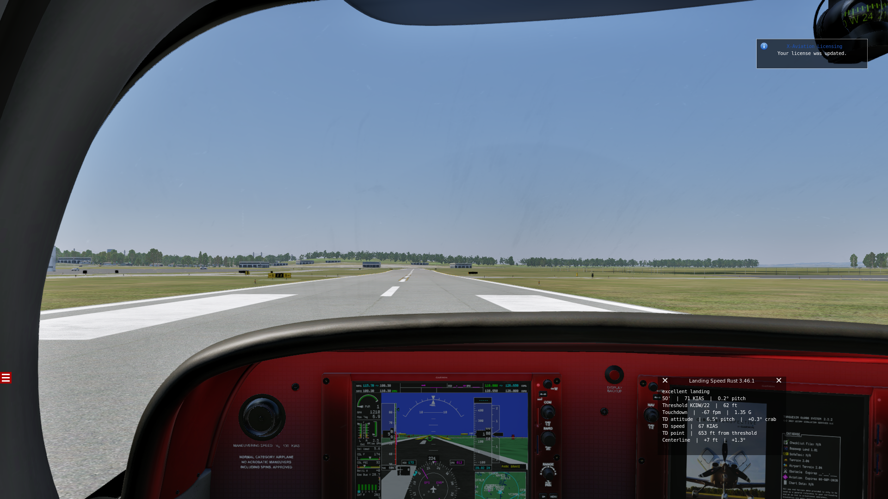

# X-Plane 12.4.4 beta 1 compatibility checks

Tested on September 11, 2026. The installed simulator was upgraded from **12.4.3 r2, build 124311**, to **12.4.4 beta 1, build 124410**, using the official installer.

**Existing Rust plugin loading and the tested 2D drawing/command paths work. The initial SR20 precision-landing validation failed: 0/8 passes, with 8 measurements accepted by the assessment then in use.** These retained flights are the failed baseline for the [subsequent timing and flare repair](../../poweroff180/timing-fix-20260911/README.md). The later diagnosis found intermittent attitude-control resets that the original validity checks did not detect.

## Plugin and build results

| Component | Observed result |
| --- | --- |
| Workspace | Release build succeeded; 79 Rust and 13 Python tests passed, including replay and real WGL drawing checks. One existing Rust test is ignored. |
| Position Aircraft 0.4.1 | Fresh startup without unset-position warnings; first-frame initialization logged once; egui window rendered; capture/reposition restored a 25 m displacement to within 0.028 m. |
| SR20 native guidance and attitude plugins | Eight completed maneuvers, no native aborts; coherent frame telemetry, entry gates and terminal authority-release checks passed. |
| SR20 HUD | Native display rendered; font and navigation readiness were both 1, with thousands of draw frames. |
| Shuttle HUD v144 | Cockpit and fullscreen drawing, runway projection, enable toggle, declutter and attitude-reference commands passed readback and screenshot checks. Clean SDK shutdown recorded. |
| XGS Rust 3.46.1 | Loaded, scored an actual landing, and rendered its native widget overlay. Its displayed 653 ft touchdown agrees with that flight's native measurement. |

The build retains the existing SDK bindings and OpenGL/egui backends. These checks did not adopt the new PanelGraphics, ImGui, or XLua APIs.

Position Aircraft previously read latitude, longitude and altitude during `XPluginStart`. The same warnings occur in the retained 12.4.3 log, so this was an existing bug. Version 0.4.1 defers the initial capture and traffic-pattern setup until the first flight callback, following [Laminar's deferred-initialization guidance](https://developer.x-plane.com/article/deferredinitialization/). Initialization retains valid saved airport/runway selections.

## Flown results

All flights used the existing TorqueSim SR20 full-fuel/400 lb front-seat adapter at KCDW runway 22. Native entry required approximately 100 KIAS and 1,000 ft AGL before the maneuver. Each wind case was flown twice with recording; calm was then repeated twice without the recording/HUD profile.

| Flight | Touchdown (ft) | KIAS | Physical sink (fpm) | Failed limits |
| --- | ---: | ---: | ---: | --- |
| calm-01 · recording | 824.7 | 65.78 | 75.1 | Touchdown distance |
| calm-02 · recording | 589.9 | 68.13 | 300.0 | Touchdown distance, Physical sink, Touchdown speed, Flare motion |
| cross_left10-01 · recording | 799.6 | 66.85 | 426.6 | Touchdown distance, Alignment, Physical sink, Flare motion |
| cross_left10-02 · recording | 856.0 | 64.96 | 122.8 | Touchdown distance, Flare motion |
| head15-01 · recording | 833.7 | 64.82 | 234.5 | Touchdown distance, Physical sink |
| head15-02 · recording | 870.9 | 65.30 | 123.6 | Touchdown distance |
| calm-01 · no recording | 653.5 | 66.89 | 62.4 | Touchdown distance, Flare motion |
| calm-02 · no recording | 760.9 | 65.65 | 69.8 | Touchdown distance |

The touchdown-distance interval is **1,000–1,200 ft**. Other limits include 63–67 KIAS, at most 200 fpm physical sink, 7.5° pitch and 2.8°/s flare pitch rate. The full unchanged acceptance rules are in each resolved configuration. Beta touchdown distances span **589.9–870.9 ft**.

The earlier [12.4.3 native validation](../../poweroff180/standard-units-validation.md) passed all six corresponding wind-case flights. The guidance/attitude kernels and landing limits are unchanged; drawing and ownership refactors occurred between the retained source snapshots. Failures with recording disabled show that capture is not the sole explanation. This is a measured regression relative to the earlier flights, not an isolated attribution to one simulator or plugin change. Guidance and aircraft parameters were not retuned.

A separate [setup-only failure](setup-failure/summary.json) recorded zero flights because X-Plane would not resume during loading. Its installation restoration passed. The harness's bounded resume wait was increased from 90 to 180 seconds, matching catalog discovery, after the interface load took over two minutes to reach its first frame. The retry completed both flights; flight-entry and landing gates were retained.

## Display evidence and limits

Screenshots came from X-Plane's native screenshot command. Windows UI automation could not launch the app, so command tests used the simulator API. **Mouse/controller interaction and VR/headset behavior were not tested.** The Shuttle checks cover startup, presentation and command behavior, not a new complete Shuttle flight-envelope campaign.

The recorded SR20 run loaded FlyWithLua and showed its 3jFPS12 update notice. The no-sound interface session reported a FlyWithLua loader error; that session is not certification of every installed third-party add-on. SAM blacklist and Airfoillabs startup warnings were also present before this update.

## Recovery and retained evidence

All test sessions restored the original 179 Custom Scenery entries and five links, the isolated TelemFFB plugin, preferences and SR20 state. Temporary helpers were removed and source/protected-installation checks passed. Original XGS and Shuttle binaries were restored; the tested Position Aircraft 0.4.1 fix is installed separately, with its original binary retained as a backup. Final installation evidence is in [installation-verification.json](installation-verification.json).

- [Recorded six-flight matrix](recorded-matrix/report.md), [fresh trace validation](recorded-matrix/validation.json).
- [Two flights without recording](no-recording/report.md), [fresh trace validation](no-recording/validation.json).
- [Position startup verification](ui/position-startup-validation.json), [position command readbacks](ui/position-reapply.json), [Shuttle command readbacks](ui/shuttle-controls.json).
- [UI session restoration](ui/restoration.json) and [native plugin lifecycle log](ui/plugin-lifecycle.log).

Every flight's compressed native trace reproduces its stored assessment. Native terminal readbacks verify pause, disarm and release of joystick/path overrides. Source/build manifests identify the exact artifacts for each attempt. The original run reports' grey legacy-HTTP overlays are historical context; the comparison above uses the explicitly identified earlier native measurements.

Full logs, videos, installer records and recovery backups remain under `D:/X-Plane 12/Output/performance-tests/XP1244_COMPAT_20260911_122730` and the flight-run directories named in `validation.json`. Preference contents, aircraft files and plugin binaries are not included in this repository evidence package. `compare.py` recreates the comparison from the retained assessments using the harness Python environment.
