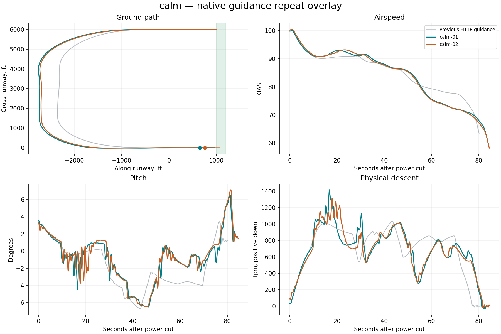

# Native X-Plane harness report

**0/2 flights passed the landing limits.** Measurement-valid flights: 2. Installation restored: True.

Landing pass/fail is separate from harness operation. Native guidance runs on simulator frames; Python only supervises it. All attempts, including aborted and non-passing flights, remain in this report.

| Trial | Touchdown ft | KIAS | Physical sink fpm | Peak pitch ° | Peak pitch rate °/s | Result |
|---|---:|---:|---:|---:|---:|---|
| calm-01 | 653.5 | 66.9 | 62.4 | 6.5 | 3.6 | Touchdown distance; Flare motion |
| calm-02 | 760.9 | 65.7 | 69.8 | 7.1 | 2.2 | Touchdown distance |

## calm

- pitch_deg spread 4.3 at 16.6s exceeds diagnostic threshold 2
- physical_sink_fpm spread 397.5 at 21.2s exceeds diagnostic threshold 150

## Evidence

- `resolved-config.json` and each card’s `effective-config.json`: complete settings, with no inactive legacy fields.
- `native-effective.ini`: exact configuration read back from the plugin before flight.
- `trace.csv`: native-frame observations; `supervision.json`: independent polling and deliberate gap probes.
- `source-manifest.json`: harness, native binary, setup adapter and original aircraft lineage.
- `events.jsonl`, `status.json`: structured progress; `restoration.json`: recovery verification.
- `summary.json`: metrics and repeat-divergence timestamps; `charts/*.svg`: standalone vector figures.
