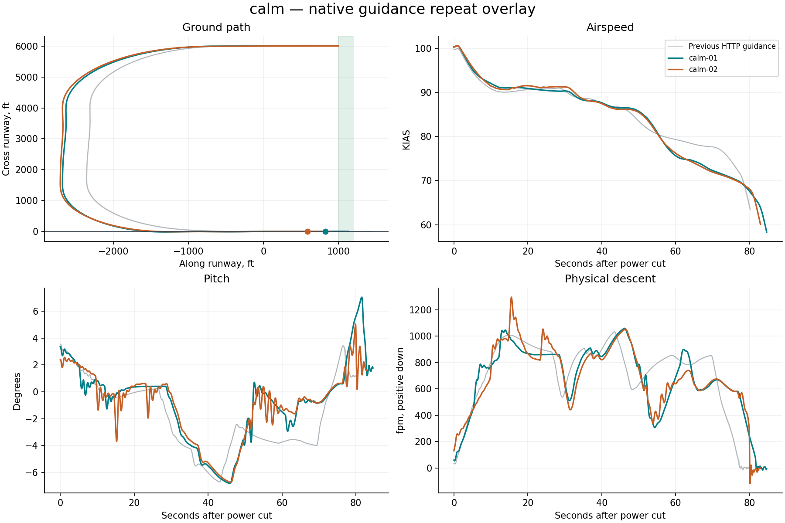
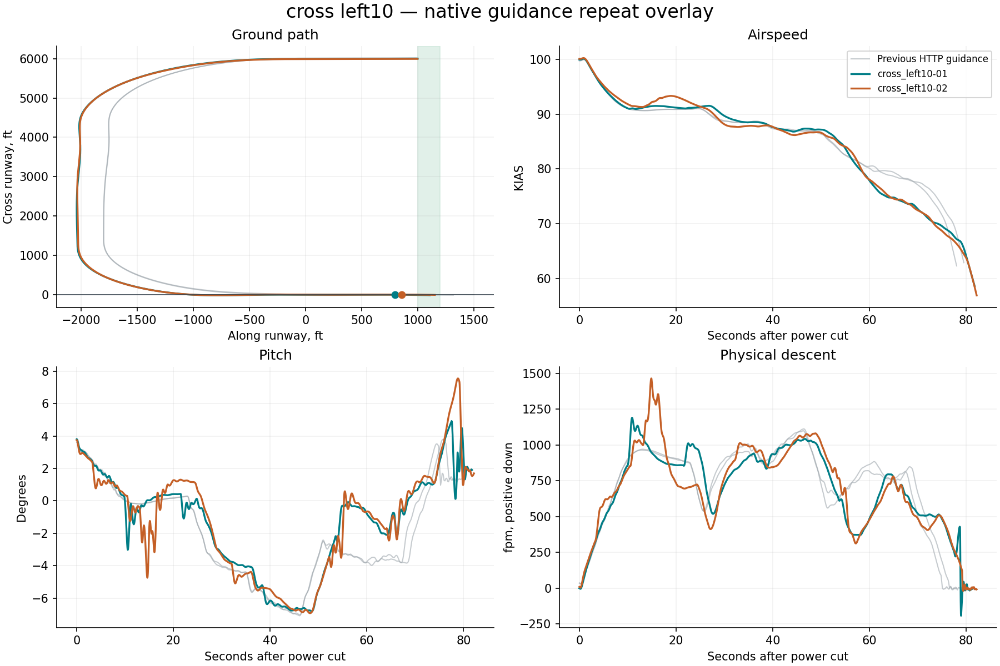
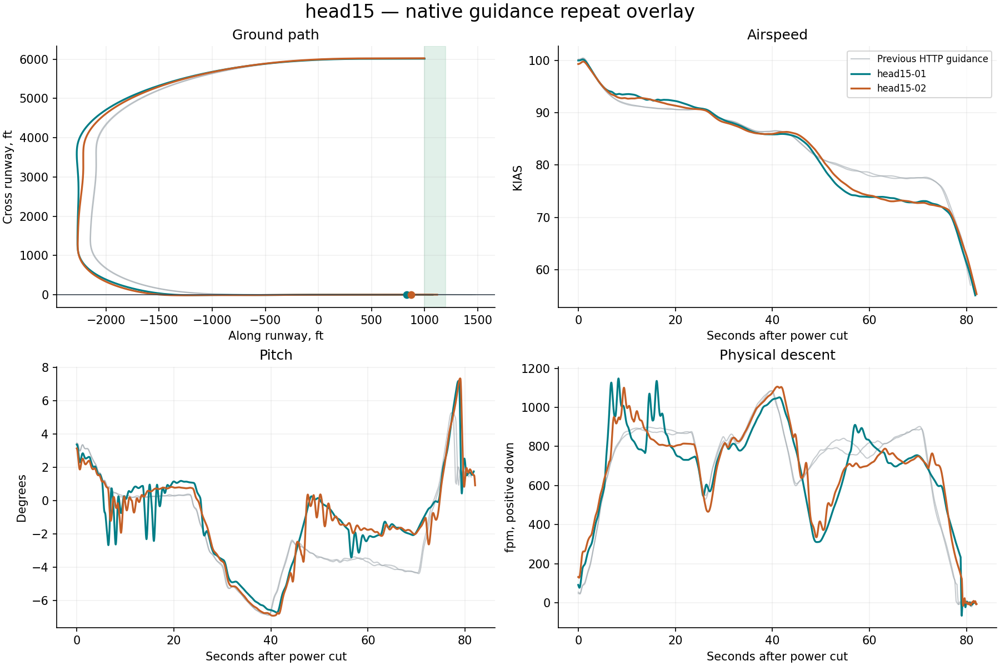

# Native X-Plane harness report

**0/6 flights passed the landing limits.** Measurement-valid flights: 6. Installation restored: True.

Landing pass/fail is separate from harness operation. Native guidance runs on simulator frames; Python only supervises it. All attempts, including aborted and non-passing flights, remain in this report.

| Trial | Touchdown ft | KIAS | Physical sink fpm | Peak pitch ° | Peak pitch rate °/s | Result |
|---|---:|---:|---:|---:|---:|---|
| calm-01 | 824.7 | 65.8 | 75.1 | 7.0 | 2.4 | Touchdown distance |
| calm-02 | 589.9 | 68.1 | 300.0 | 5.0 | 5.4 | Touchdown distance; Physical sink; Touchdown speed; Flare motion |
| cross_left10-01 | 799.6 | 66.8 | 426.6 | 4.9 | 11.5 | Touchdown distance; Alignment; Physical sink; Flare motion |
| cross_left10-02 | 856.0 | 65.0 | 122.8 | 7.6 | 1.9 | Touchdown distance; Flare motion |
| head15-01 | 833.7 | 64.8 | 234.5 | 7.2 | 2.7 | Touchdown distance; Physical sink |
| head15-02 | 870.9 | 65.3 | 123.6 | 7.3 | 2.8 | Touchdown distance |

## calm

- ias_kias spread 3.7 at 82.9s exceeds diagnostic threshold 3
- pitch_deg spread 5.7 at 81.6s exceeds diagnostic threshold 2
- physical_sink_fpm spread 338.1 at 80.1s exceeds diagnostic threshold 150

## cross left10

- pitch_deg spread 6.9 at 78.4s exceeds diagnostic threshold 2
- physical_sink_fpm spread 516.5 at 14.9s exceeds diagnostic threshold 150

## head15

- pitch_deg spread 5.2 at 79.2s exceeds diagnostic threshold 2
- physical_sink_fpm spread 362.2 at 6.7s exceeds diagnostic threshold 150

## Evidence

- `resolved-config.json` and each card’s `effective-config.json`: complete settings, with no inactive legacy fields.
- `native-effective.ini`: exact configuration read back from the plugin before flight.
- `trace.csv`: native-frame observations; `supervision.json`: independent polling and deliberate gap probes.
- `source-manifest.json`: harness, native binary, setup adapter and original aircraft lineage.
- `events.jsonl`, `status.json`: structured progress; `restoration.json`: recovery verification.
- `summary.json`: metrics and repeat-divergence timestamps; `charts/*.svg`: standalone vector figures.
