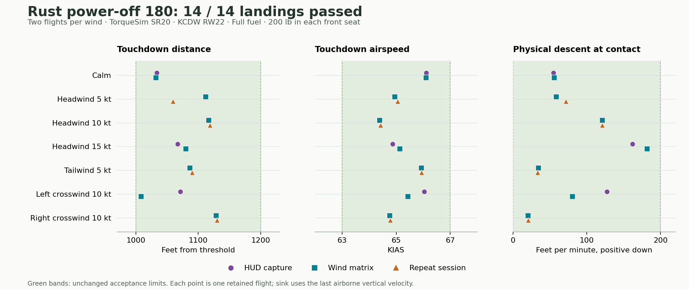
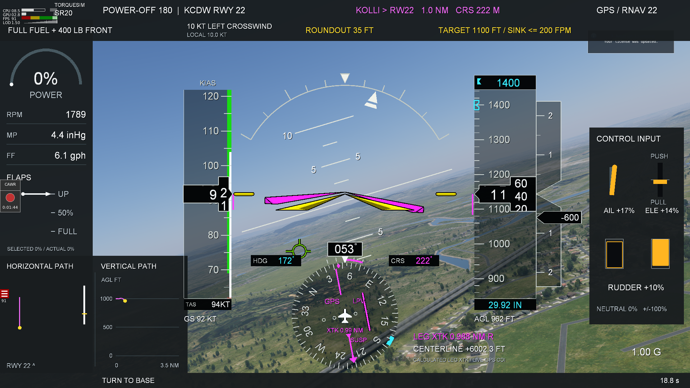
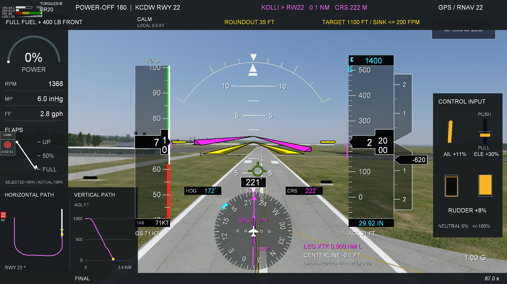
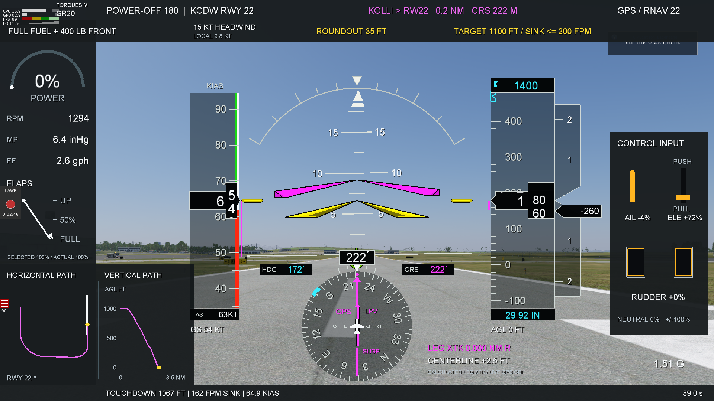

# Power-off 180 Rust migration

This report records the migration at commit `0445689`. The later
[standard-unit cleanup validation](standard-units-validation.md) records direct
`uom` conversions, physical replay tolerances and fresh simulator flights.
The [12.4.4 beta timing and flare report](timing-fix-20260911/README.md) records
the subsequent attitude timing repair and v8 guidance changes; the results and
v7 parity claims below describe the earlier 12.4.3 migration.

The maneuver controller, inner attitude controller, and native HUD have moved
into this Cargo workspace. The [lower-flare report](lower-flare-report.md), its
verification records, and selected images are preserved alongside the port.

All 14 Rust release flights passed, with two flights in every wind case. The
three test sessions restored the simulator completely. The retained evidence
includes the less consistent left-crosswind pair and its narrowest landing margin.

## Live release results

All 14 flights passed the unchanged landing limits: touchdown at 1,000–1,200 ft,
63–67 KIAS, physical descent no greater than 200 fpm, peak flare pitch no greater
than 7.5°, and peak pitch rate no greater than 2.8°/s. Alignment, loading, idle
power, released flight-path overrides, roundout height and rebound checks also passed.

| Wind | Flights | Touchdown ft | KIAS | Max sink fpm | Max pitch | Max pitch rate |
|---|---:|---:|---:|---:|---:|---:|
| Calm | 2 | 1032–1034 | 66.10–66.11 | 56 | 6.85° | 2.47°/s |
| Headwind 5 kt | 2 | 1060–1112 | 64.95–65.05 | 72 | 7.30° | 2.48°/s |
| Headwind 10 kt | 2 | 1117–1119 | 64.39–64.42 | 121 | 7.20° | 2.50°/s |
| Headwind 15 kt | 2 | 1067–1080 | 64.87–65.13 | 182 | 7.37° | 2.61°/s |
| Tailwind 5 kt | 2 | 1086–1090 | 65.93–65.94 | 35 | 6.56° | 1.97°/s |
| Left crosswind 10 kt | 2 | 1008–1071 | 65.43–66.04 | 128 | 7.16° | 2.03°/s |
| Right crosswind 10 kt | 2 | 1128–1130 | 64.76–64.78 | 21 | 7.27° | 2.27°/s |

Roundout began at 34.87–34.98 ft AGL. The set spans three separate
simulator processes: three HUD/video flights, seven wind-matrix flights with a
3-second supervision-gap probe, and four remaining repeats. Each wind has two
measurement-valid flights. The earlier C++ baseline is kept separately.



Source: [reassessed release data and paired comparisons](rust-validation.json).

The left-crosswind pair has the narrowest distance margin: 1,008.4 and 1,071.2 ft,
leaving 8.4 ft above the lower limit. It also triggered the existing repeat
comparison flags: 2.30° pitch spread at 78.7 seconds after power cut (2° diagnostic
limit), and 163.9 fpm physical-descent spread at 80.0 seconds (150 fpm diagnostic
limit). The other six wind pairs triggered no comparison flags. These flags and
both passing landing assessments are retained.

The original C++ guidance produced exactly the same recorded commands for both
left-crosswind flights, as it did for every release flight. The source of the
between-run variation was not fully isolated; the guidance arithmetic remained
unchanged, and this migration makes no broader reliability claim beyond the
retained scenarios.

## Code and reproduction

| Component | Location | Responsibility |
|---|---|---|
| Maneuver guidance | [poweroff180](../../crates/poweroff180/src/guidance.rs) | v7 state machine, wind compensation, speed management, 35 ft roundout |
| Attitude control | [xplane-attitude](../../crates/xplane-attitude/src/flight.rs) | v1.9 roll/pitch PID, yaw coordination, contact latch and release conditions |
| Guidance runtime | [poweroff180-controller](../../plugins/poweroff180-controller/README.md) | After-physics sampling, configuration, watchdog and frame trace |
| Attitude runtime | [poweroff180-attitude](../../plugins/poweroff180-attitude/README.md) | Before-physics loop, ordinary joystick inputs and owned overrides |
| HUD | [poweroff180-hud](../../plugins/poweroff180-hud/README.md) | Native instruments, G1000 symbology, navigation, control indications and flight paths |
| Test runner | [flight-test-harness](../../tools/flight-test-harness/README.md) | Paused setup, supervision, capture, assessment and verified restoration |

All deployed helpers build from Rust. C++ files under replay-test directories
are frozen reference inputs, not runtime dependencies. Python and PowerShell
remain the test orchestration tools. The attitude component retains its
[GPL-3.0-or-later provenance](../../crates/xplane-attitude/NOTICE.md); guidance
and the HUD remain MIT.

From `tools/flight-test-harness`, with X-Plane closed:

```powershell
.\scripts\Test-Harness.ps1
.\Run-XPlaneTest.ps1 -Config .\configs\wind-matrix.json -IsolateGlobalPlugin TelemFFB-XPP
.\Run-XPlaneTest.ps1 -Config .\configs\rust-hud.json -RecordVideo -IsolateGlobalPlugin TelemFFB-XPP
```

The guidance defaults and acceptance limits are unchanged. The HUD also keeps
the approved v5 layout, 104 KIAS full-flap marking, camera projection and live
KOLLI → RW22 navigation. The port corrects the tailwind caption, which previously
showed a crosswind label. User-aircraft reload handling no longer resets the
test for an unrelated AI-aircraft load. New `rust_implementation` datarefs
identify each helper independently.

## Numerical and automated verification

The complete workspace passed 53 Rust tests, with one existing local-scenery
integration test intentionally ignored. All 13 Python harness tests and
`cargo clippy --workspace --all-targets -- -D warnings` passed. The harness also
checks PowerShell syntax and rejects mismatched process identity records.

- **Maneuver guidance:** 88,586 frames from all seven accepted C++ wind cases,
  comparing 18 outputs per frame. Maximum double-precision difference was
  `3.19e-12`; tolerance is `1e-8`.
- **Inner attitude controller:** 12,000 complete C++ flight-loop frames,
  including all four modes, all eight release reasons, ownership state and
  first-contact coordinates. Integer and double diagnostics match exactly;
  maximum float difference was `1.91e-6`, below the `4e-6` tolerance.
- **Recorded Rust flights:** the original C++ v7 generator replayed all 211,968
  frames from the 14 release flights. All 18 outputs matched bit for bit after
  conversion to the protocol’s float precision. The
  [portable replay check](verify_cpp_commands.py) was also run against the
  compressed repo traces; [its result](cpp-recorded-flight-validation.json)
  records zero mismatches.
- **HUD and lifecycle:** Projection, flight-director geometry, rolling digits,
  rewind handling, tailwind labeling, live CDI displacement, flap bands, finite
  drawing coordinates, clipping balance, scalar callbacks and snapshot bounds.

Frozen source and fixture hashes are included in the
[guidance fixtures](../../crates/poweroff180/tests/fixtures/manifest.json) and
[attitude fixtures](../../crates/xplane-attitude/tests/fixtures/manifest.json).

The [retained evidence](verification/README.md) includes compressed native traces,
per-flight assessments, configuration and authority readbacks, source manifests,
and restoration results. [validate_evidence.py](validate_evidence.py) verifies
their hashes, reassesses every saved flight, and compares repeated trajectories
across the separate simulator sessions. It also checks the release's recorded
source hashes against this checkout. Git attributes preserve those exact bytes.

## Native HUD inspection

Three recorded flights exercised calm air, a 10 kt left crosswind, and a 15 kt
headwind. These are actual simulator screenshots from the Rust HUD:







The corresponding JSON files retain the screenshot request time and native
snapshot. Raw AVI segments and loopback recordings remain in the original
simulator test directories; this migration does not add new verified MP4 exports.

## External control interference found during validation

The initial Rust-guidance flight missed the touchdown limits. Replaying its
actual inputs through C++ reproduced every guidance command. A fresh flight
using the original C++ binary then reproduced the same failure: touchdown at
545 ft, 68.42 KIAS and 282 fpm. The initial Rust-guidance flight touched down at
525 ft, 68.42 KIAS and 314 fpm. Both are retained as failed landing attempts.
The following crosswind attempt was cancelled to investigate the interference;
its aborted trace is retained separately and does not count as a landing result.

Telemetry showed the attitude controller active with pitch override enabled,
while its elevator command was replaced by near-zero hardware input roughly
every third frame. The running TelemFFB client sends `AXIS` commands to its
X-Plane plugin on UDP port 34391, independent of X-Plane's `--no_joysticks` flag.
The release trials therefore explicitly isolate `TelemFFB-XPP` for each test
session. Its files and hashes are recorded before an atomic move and checked
again after restoration; no persistent TelemFFB settings are changed.

## Recovery verification

Preparation failure, failure after simulator launch, launcher exit and native
heartbeat-loss probes are retained separately from performance evidence.
The complete Rust watchdog trial confirmed `supervisor_lost` and, before
Python cleanup, paused = 1, throttle = 0, armed = 0, active = 0, all three
joystick overrides = 0 and all flight-path overrides = 0.

Restoration checks cover the original aircraft and plugin hashes, exact global
plugin names, 179 scenery entries and five links, 122 preference files, 11
aircraft-state files, and the protected installation snapshot.

## Relocation and compatibility

The repository is the active source for the controller, HUD, runner and report.
The former `D:\X-Plane 12\Support\flight-test-harness` directory was moved
atomically into `Output/performance-tests/XPT_RUST_PORT_ARCHIVE_20260911`.
Its old location now contains only a forwarding launcher and a README.
The [move record](verification/migration-completed.json) includes the verified
original reference hashes. A deliberate preparation failure through that
forwarding launcher also [restored the installation completely](verification/recovery/XPT_RUST_FORWARDER_20260911/restoration.json).

## Scope

This port preserves the tested TorqueSim SR20 maneuver, loading, wind cases
and acceptance criteria. It does not change the aircraft flight model or
establish performance for another aircraft or loading. The supplied report and
simulator measurements are not real-aircraft operating guidance.
