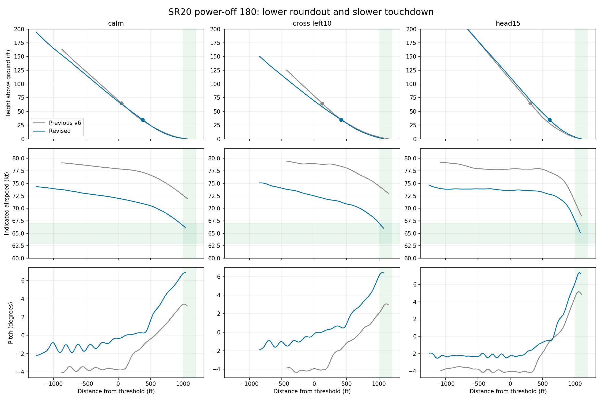

# SR20 lower-flare and slower-touchdown release — September 9, 2026

This is the C++ v7 baseline preceding the [Rust migration](README.md). The original recordings remain in the local simulator archive; their verification records and selected frames are included here.

The previous three recordings touched down at 68.4–73.0 KIAS after roundout started at 65 ft. The replacement controller uses 75 KIAS final, gradual short-final deceleration and a 35 ft roundout. All 14 frozen-source release flights passed the new 63–67 KIAS touchdown and ≤35 ft roundout checks, together with the original distance, sink and motion limits.

| Wind | Flights | Touchdown ft | KIAS | Max sink fpm | Max pitch | Max rate |
|---|---:|---:|---:|---:|---:|---:|
| calm | 2 | 1041–1075 | 66.12–66.15 | 55 | 6.85° | 2.47°/s |
| cross_left10 | 2 | 1073–1073 | 65.31–66.00 | 126 | 7.29° | 2.17°/s |
| cross_right10 | 2 | 1129–1132 | 64.79–64.80 | 21 | 7.25° | 2.27°/s |
| head10 | 2 | 1114–1119 | 64.44–64.52 | 131 | 7.23° | 2.46°/s |
| head15 | 2 | 1084–1120 | 65.06–65.29 | 165 | 7.37° | 2.74°/s |
| head5 | 2 | 1104–1108 | 64.93–64.94 | 61 | 7.30° | 2.45°/s |
| tail5 | 2 | 1087–1092 | 65.93–65.94 | 35 | 6.56° | 1.98°/s |

The release includes at least two flights in every wind case. One release campaign was recorded; three selected exports cover calm, left-crosswind and 15 kt headwind conditions. Actual starting weight was 2944.0–2945.0 lb with the same requested full tanks and 400 lb front-seat payload. The source ACF, aircraft physics, attitude controller and approved HUD v5 were not changed.

## Recordings

| Recorded condition | Previous touchdown KIAS | Replacement touchdown KIAS |
|---|---:|---:|
| calm | 72.0 | 66.1 |
| cross_left10 | 73.0 | 66.0 |
| head15 | 68.4 | 65.1 |

Roundout moved from 65 ft to 35 ft AGL in all three recordings.

- [calm — 66.1 KIAS, 55 fpm, 1041 ft](baseline/calm-verification.json). Native-frame video, synchronized loopback audio, complete decode and visual checks passed.
- [cross_left10 — 66.0 KIAS, 126 fpm, 1073 ft](baseline/cross_left10-verification.json). Native-frame video, synchronized loopback audio, complete decode and visual checks passed.
- [head15 — 65.1 KIAS, 165 fpm, 1084 ft](baseline/head15-verification.json). Native-frame video, synchronized loopback audio, complete decode and visual checks passed.

Native AVI frames are mapped to simulator time using the visible HUD clock at one-second intervals; repeated frames recorded after the simulator paused are collapsed. Loopback audio is aligned from the measured capture timestamps. Independent readings of the HUD clock in all 24 exported review frames differ from the trace by at most 0.067 seconds. The original AVI and audio files, frame-clock measurements and export verification records are retained.

## Verification and retained history

[Release verification](baseline/release-validation.json) contains every accepted flight, source hashes and restoration records. [All development campaigns](baseline/development-campaigns.json) retain setup failures, cancellations and memory errors; [development flight assessments](baseline/development-summary.json) retain every measured landing miss. Runs followed by memory warnings or crash callbacks are excluded from release evidence. The read-only comparison below uses the old recordings as history, not repeat samples.

The temporary 2D rendering profile reduces scenery/texture detail to prevent reload memory failures and is restored afterward. Full-fuel requested mass varied between simulator starts, so the adapter verifies the payload and saturated-tank state, records actual starting weight and uses that measurement for the unchanged 3 lb drift guard. The cause of the small full-tank weight variation was not established.

The exact supplied TorqueSim SR20 AIM specifies 77 KIAS for short-field approach and full-flap main-wheel touchdown; its stall table lists 59–61 KIAS depending on CG and cautions about indicated-speed accuracy near stall. [Cirrus’s July 2005 normal-landing training reference](https://www.kineticlearning.com/pilots_world/cmpp/07_05/07_05_p2.html) gives about 65 KIAS at touchdown and a 10–20 ft roundout for a normal powered approach. The tested 35 ft roundout is for this steeper simulated power-off maneuver. These references do not validate this controller for real flight. [Reference notes](baseline/reference-notes.md) distinguish the sources from inferences.

[Control formulas and reproduction](../../tools/flight-test-harness/POWER_OFF_180.md) document the final defaults. The ground aimpoint was not shown to be the sole cause of the original behavior; speed management and roundout timing changed together. Validation covers the listed winds, loading and installed simulator/add-on only.
