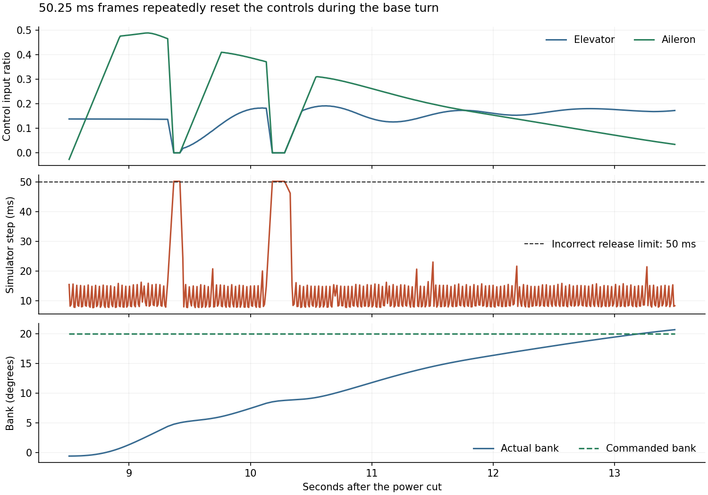
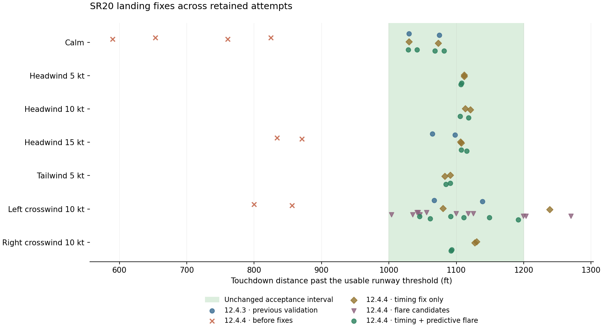
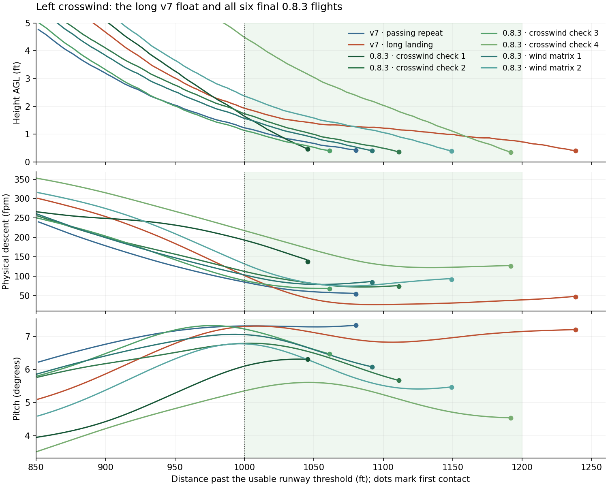

# SR20 landing fixes on X-Plane 12.4.4 beta 1

The short landings were caused by an incorrect timing limit in the Rust
attitude controller. The original C++ adapter permits frames through **75 ms**;
the Rust port released all three control axes above **50 ms**. The beta's
approximately **50.25 ms** slow frames repeatedly zeroed the controls and reset
the PID state. Attitude version **1.9.1** restores the original release limit.

That repair passed 13 of 14 wind-matrix flights. The remaining left-crosswind
flight floated past the landing zone with healthy control authority. Guidance
**0.8.3** adds a bounded prediction-based flare correction and adjusts the
left-crosswind turn lead for the separate final-approach failures.

A separate cold-start failure left Flight Configuration open, preventing
simulation time from advancing. The setup adapter now attempts main-menu
recovery after a failed first resume and records the pause-state readback.

The final native build passed **20 of 20 flown landing assessments**: the
14-flight wind matrix, four additional left-crosswind repeats, and two recorded
calm flights. The recordings used broader optional-plugin isolation after two
separate zero-flight startup failures. Every session is stopped and restored;
the startup failures remain unresolved environment limitations, documented below.

## Diagnosis

The eight failed beta flights contain **462 airborne simulator steps above
50 ms**. On every one of those steps, both elevator and aileron input became
exactly zero. Each flight had 27–86 such frames. The six earlier passing
12.4.3 flights had none. These counts are reproducible with
[diagnose.py](diagnose.py) from the retained CSV traces; see
[timing-diagnosis.json](timing-diagnosis.json).



The [original C++ release check](../../../crates/xplane-attitude/tests/reference/sr20g6_chandelle_video_controller.cpp)
uses `dt > 0.075f`. The incorrect Rust check, introduced in migration commit
`0445689`, used `dt > 0.05`. The inner PID separately caps integration at
50 ms; that cap does not require releasing the joystick overrides. Releasing
them resets the integrators and filtered commands, so each recovery begins
again with nearly neutral controls. The disturbed turns use more distance and
altitude, and interruptions in roundout produce abrupt pitch motion.

The original 12,000-frame C++ parity fixture exercised valid intervals of
2, 8, 16, 33 and 50 ms, plus invalid 1 and 100 ms intervals. It did not test the
50–75 ms interval and therefore missed this translation error. The retained
fixture is unchanged. New regression tests explicitly exercise 50.25, 60 and
75 ms, check control continuity and ownership, and still require release above
75 ms or for invalid timing.

The old beta landing positions and control traces remain useful diagnostic
measurements. Their historical `measurement_valid` flags predate the new
continuous-authority check and do not certify uninterrupted attitude control.

The first calm flight in each set illustrates how the disturbed turn moved the
whole approach short. Distances below use the same usable runway threshold.

| Calm example | Base starts (ft) | Roundout starts (ft) | Touchdown (ft) |
| --- | ---: | ---: | ---: |
| Earlier 12.4.3 native validation | -2,499.7 | 369.2 | 1,029.7 |
| Failed beta run, recording off | -2,746.6 | 58.1 | 653.5 |
| Beta with the timing fix only | -2,500.2 | 368.6 | 1,029.8 |

The repaired flight still encountered 27 slow frames. Its actual armed, active
and override readbacks stayed healthy throughout, and the earlier flight path
returned without changing the guidance parameters in that first matrix.

## Remaining late-flare float

The complete [timing-only matrix](timing-only-matrix/report.md) passed 13 of
14 flights. `cross_left10-02` touched down at **1,238.6 ft**, outside the
unchanged 1,000–1,200 ft interval. All its other landing checks passed, and
its actual attitude state remained healthy throughout. Both crosswind attempts
and the miss are preserved.

The v7 flare follows a decreasing sink target after roundout, independently of
remaining runway distance. In the long flight it spent an extra second in the
last two feet above the runway: at 1 ft AGL it had reached approximately
1,145 ft along the runway and was descending at only 30 fpm. Contact followed
at 1,238.6 ft with a measured 47.8 fpm descent. The earlier passing crosswind
repeat reached 1 ft near 1,018 ft along the runway. This is late-flare float,
separate from the timing resets.

The first correction, runtime 0.8.0, passed only three of its four crosswind
repeats. Its fourth flight touched down at 1,269.8 ft; waiting until 67 KIAS
delayed activation beyond 1,060 ft. Short-final cross-track error also reached
15.30 ft against a 15 ft limit while rolling out of the turn. This rejected
[candidate and all four traces](float-candidate-1/report.md) remain separate.
One of its passing flights touched down at 1,003.6 ft, so simply starting a
stronger downward correction earlier would risk making an early landing short.

The prediction-based 0.8.1 candidate also passed three of four repeats. Its
last flight passed alignment and flare-motion checks but touched down at
1,203.2 ft, still outside the landing zone. The
[four retained attempts](float-candidate-2/report.md) are not release passes.
Runtime 0.8.2 raises the correction's terminal descent target from 150 to
165 fpm; the landing sink limit remains 200 fpm.

The 0.8.2 [four-flight candidate](float-candidate-3/report.md) passed all four
limits assessments, but its fourth touchdown at 1,199.6 ft left only 0.4 ft
inside the upper distance limit. It is retained as development evidence rather
than pooled with final validation. At correction activation it was still
increasing its pitch target: current descent was 4.03 ft/s, but the existing
pitch demand was already decelerating it toward a predicted 2.55 ft/s.
Runtime 0.8.3 uses predicted vertical speed in the active correction's velocity
feedback as well as its trigger, addressing that remaining response delay.
It retains the 0.8.2 gates, sink target and rate bounds.

Runtime 0.8.3 projects height and vertical velocity through the existing 0.8 s
lookahead using measured, filtered vertical acceleration. It estimates contact
distance from that state, using a 0.4 ft contact-height reference and a 0.6 ft/s
minimum predicted descent in the time estimate. In native feet/seconds units:

```text
predicted_height = h + vy * look + 0.5 * acceleration * look^2
predicted_vy = vy + acceleration * look
predicted_contact = x + along_speed *
  (look + max(predicted_height - contact_height, 0) / max(-predicted_vy, 0.6))
```

It latches the correction after roundout when all these conditions hold:

- distance is at least `path_target_touchdown_ft - flare_float_margin_ft`
  (950 ft with the default target of 1,100 ft and margin of 150 ft);
- height is at most 5 ft and speed at most 69 KIAS;
- predicted height is above the contact reference, predicted descent is slower
  than 2.75 ft/s, and predicted contact lies beyond the 1,100 ft aim point.

The correction raises the flare profile's terminal sink floor from 0.6 to
2.75 ft/s (165 fpm), retaining its height-dependent deceleration and feedforward.
While active, its velocity-error term uses `desired_vy - predicted_vy`; the
ordinary flare continues to use `desired_vy - current_vy`.
It permits pitch-command reduction up to 1.25 degrees per second. The existing
feedback and positive pitch-rate limits continue to apply. It latches until
reset to avoid returning to the shallow target as descent recovers. The 69 KIAS
activation gate allows time for control response; touchdown still must be
63–67 KIAS. The prediction avoids correction when contact is already imminent.

The two existing crosswind turn-lead coefficients change from -2.2/0.65 to
-4.2/2.65 ft per knot for the signed/absolute crosswind terms. Together, these
add 4 ft per knot of left crosswind (40 ft at 10 kt); their calm and right-wind
contributions are unchanged. This addresses the measured roll-out overshoot.

These changes use ordinary bank/pitch control with idle power. No velocity,
position, force, aircraft file, loading, wind or acceptance limit is changed.
The seven float defaults and all parameter bounds are defined in
[parameters.csv](../../../crates/poweroff180/parameters.csv).

## Changes

- Attitude runtime 1.9.1 restores the C++ interval of 2–75 ms and retains the
  existing 50 ms PID integration cap. It publishes `version_patch = 1` under
  `sr20g6/test_controller/`.
- Guidance runtime 0.8.3 checks the attitude helper's armed, active, release
  reason and three axis overrides on every unpaused running frame. Any loss
  aborts with `attitude_authority_lost`, pauses the simulator and releases
  test authority. Snapshot `native_version = 8` and `xpt/version_patch = 3`
  identify this runtime; the temporary timing-only runtime was 0.7.1.
- Each native CSV appends seven actual attitude readbacks, including the
  simulator's frame interval. The 75-float HUD/supervisor snapshot remains
  protocol v1. Further `flare_float_active` and `flare_predicted_touchdown_ft`
  fields record the latch and prediction. Result schema v3 identifies v8
  guidance; schemas v2 and later
  reject any missing or unhealthy authority frame during offline assessment.

## Validation

The [final workspace check](final-offline-validation.json) passed **86 Rust tests
and 15 Python tests**, with one
existing ignored Rust test. This includes the 88,586-frame historical guidance
replay, the 12,000-frame attitude replay, timing-boundary and late-flare tests,
and a test that rejects a single attitude dropout in an otherwise passing trace.
The frozen fixture bytes are unchanged. The guidance replay explicitly disables
the new float correction to preserve its v7 comparison; it does not claim C++
parity for the new v8 behavior. The new correction requires its own repeated
simulator validation.
The release build, PowerShell syntax and exact-process identity rejection
checks passed, as did Clippy with warnings treated as errors. Earlier log files
in this directory retain their development version's results.

The live matrix uses X-Plane **12.4.4 beta 1, build 124410**, TorqueSim SR20,
KCDW runway 22, full fuel, and 200 lb in each front seat. It repeats calm,
5/10/15 kt headwinds, 5 kt tailwind, and left/right 10 kt crosswinds.
Acceptance remains 1,000–1,200 ft touchdown distance, 63–67 KIAS, at most
200 fpm physical sink, 7.5° flare pitch and 2.8°/s pitch rate, with the existing
alignment and rebound limits.

## Final live results

| Campaign | Landing passes | Global plugin profile |
| --- | ---: | --- |
| [Seven winds, two repeats each](wind-matrix/report.md) | 14/14 | TelemFFB isolated; other global plugins retained |
| [Additional left-crosswind repeats](crosswind-check/report.md) | 4/4 | Same profile as the wind matrix |
| [Recording-enabled calm repeats](recording-check/report.md) | 2/2 | 18 optional plugins isolated; licensing/support plugins retained |

All three native helper binaries are byte-identical across these campaigns
and the separate authority-loss probe. Guidance defaults, aircraft loading,
runway and landing limits are unchanged between the final campaigns.
The [20-flight summary](final-results.json) contains **288,401 native frames**,
including **1,023 frames above 50 ms**, with **zero unhealthy authority frames**.
The float correction activated in 13 flights.

| Metric across the 20 flights | Observed range | Acceptance |
| --- | ---: | ---: |
| Touchdown past usable threshold | 1,028.4–1,191.7 ft | 1,000–1,200 ft |
| Touchdown IAS | 64.67–66.85 KIAS | 63–67 KIAS |
| Physical touchdown sink | 36.3–190.1 fpm | ≤200 fpm |
| Maximum flare pitch | 5.61–7.33° | ≤7.5° |
| Maximum flare pitch rate | 1.74–2.56°/s | ≤2.8°/s |
| Maximum short-final cross-track error | 10.13–13.15 ft | ≤15 ft |

The longest additional crosswind repeat leaves only **8.3 ft** to the upper
distance limit and **0.15 KIAS** to the speed limit. The strongest-headwind
flight leaves **9.9 fpm** to the sink limit. These are repeated observed passes
with some narrow margins, not a guarantee outside this setup or on every future
attempt. All failed development candidates remain in their own evidence sets.





The deliberate [authority-loss probe](authority-guard/authority-loss-injection.json)
disarmed the attitude helper during controlled downwind. Native guidance
immediately reported `attitude_authority_lost`, paused X-Plane and released all
three axes. Its expected rejected assessment is excluded from the 20 landing
passes. Both recorded flights also continued through the requested three-second
supervision gap, advancing native steps and simulation time without an abort.

The [recording verification](recording-check/recording-validation.json) fully
decoded all four 1920×1080 MJPEG AVI segments and both 48 kHz stereo WAV files.
Both audio streams were non-silent and covered the movie capture interval.
Sound-group readbacks passed, and read-only Windows audio-session inspection
matched the dedicated X-Plane process to the recorder's output device.
[Inspection of all six event frames](recording-check/visual-validation.json)
confirmed final approach, latched touchdown and rollout in sequence, with the
displayed touchdown values matching the traces. The AVI clock differs from
simulation time; the verification uses their measured spans and confirms the
visible event sequence. Original AVI/WAV files remain in the local run directory;
compressed traces, metadata and extracted frames are retained here.

The recording result applies to the explicitly retained
[plugin profile](recording-check/recording-profile.json), which keeps PluginAdmin,
CEF, Gizmo64 and X-Aviation support available. The successful isolated session
does not identify the cause of the preceding startup crash or timeout.
All 18 isolated plugins were restored afterward. The wind matrix and additional
crosswind tests retained the usual global plugins apart from TelemFFB.

Every final campaign's native log was checked through shutdown without a crash
marker. Restoration verifies the 179 scenery entries and five links, exact
plugin/name sets, 122 preference files, 11 aircraft-state files, original source
hashes, removal of temporary helpers and protected installation state.
[validate.py](validate.py) reassesses every retained attempt, checks the expected
negative probe, validates evidence hashes and verifies the final native binaries.
`--current-source` additionally compares the current checkout and built helpers
with the wind-matrix source manifest. [summarize.py](summarize.py) reproduces
the ranges above, and [diagnose.py](diagnose.py) reproduces the charts.

## Startup menu failure

The first authority-loss probe stopped during setup with zero flight
measurements and no deliberate disarm. The [retained screenshot](setup-failure/flight-configuration-open.png)
shows Flight Configuration still open over the loaded cockpit, with a
**Resume Flight** button. Simulation time remained at zero, and pause-off
commands failed through the existing 180-second startup window. The
[exception](setup-failure/worker-error.log) and
[restoration record](setup-failure/restoration.json) preserve
this failure separately from maneuver results.

The [first menu-recovery candidate](setup-menu-candidate/summary.json) also
failed during setup. The generic `sim/operation/close_windows` command did not
dismiss this screen. A manual `toggle_flight_config` diagnostic returned to the
main menu and still left simulation time stopped. These attempts are not
automatic-setup or authority-guard passes.

The adapter now tries ordinary resume first. Only if the first startup resume
fails does it send `sim/operation/toggle_main_menu` with a finite 0.2 s
activation, then retry pause-off and verify the readback. The setup path
override is already held at this point. The original 180-second bound remains
in place for unfinished loading. `startup-resume.json` records the recovery
attempt count and successful pause readback; zero means no recovery was needed.
Later pause/resume calls do not toggle menus. A regression test verifies both
the blocked-menu recovery and an ordinary first resume that needs no toggle.
The final successful live sessions all recorded zero recovery attempts;
the fallback branch itself has unit-test coverage, not a successful live proof.

The first recording-profile attempt subsequently crashed during cold setup,
before recording or the maneuver began. Its
[selected simulator log](recording-setup-crash/selected-simulator.log) reports
an undetermined fault location and a runloop backlog; it does not identify a
responsible component. This [zero-flight attempt](recording-setup-crash/summary.json)
is retained separately. An automatically launched `X-Plane.exe --report_crash`
process correctly prevented restoration from moving files while another
X-Plane process existed. After recording and verifying that reporter's PID,
path, start time and arguments, it was closed through the existing process
identity helper. The standard recovery then
[verified complete restoration](recording-setup-crash/restoration.json).
This does not constitute a fix for the simulator's undetermined startup crash.

An unchanged retry [timed out before API readiness](recording-setup-timeout/summary.json)
after the existing four-minute wait. It produced zero flights and recovered
automatically. The log stopped at graphics initialization without a crash
marker, and a native-window inspection found no targetable simulator dialog.

## Reproduction

From `tools/flight-test-harness`, with X-Plane closed:

```powershell
.\scripts\Test-Harness.ps1
.\Run-XPlaneTest.ps1 -Config .\configs\wind-matrix.json -IsolateGlobalPlugin TelemFFB-XPP
```

The runner temporarily installs the two aircraft-local helpers, uses the
recorded 2D test preferences, isolates Custom Scenery and TelemFFB, and restores
the original installation after the dedicated simulator process exits.
Other global plugins are retained. All raw failed and accepted attempts remain
separate; successful process completion alone is not a landing pass.
