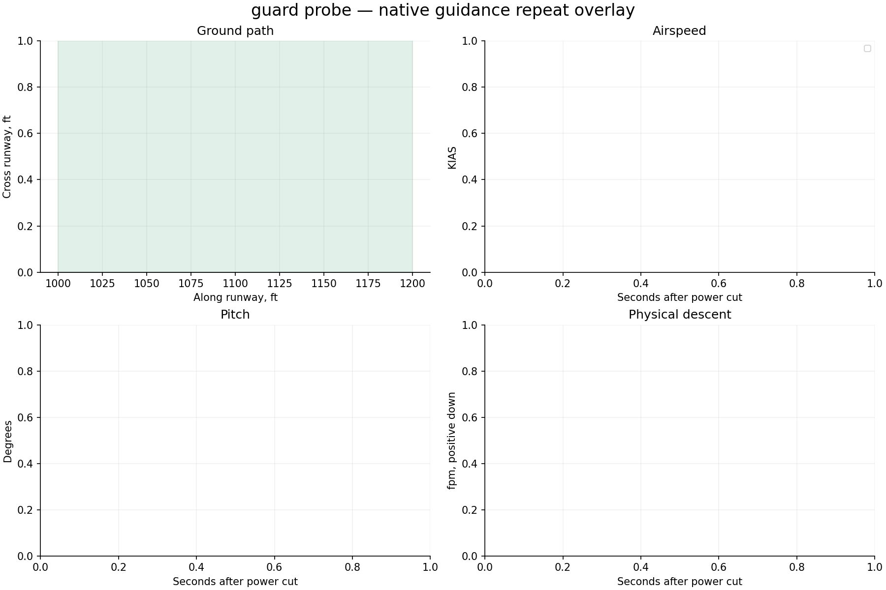

# Native X-Plane harness report

**0/1 flights passed the landing limits.** Measurement-valid flights: 0. Installation restored: True.

Landing pass/fail is separate from harness operation. Native guidance runs on simulator frames; Python only supervises it. All attempts, including aborted and non-passing flights, remain in this report.

| Trial | Touchdown ft | KIAS | Physical sink fpm | Peak pitch ° | Peak pitch rate °/s | Result |
|---|---:|---:|---:|---:|---:|---|
| guard_probe-01 | — | — | — | — | — | Attitude authority not continuously established; Native abort: attitude_authority_lost; No abeam power cut |

## guard probe



- Fewer than two traces; repeatability is not established

## Evidence

- `resolved-config.json` and each card’s `effective-config.json`: complete settings, with no inactive legacy fields.
- `native-effective.ini`: exact configuration read back from the plugin before flight.
- `trace.csv`: native-frame observations; `supervision.json`: independent polling and deliberate gap probes.
- `source-manifest.json`: harness, native binary, setup adapter and original aircraft lineage.
- `events.jsonl`, `status.json`: structured progress; `restoration.json`: recovery verification.
- `summary.json`: metrics and repeat-divergence timestamps; `charts/*.svg`: standalone vector figures.

## Execution errors

```json
[
  {
    "utc": "2026-09-12T00:48:04.3811547Z",
    "error": "Worker failed with exit code 1; see worker-error.log"
  },
  {
    "error": "Native test aborted: attitude_authority_lost; restart from a fresh session",
    "traceback": "Traceback (most recent call last):\n  File \"V:\\src\\xplane\\tools\\flight-test-harness\\xpt\\cli.py\", line 73, in worker\n    raise RuntimeError('Native test aborted: '+document['terminal']['reason']+'; restart from a fresh session')\nRuntimeError: Native test aborted: attitude_authority_lost; restart from a fresh session\n"
  }
]
```
