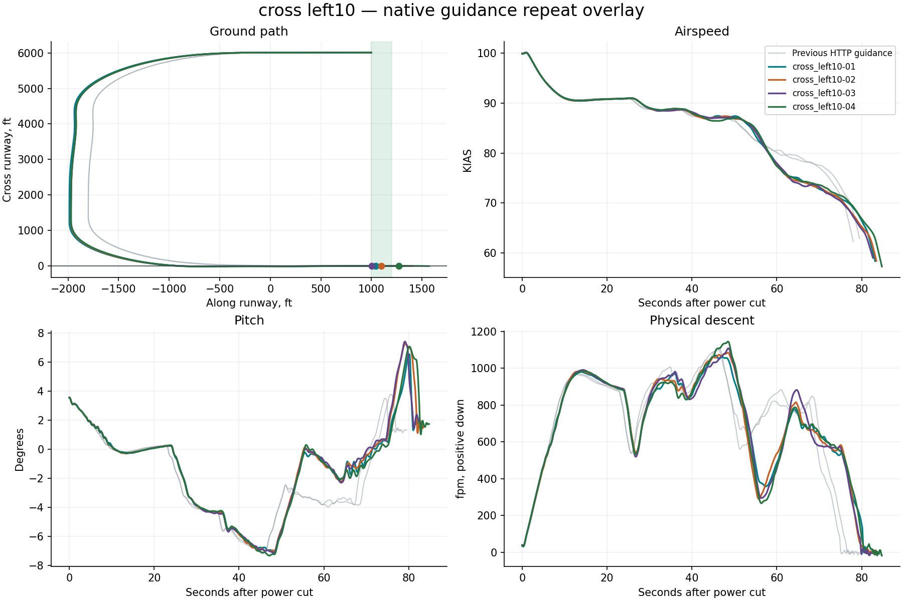

# Native X-Plane harness report

**3/4 flights passed the landing limits.** Measurement-valid flights: 4. Installation restored: True.

Landing pass/fail is separate from harness operation. Native guidance runs on simulator frames; Python only supervises it. All attempts, including aborted and non-passing flights, remain in this report.

| Trial | Touchdown ft | KIAS | Physical sink fpm | Peak pitch ° | Peak pitch rate °/s | Result |
|---|---:|---:|---:|---:|---:|---|
| cross_left10-01 | 1041.7 | 66.2 | 133.0 | 6.5 | 2.0 | Pass |
| cross_left10-02 | 1099.8 | 64.8 | 27.4 | 7.3 | 2.3 | Pass |
| cross_left10-03 | 1003.6 | 65.2 | 77.6 | 7.4 | 2.4 | Pass |
| cross_left10-04 | 1269.8 | 65.0 | 44.1 | 7.1 | 1.7 | Touchdown distance; Alignment |

## cross left10

- ias_kias spread 4.8 at 82.6s exceeds diagnostic threshold 3
- pitch_deg spread 5.1 at 81.0s exceeds diagnostic threshold 2
- physical_sink_fpm spread 169.2 at 79.9s exceeds diagnostic threshold 150

## Evidence

- `resolved-config.json` and each card’s `effective-config.json`: complete settings, with no inactive legacy fields.
- `native-effective.ini`: exact configuration read back from the plugin before flight.
- `trace.csv`: native-frame observations; `supervision.json`: independent polling and deliberate gap probes.
- `source-manifest.json`: harness, native binary, setup adapter and original aircraft lineage.
- `events.jsonl`, `status.json`: structured progress; `restoration.json`: recovery verification.
- `summary.json`: metrics and repeat-divergence timestamps; `charts/*.svg`: standalone vector figures.
