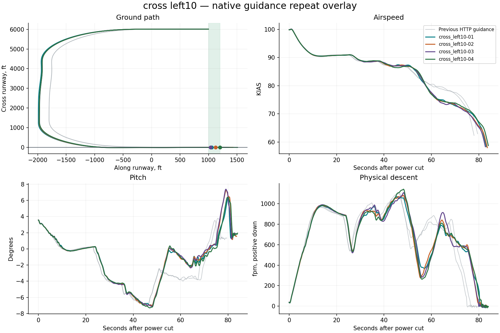

# Native X-Plane harness report

**3/4 flights passed the landing limits.** Measurement-valid flights: 4. Installation restored: True.

Landing pass/fail is separate from harness operation. Native guidance runs on simulator frames; Python only supervises it. All attempts, including aborted and non-passing flights, remain in this report.

| Trial | Touchdown ft | KIAS | Physical sink fpm | Peak pitch ° | Peak pitch rate °/s | Result |
|---|---:|---:|---:|---:|---:|---|
| cross_left10-01 | 1055.9 | 66.3 | 137.5 | 6.4 | 1.9 | Pass |
| cross_left10-02 | 1125.0 | 65.1 | 38.7 | 7.3 | 2.2 | Pass |
| cross_left10-03 | 1035.1 | 65.5 | 63.4 | 7.4 | 2.3 | Pass |
| cross_left10-04 | 1203.2 | 66.2 | 59.7 | 6.4 | 2.0 | Touchdown distance |

## cross left10

- ias_kias spread 4.7 at 82.7s exceeds diagnostic threshold 3
- pitch_deg spread 4.2 at 81.1s exceeds diagnostic threshold 2
- physical_sink_fpm spread 167.2 at 79.5s exceeds diagnostic threshold 150

## Evidence

- `resolved-config.json` and each card’s `effective-config.json`: complete settings, with no inactive legacy fields.
- `native-effective.ini`: exact configuration read back from the plugin before flight.
- `trace.csv`: native-frame observations; `supervision.json`: independent polling and deliberate gap probes.
- `source-manifest.json`: harness, native binary, setup adapter and original aircraft lineage.
- `events.jsonl`, `status.json`: structured progress; `restoration.json`: recovery verification.
- `summary.json`: metrics and repeat-divergence timestamps; `charts/*.svg`: standalone vector figures.
