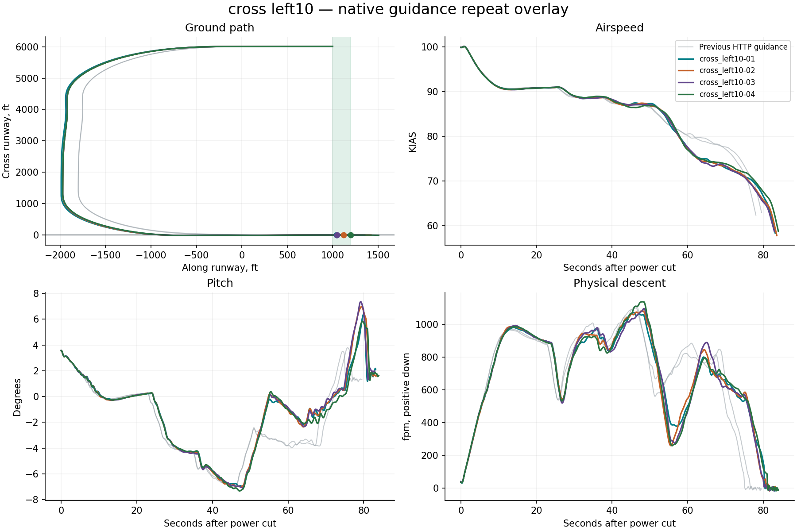

# Native X-Plane harness report

**4/4 flights passed the landing limits.** Measurement-valid flights: 4. Installation restored: True.

Landing pass/fail is separate from harness operation. Native guidance runs on simulator frames; Python only supervises it. All attempts, including aborted and non-passing flights, remain in this report.

| Trial | Touchdown ft | KIAS | Physical sink fpm | Peak pitch ° | Peak pitch rate °/s | Result |
|---|---:|---:|---:|---:|---:|---|
| cross_left10-01 | 1043.5 | 66.3 | 138.4 | 6.4 | 2.0 | Pass |
| cross_left10-02 | 1117.6 | 65.2 | 54.9 | 7.0 | 2.3 | Pass |
| cross_left10-03 | 1046.0 | 65.3 | 68.8 | 7.4 | 2.2 | Pass |
| cross_left10-04 | 1199.6 | 66.5 | 88.0 | 5.8 | 1.8 | Pass |

## cross left10

- ias_kias spread 4.0 at 82.6s exceeds diagnostic threshold 3
- pitch_deg spread 4.0 at 81.0s exceeds diagnostic threshold 2
- physical_sink_fpm spread 155.3 at 54.8s exceeds diagnostic threshold 150

## Evidence

- `resolved-config.json` and each card’s `effective-config.json`: complete settings, with no inactive legacy fields.
- `native-effective.ini`: exact configuration read back from the plugin before flight.
- `trace.csv`: native-frame observations; `supervision.json`: independent polling and deliberate gap probes.
- `source-manifest.json`: harness, native binary, setup adapter and original aircraft lineage.
- `events.jsonl`, `status.json`: structured progress; `restoration.json`: recovery verification.
- `summary.json`: metrics and repeat-divergence timestamps; `charts/*.svg`: standalone vector figures.
