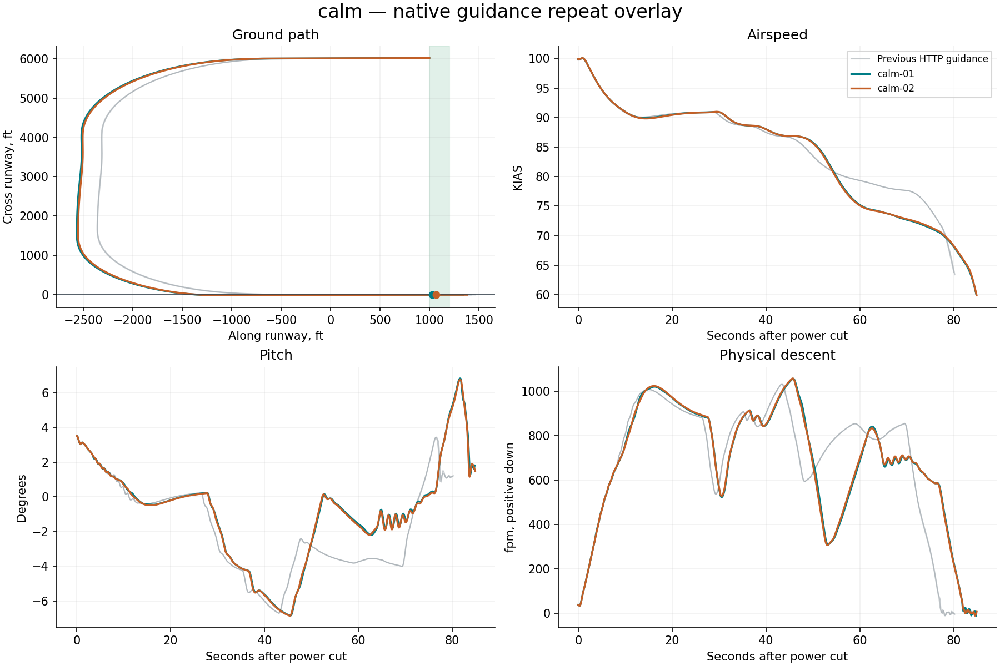
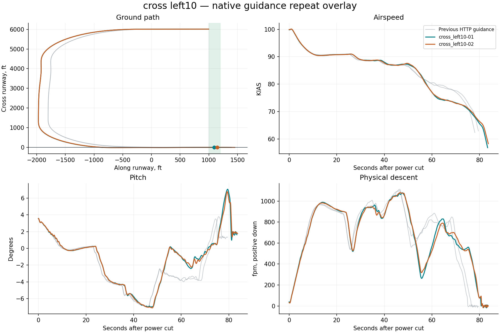
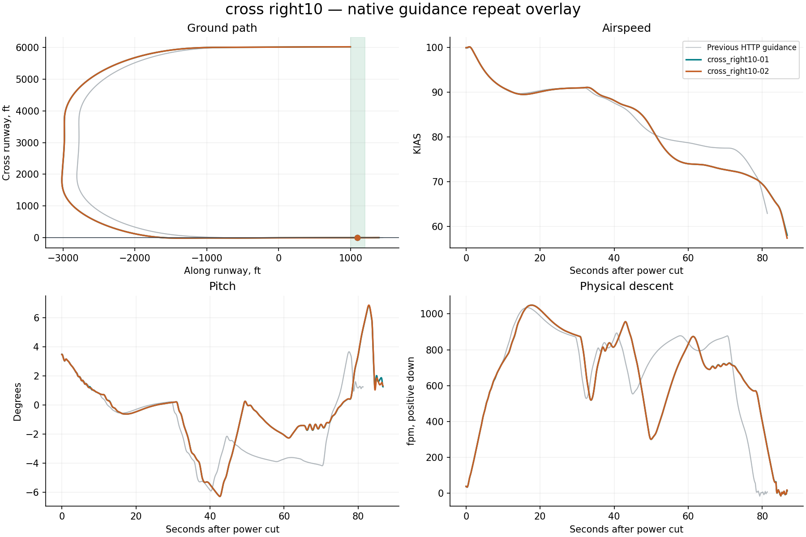
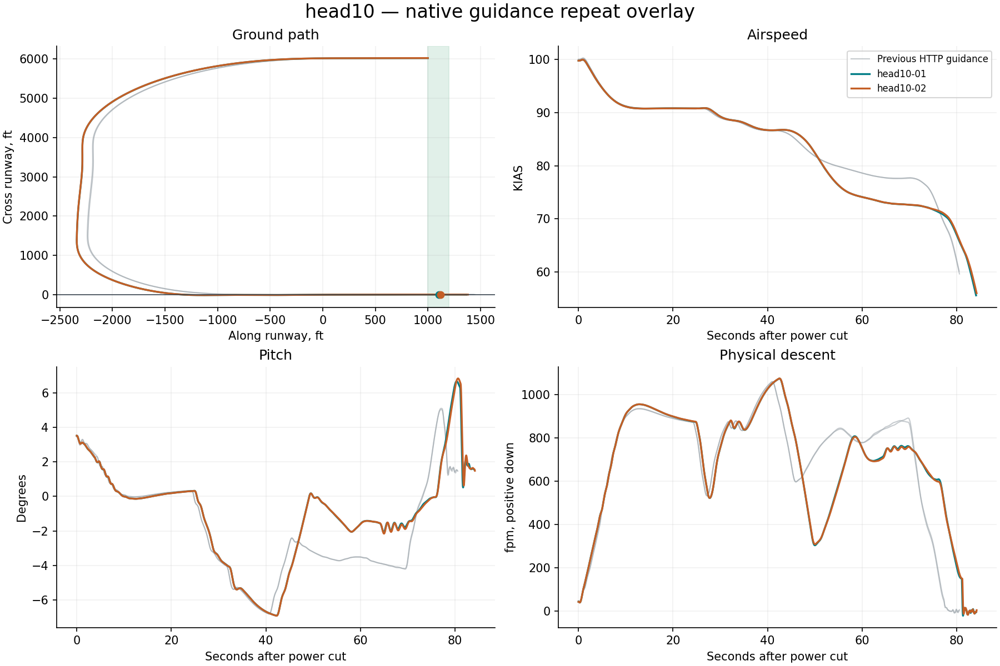
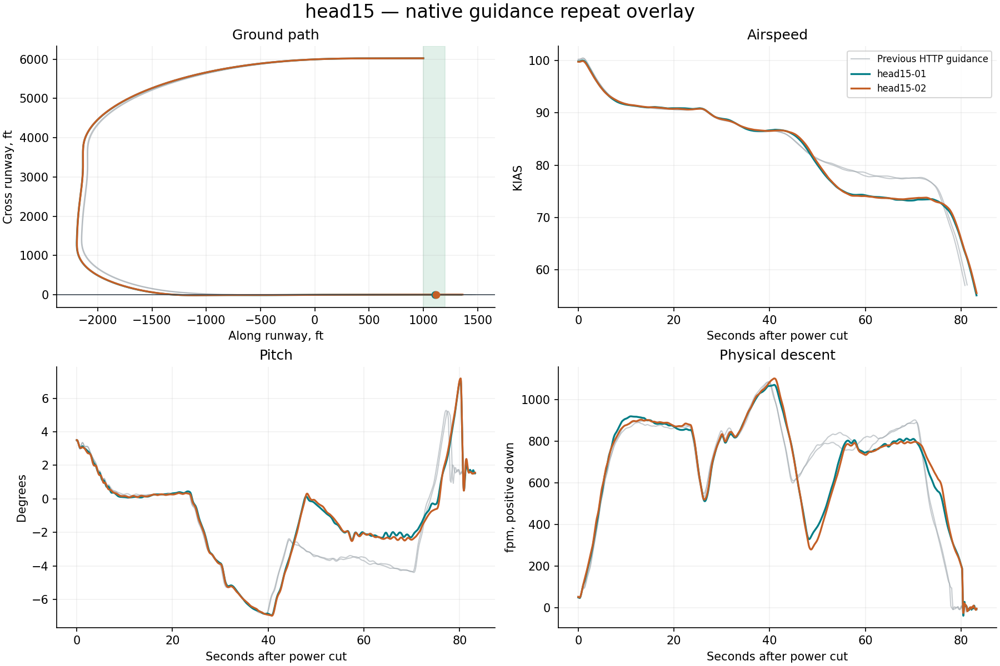
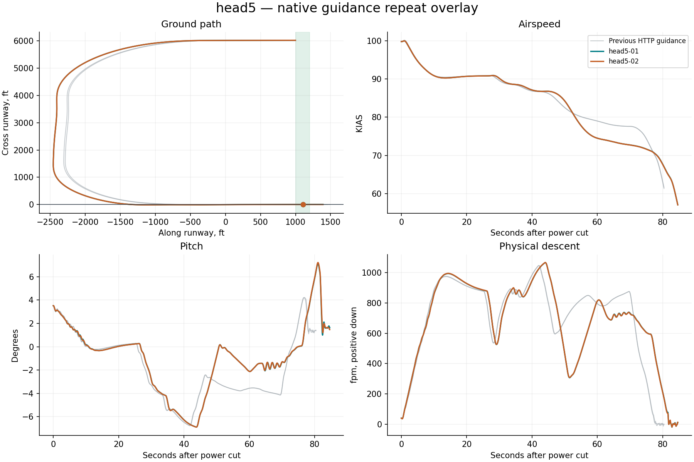

# Native X-Plane harness report

**14/14 flights passed the landing limits.** Measurement-valid flights: 14. Installation restored: True.

Landing pass/fail is separate from harness operation. Native guidance runs on simulator frames; Python only supervises it. All attempts, including aborted and non-passing flights, remain in this report.

| Trial | Touchdown ft | KIAS | Physical sink fpm | Peak pitch ° | Peak pitch rate °/s | Result |
|---|---:|---:|---:|---:|---:|---|
| calm-01 | 1028.4 | 66.1 | 55.7 | 6.8 | 2.5 | Pass |
| calm-02 | 1068.2 | 66.1 | 46.7 | 6.8 | 2.5 | Pass |
| cross_left10-01 | 1091.8 | 65.2 | 86.2 | 7.1 | 2.2 | Pass |
| cross_left10-02 | 1149.1 | 65.9 | 93.7 | 6.8 | 2.3 | Pass |
| cross_right10-01 | 1093.3 | 65.3 | 63.7 | 6.8 | 2.3 | Pass |
| cross_right10-02 | 1092.2 | 65.2 | 61.3 | 6.9 | 2.3 | Pass |
| head10-01 | 1105.8 | 64.7 | 151.3 | 6.7 | 2.5 | Pass |
| head10-02 | 1118.0 | 64.7 | 149.4 | 6.8 | 2.4 | Pass |
| head15-01 | 1107.5 | 65.0 | 190.1 | 7.1 | 2.2 | Pass |
| head15-02 | 1115.4 | 65.2 | 186.7 | 7.2 | 2.6 | Pass |
| head5-01 | 1107.7 | 65.1 | 78.5 | 7.1 | 2.4 | Pass |
| head5-02 | 1106.5 | 65.0 | 71.8 | 7.2 | 2.4 | Pass |
| tail5-01 | 1091.0 | 65.9 | 38.8 | 6.5 | 2.0 | Pass |
| tail5-02 | 1084.6 | 65.9 | 36.3 | 6.6 | 2.0 | Pass |

## calm

No repeat-divergence diagnostic threshold was exceeded.

## cross left10

- pitch_deg spread 2.1 at 81.0s exceeds diagnostic threshold 2

## cross right10

No repeat-divergence diagnostic threshold was exceeded.

## head10

No repeat-divergence diagnostic threshold was exceeded.

## head15

No repeat-divergence diagnostic threshold was exceeded.

## head5

No repeat-divergence diagnostic threshold was exceeded.

## tail5

No repeat-divergence diagnostic threshold was exceeded.

## Evidence

- `resolved-config.json` and each card’s `effective-config.json`: complete settings, with no inactive legacy fields.
- `native-effective.ini`: exact configuration read back from the plugin before flight.
- `trace.csv`: native-frame observations; `supervision.json`: independent polling and deliberate gap probes.
- `source-manifest.json`: harness, native binary, setup adapter and original aircraft lineage.
- `events.jsonl`, `status.json`: structured progress; `restoration.json`: recovery verification.
- `summary.json`: metrics and repeat-divergence timestamps; `charts/*.svg`: standalone vector figures.
