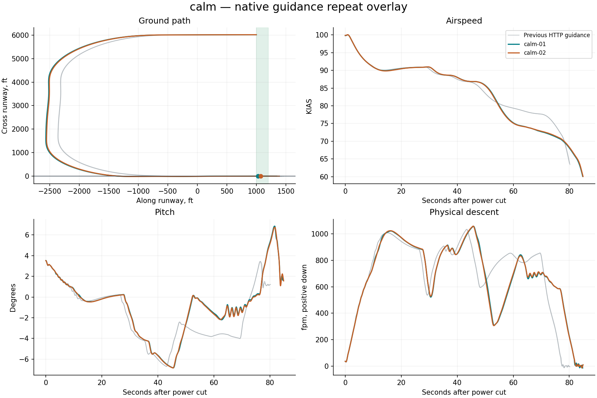
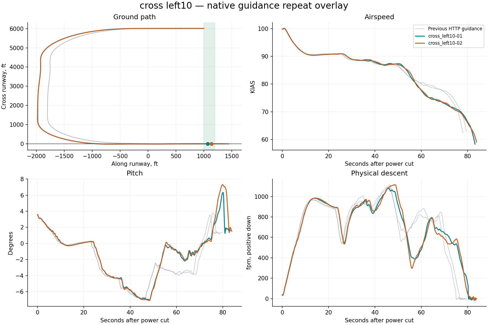
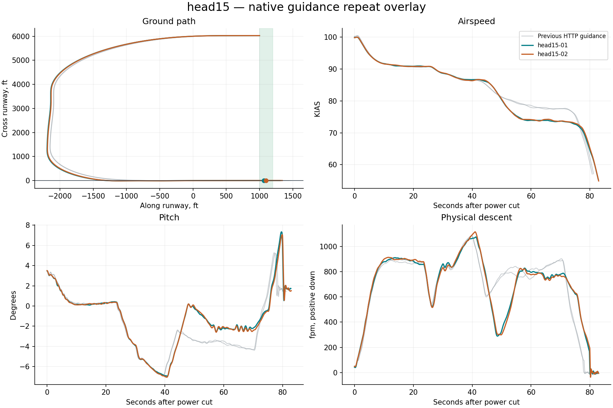

# Native X-Plane harness report

**6/6 flights passed the landing limits.** Measurement-valid flights: 6. Installation restored: True.

Landing pass/fail is separate from harness operation. Native guidance runs on simulator frames; Python only supervises it. All attempts, including aborted and non-passing flights, remain in this report.

| Trial | Touchdown ft | KIAS | Physical sink fpm | Peak pitch ° | Peak pitch rate °/s | Result |
|---|---:|---:|---:|---:|---:|---|
| calm-01 | 1029.7 | 66.1 | 55.2 | 6.8 | 2.5 | Pass |
| calm-02 | 1074.6 | 66.1 | 44.8 | 6.7 | 2.5 | Pass |
| cross_left10-01 | 1067.0 | 66.1 | 128.1 | 6.3 | 2.1 | Pass |
| cross_left10-02 | 1138.7 | 64.7 | 20.8 | 7.3 | 2.5 | Pass |
| head15-01 | 1064.6 | 65.0 | 170.6 | 7.3 | 2.7 | Pass |
| head15-02 | 1097.9 | 65.3 | 195.0 | 7.1 | 2.8 | Pass |

## calm

No repeat-divergence diagnostic threshold was exceeded.

## cross left10

- pitch_deg spread 5.8 at 80.9s exceeds diagnostic threshold 2

## head15

- physical_sink_fpm spread 164.3 at 80.0s exceeds diagnostic threshold 150

## Evidence

- `resolved-config.json` and each card’s `effective-config.json`: complete settings, with no inactive legacy fields.
- `native-effective.ini`: exact configuration read back from the plugin before flight.
- `trace.csv`: native-frame observations; `supervision.json`: independent polling and deliberate gap probes.
- `source-manifest.json`: harness, native binary, setup adapter and original aircraft lineage.
- `events.jsonl`, `status.json`: structured progress; `restoration.json`: recovery verification.
- `summary.json`: metrics and repeat-divergence timestamps; `charts/*.svg`: standalone vector figures.
