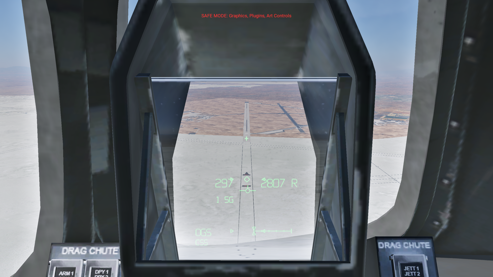
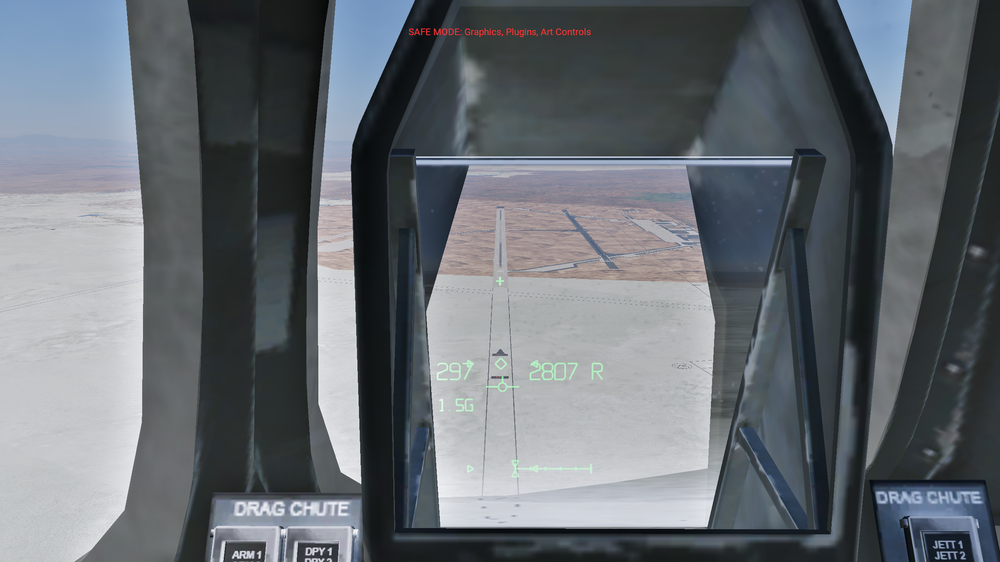
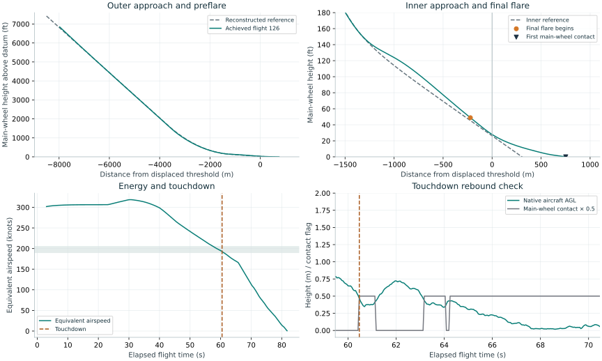

# Shuttle HUD optics
and landing guidance

NASA operational references, native X-Plane projection, shared approach geometry, and measured simulator evidence.

## Corrected cockpit landing — release 127

The native collimated HUD and revised Shuttle landing sequence passed the defined demonstration checks in three consecutive runs. This recording shows the final repeated flight from the commander HUD view, through touchdown, chute rollout and stopping. The lightweight, dry, zero-wind Edwards case is the validated scope.

[Recorded flight](take-126/Shuttle-corrected-HUD-landing.mp4)
Open the MP4 link below to watch the recording.

[Open the cockpit video](take-126/Shuttle-corrected-HUD-landing.mp4) · [Video verification](take-126/video-verification.json) · [Timing and event frames](take-126/video-timing.json)

1706 × 960, 50 fps, 76.22 seconds, with captured simulator sound. Both native AVI segments are retained and joined without removing a flight segment. The simulator's recording clock maps 85.00 seconds of elapsed capture time to 76.22 seconds of video; the original audio was tempo-aligned at a ratio of 1.11517. The final MP4 passed a full decode and a non-silence check. Event timing is approximate because capture and telemetry use separate clocks.

### Repeated landing results

| Flight | KEAS at touchdown | Downrange (m) | Sink (ft/s) | Inner interval (s) | Rebound indicator (m AGL) | Checks |
| --- | --- | --- | --- | --- | --- | --- |
| [124](analysis-124.json) | 192.85 | 750.75 | 2.448 | 7.830 | 0.721 | Pass |
| [125](analysis-125.json) | 192.86 | 750.58 | 2.452 | 7.779 | 0.716 | Pass |
| [126](analysis-126.json) | 193.05 | 751.14 | 2.451 | 7.789 | 0.721 | Pass |

Flights 125 and 126 used the installed ACF without runtime damping adjustment. The separate trial copy added the validation pilot and bypassed the source aircraft's delayed placement call during controlled initial setup. The released aircraft retains the original initialization script and contains no validation pilot. X-Plane physics, responding to native controls, determined the airborne trajectory.

The preflare peak remains approximately **1.61 g**, above the handbook's approximate 1.3 g nominal. A **small touchdown rebound remains** below the fixed 0.75 m native-AGL criterion. Strut damping, feedback gains and speedbrake ratios are local calibration choices. Passing these demonstration checks does not establish exact Shuttle flight dynamics.

### Optical registration and lifecycle

The live 16-card matrix includes head translation, pan, zoom, HUD power, display disable, brightness, night, declutter and exterior views. Across ±6 cm lateral, ±4 cm vertical and 15 cm forward eye movement, the maximum central boresight displacement was **0.125 pixel** at 2560 × 1440. The nearby combiner moves while the projected cross retains its outside direction. Panel pixels and cockpit/glass geometry were independently audited.

Centered eye

Eye translated 6 cm left; cross retains its direction

[Pixel measurement](optics-audit-127.json) · [All camera/display readbacks](optics-127.json) · [Centered full-resolution image](optics-127-center.png) · [Translated full-resolution image](optics-127-eye-left.png)

Power-off and display-disable readbacks report active=0 and their captures contain no central green cross. The exterior view is inactive. The remaining matrix images are retained alongside the readbacks. VR/headset and copilot-eye optics remain unvalidated.

Actual Plugin Admin disable/re-enable removed and restored the release HUD. Full-screen/cockpit switching restored the camera settings. Chute tests verified staged opening, pause/resume, replay, landing-system disable, jettison and independence from HUD visibility. The dedicated simulator process then exited normally with plugin cleanup and the simulator shutdown marker; no forced termination was used.

[SDK disabled](../shuttle-hud-20260909/cockpit/sdk-127-disabled.png) · [SDK re-enabled](../shuttle-hud-20260909/cockpit/sdk-127-reenabled.json) · [Camera restoration](camera-restore-127.json) · [Chute checks](chute-127.json) · [Clean shutdown](clean-exit-127.json) · [Complete final-session log](Log-127-clean-exit-excerpt.txt)

The session log also retains unrelated OpenXR startup, missing external XPME scenery-resource, absent aircraft VR configuration and third-party texture warnings. It contains no already-destroyed avionics-device warning or Lua stack trace. Earlier development reload and startup crashes are retained separately; their causes are unproven. The full global-plugin environment was not tested.

The final read-only installation audit verified all **430 source files unchanged**, preserved original instrument pixels and geometry, unchanged release initialization, no installed validation pilot, matching source-build/installed binary hashes and restored scenery configuration. The temporary trial aircraft was archived outside Aircraft after shutdown. X-Plane is closed.

[Installation audit](audit-final-127.json) · [Archived test-aircraft manifest](retired-trial-manifest.json) · [Completion record](completion-127.json) · [Acceptance contract](CORRECTION_SPEC.md)

The corrected earth-relative velocity agreed with the derivative of recorded MSL altitude to a median absolute error of **0.0029 m/s** over 1,032 airborne samples, compared with **0.989 m/s** for the former local-Y assumption. [Velocity comparison](velocity-check-126.json)

## Measured result — flight 126

**ACCEPTED.** All defined landing checks passed.

| Quantity | Measured value |
| --- | --- |
| Touchdown equivalent airspeed | 193.05 KEAS |
| Distance beyond displaced threshold | 751.1 m |
| True altitude rate before contact | 2.45 ft/s downward |
| Centerline displacement | -5.92 m |
| Gear locked before contact | 17.58 s |
| Established inner-path interval | 7.79 s |
| Maximum native aircraft AGL after contact | 0.72 m |

The full-resolution figure is also available as [PNG](flight-126.png). [Raw 20 Hz trace](trace-126.csv) · [Acceptance calculations](analysis-126.json) · [Exact trial configuration](configuration-126/hashes.json).

Native aircraft AGL is a conservative bounce indicator, distinct from the modeled extended-wheel height. The raw wheel-contact sequence also shows whether the aircraft left the runway after contact. Initial paused placement and the first three seconds of settling are excluded from event-gate analysis.

# Shuttle landing guidance and HUD optics

## Findings

The earlier cockpit display placed an image on the glass. That produced readable symbols but did not reproduce a head-up display focused at optical infinity. The earlier demonstration also used a locally invented approach curve and a continuously falling speed target. Those choices did not reproduce the Shuttle's documented approach and energy-management sequence.

The replacement uses X-Plane's native collimated HUD compositor on the aircraft's actual combiner glass. Landing guidance now follows a common geometric definition used by both the displayed guidance cues and the validation pilot. It separates the steep outer approach, preflare, shallow inner approach, final flare, and rollout. The installation retains the original aircraft separately.

## The documented landing sequence

The primary operational reference is **JSC-23266, Approach, Landing and Rollout Flight Procedures Handbook, Revision B**, May 2005. The complementary **Entry, TAEM, and Approach/Landing Guidance Workbook**, January 2006, explains the guidance geometry. These are late-program training documents; they are more useful for this correction than a generic description of an unpowered landing or an appearance-only comparison with a cockpit video. [1, 2]

| Stage | Documented nominal behavior | Consequence for the simulation |
| --- | --- | --- |
| Outer approach | Lightweight vehicle: 20° path and approximately 300 KEAS; heavyweight: 18° | Use the lightweight case at 184,000 lb and label its scope |
| Outer aim point | Nominal point 7,500 ft before the runway threshold | Do not draw a 20° line directly to the touchdown point |
| Preflare | Initiation near 2,000 ft; circular pullup, followed by an exponential transition | Replace the previous arbitrary parabola and prolonged nearly level segment |
| Inner approach | 1.5° path, projected to a point 1,000 ft beyond the threshold | Establish a brief shallow descent before final flare |
| Final flare | Sink-dependent trigger, approximately 30–80 ft; touchdown sink target about 3 ft/s | Use a bounded height trigger and a reducing sink command |
| Gear | Lower around 300 ft, within the 200–400 ft band; locked at least five seconds before touchdown | Verify deployment from the actual gear data, not just the handle |
| Touchdown | Nominal lightweight target about 195 KEAS and 2,500 ft downrange | Measure EAS, position, sink and centerline error separately |
| Rollout | Full speedbrake after main-gear contact; light-vehicle chute deployment promptly after contact; derotation about two seconds later, before slowing below 175 KEAS | Use wheel-contact events and a controlled nose-lowering rate |
| Chute jettison | Approximately 60 knots groundspeed | Use groundspeed for this event, rather than IAS or EAS |

Sources: handbook sections 4.4–4.7 and 4.11, Appendix B.3; guidance workbook section 4. [1, 2]

The nominal 195 KEAS touchdown target must not be confused with the handbook's off-nominal low-energy allowances. Likewise, “gear down at 300 ft” does not mean that 300 ft is the flare height. The reference material describes several distinct altitude gates, each serving a different purpose. [1]

The speedbrake schedule is particularly significant. Above 3,000 ft, it regulates outer-approach energy. At 3,000 ft, a retraction setting is selected; a further adjustment occurs at 500 ft, after which the setting is held until touchdown. A continuously declining airspeed target below 3,000 ft is not an equivalent implementation of that sequence. The X-Plane control ratios require local calibration because they describe this particular aircraft model's drag response, not the Shuttle flight computer's speedbrake-angle computation. [1]

## Geometry and implementation

Distances use the displaced landing threshold as zero, with positive distance down the runway. Heights are in metres internally. The nominal touchdown-area terrain elevation supplies the local runway datum; this avoids using the elevation at the physical end of a displaced, sloping runway. Radar height is obtained separately by probing terrain below the aircraft. The HUD also accounts for the extended main-wheel position relative to the centre of gravity.

The outer line is `h = (-7500 ft - x) tan(20°)`. The inner line is `h = (1000 ft - x) tan(1.5°)`. Between them, a circular arc is followed by an exponential term added to the inner line. The circle is tangent to the outer path at 1,700 ft. The exponential transition begins at the documented lightweight nominal downrange station of −4,562 ft. [1, 2]

The numerical reconstruction matches height, slope and curvature at the circle-to-exponential join. Its circle radius is 26,069.178 ft; exponential excess height is 14.998 ft and exponential length scale is 624.112 ft. These numbers are **derived coefficients**, not recovered Shuttle GPC software. The resulting exponential-join height is approximately 160.6 ft. That differs from the approximate 176 ft annotation in a workbook illustration, so the reconstruction must not be presented as the exact operational algorithm. The line angles, aim points, event sequence and smooth transition are the supported engineering basis.

`landing_guidance.hpp` is the single path and event definition. The HUD publishes command angle, reference height, speedbrake setting, gear command, along-runway distance, cross-track displacement and phase. The separate validation pilot reads those values and moves native stick, rudder, speedbrake, gear, chute and brake controls. It does not impose an airborne position, quaternion, velocity or custom force. Paused initial placement is recorded, and its path override is released before the flight starts.

Equivalent airspeed is calculated as `TAS × sqrt(rho / 1.225)`, converted to knots. This distinction matters during deceleration: the native indicated-airspeed instrument has its own behavior, and it can differ from instantaneous equivalent airspeed. Groundspeed is used for runway travel and chute jettison.

The local OpenGL Y axis is vertical at the scenery reference point, not necessarily at the aircraft. A comparison of flight 114's recorded MSL altitude change with `local_vy` exposed a difference of about 0.57 m/s during final flare. Treating `local_vy` as true vertical velocity understated sink and biased the guidance. Version 122 obtains the aircraft's up, north and east basis using the SDK's coordinate conversions, then projects the native velocity vector into that basis. HUD flightpath, guidance, test-pilot feedback and touchdown sink now share these earth-relative components. Earlier traces retain their original local-Y values and must not be described as true altitude-rate measurements. [8, 9]

## Rollout discrepancies identified in the host aircraft

Repeated gentle touchdowns exposed a nose-up response during chute deployment that could not be corrected with the original available downward elevon travel. The source aircraft specifies 8° downward travel. The NASA-hosted engineering record documents the Shuttle operational limits as 33° upward and 18° downward. The handbook explains that a deployed chute shifts the two-point trim requirement about 6° toward downward elevon. This supports correcting the demonstrated shortage of downward control authority, while retaining the source aircraft's other aerodynamic parameters. [1, 7]

The handbook also describes a staged drag chute: deployment to 40% diameter takes about 1.5 seconds, and disreefing occurs after a further 3.5 seconds. Forty percent diameter corresponds to 16% of full area. The aircraft-local landing-system component implements this area sequence through X-Plane's existing chute-area parameter; X-Plane still computes the force and resulting motion. A half-second smooth opening from reefed to full area is an explicitly local approximation. [1, section 5.3.6.8]

The landing-system component restores the original area after jettison, disable and unload. It is scoped to this derivative aircraft. Replay and pause restore the original configuration; resuming a valid staged deployment uses simulation time to recover the proper stage. HUD visibility and landing-system enable state are separate controls.

A preliminary trial changed the stored strut-damping coefficients while automatic damping remained enabled, so it did not test the intended physical change. Subsequent trials enabled custom native damping. With the same version-127 approach and pilot, damping multipliers of 3, 4 and 5 produced maximum native AGL after contact of 0.789, 0.7504 and 0.721 m respectively. The unchanged rejection limit is 0.75 m. Flight 124 passed all defined checks with multiplier 5; this setting is now in the derivative's source installer. It is an empirical calibration of X-Plane's linear strut model, not a recovered Shuttle damping coefficient. Original stiffness and gear geometry remain unchanged. The trace still contains a small rebound, so the result must not be described as zero bounce.

The final local flare model uses `clamp(-vertical_velocity × 4 s, 30 ft, 80 ft)` for the trigger, then a commanded downward velocity of `0.9144 + 0.180 × height_m` metres per second. The resulting angle uses the earth-relative horizontal speed. Before flare, vertical command is horizontal speed times the current path slope, plus a bounded `0.18 × height_error` correction. These explicit coefficients describe this calibrated reconstruction; NASA's original software is not used. The measured preflare peak is about 1.61 g, above the handbook's approximate 1.3 g nominal value. This remaining fidelity difference is visible in the retained trace.

## Why the new cockpit display is a HUD

The Shuttle HUD optics focus the image at infinity. The essential behavioral test is therefore angular registration: when the eye translates, distant-scene symbols should retain their outside direction while the nearby glass moves across them. A conventional image painted on a polygon moves with the glass instead. [3]

X-Plane provides this optical projection through `ATTR_hud_glass` and the native HUD panel and angular-field configuration. The replacement draws luminous vector symbology into a dedicated panel region; the simulator projects that region at optical distance and clips it to the actual combiner mesh. A static projected texture would not satisfy the same test. Laminar documents support for the native renderer's stereo/VR eye handling, but that platform capability is distinct from a headset validation of this aircraft. [4, 5, 6]

The final integration uses the real commander combiner faces in a derivative transparent-cockpit object. The original flat HUD instrument faces are removed from the derivative cockpit object. The legacy transparent cockpit object also needs the native glass rendering pass; without that setting, it occludes the native HUD. A working stock F-14 HUD in the same simulator session and controlled object-visibility checks established this cause.

The original 2,048-pixel-wide instrument atlas is extended to 4,096 pixels. Existing cockpit texture coordinates are adjusted to retain their original instrument locations, and the extra space contains the HUD region. The optics configuration defines the eye position, panel rectangle and ray slopes explicitly. Missing or invalid configuration prevents startup rather than drawing over an arbitrary region of the cockpit panel.

Brightness scales the emitted RGB values. Alpha alone is insufficient for the native additive compositor. The implementation retains native HUD power/electrical gating, declutter controls, a separate full-screen option, and original vector lettering. It contains no F-SIM application code, font files or copied artwork.

## Validation and scope

The optical matrix includes centered and translated eye positions, forward movement, camera rotation, field-of-view changes, power off/on, dimming, exterior view and night operation. Pixel measurements of the fixed central boresight supplement direct visual comparison of the moving glass and outside scene. Screenshots are supporting evidence; the simulator's live projection behavior is the relevant property.

The flight matrix measures achieved state throughout the approach and rollout. It records gear-lock timing, inner-path duration, airspeed type, vertical velocity, normal acceleration, control input, weight-on-wheels, chute state and stopping position. Failed flights remain in the evidence directory. A completed flight is not accepted merely because it eventually stopped.

The accompanying results and plots identify each accepted run and the corresponding configuration. The recorded repeat, optical measurements and lifecycle checks have their own evidence files. Video acceptance requires a complete decode, non-silent sound and alignment of the touchdown event with the recorded trace.

The validated operational case is a lightweight, dry-runway, zero-wind approach to Edwards 22L in X-Plane 12.4.3. This does not establish heavyweight, crosswind, wet-runway, emergency, entry or orbital performance. The original aircraft's remaining aerodynamic and systems approximations remain relevant. VR headset operation and compatibility with the complete global-plugin set require separate tests. This is simulator software, not real-flight guidance or a qualified Shuttle simulation.

## Sources

Current release evidence: flights [124](analysis-124.json), [125](analysis-125.json) and [126](analysis-126.json) all passed the defined demonstration checks. The final repeat supplies the accepted [cockpit video](take-126/Shuttle-corrected-HUD-landing.mp4). Release 127's [optical audit](optics-audit-127.json) measured 0.125 pixel maximum boresight displacement across the translated-eye cards; its [velocity audit](velocity-check-126.json) measured 0.0029 m/s median absolute difference from the derivative of recorded MSL altitude. [Chute restoration](chute-127.json), Plugin Admin disable/re-enable, camera restoration and [normal simulator shutdown](clean-exit-127.json) passed. The [installation audit](audit-final-127.json) verifies all 430 original files unchanged. The report presents the full results alongside the retained rebound and preflare-g limitations.

- NASA/JSC. [JSC-23266, Approach, Landing and Rollout Flight Procedures Handbook, Revision B](https://www.ibiblio.org/apollo/Shuttle/Crew%20Training/Flight%20Procedures%20App%20Land%20Roll.pdf), May 2005. Sections 4.4–4.7, 4.11, 5.3.6.8 and Appendix B.3. NASA document preserved by ibiblio.
- United Space Alliance/NASA training material. [USA005512, Entry, TAEM, and Approach/Landing Guidance Workbook](https://www.ibiblio.org/apollo/Shuttle/Crew%20Training/Entry,%20TAEM%20and%20Approach%20Workbook.pdf), January 2006, section 4. Preserved by ibiblio.
- United Space Alliance/NASA training material. [USA006082, Star Tracker/HUD/COAS Workbook](https://www.ibiblio.org/apollo/Shuttle/Crew%20Training/S-TRK%20HUD%20COAS%20Workbook.pdf), section 7.3. Preserved by ibiblio.
- Laminar Research. [X-Plane 3-D HUD](https://developer.x-plane.com/article/x-plane-3-d-hud/). Native optical projection, panel region, angular bounds and VR treatment.
- Laminar Research. [OBJ8 File Format Specification](https://developer.x-plane.com/article/obj8-file-format-specification/). HUD glass and cockpit material attributes.
- Laminar Research. [Plugin Guidance for OpenGL Drawing](https://developer.x-plane.com/article/plugin-guidance-for-opengl-drawing/). Supported drawing phases and rendering constraints.
- Historic American Engineering Record, National Park Service. [Space Transportation System, HAER No. TX-116](https://www.nasa.gov/wp-content/uploads/2015/12/2.pdf), printed p. 135 / PDF p. 43. Elevon operating limits and source references; hosted by NASA.
- Laminar Research. [Screen Coordinates](https://developer.x-plane.com/article/screencoordinates/). Local-axis divergence from true up and north; requirement to use SDK coordinate conversions.
- Laminar Research. [XPLMGraphics](https://developer.x-plane.com/sdk/XPLMGraphics/). Global/local coordinate conversion contract.

The three training PDFs are retained with exact URL, byte count and SHA-256 hashes in `sources/manifest.json`. Local trace, configuration and binary hashes provide the corresponding simulator evidence lineage.

Repository edition: source, linked media and acceptance evidence are included. The complete development archive, original aircraft, failed screenshots and full simulator logs remain in the original local workspace. See [the repository report index](../../README.md) for scope and provenance.

Local engineering record. No report, aircraft assets or flight data have been published externally.
