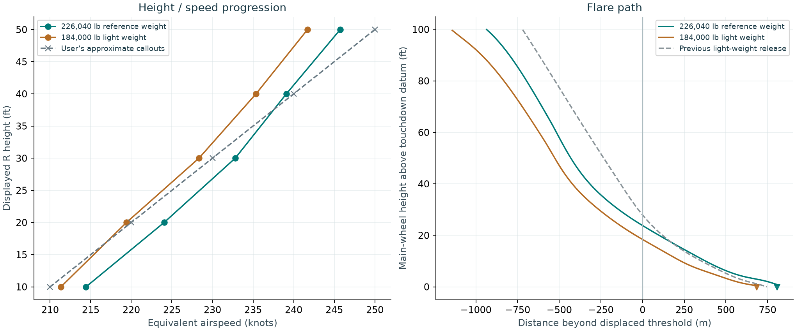
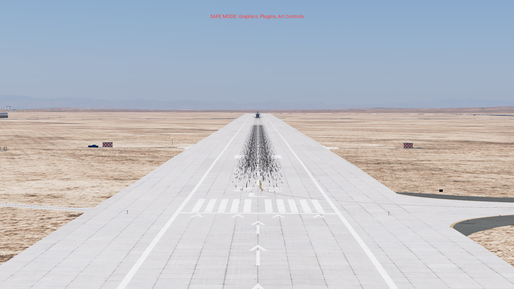
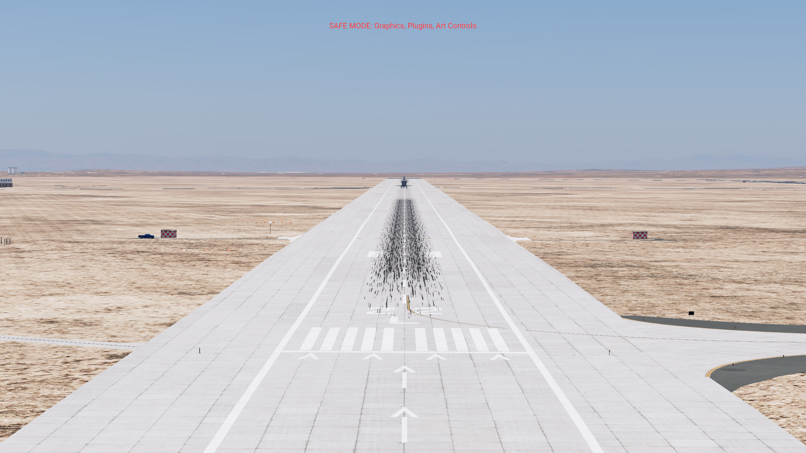
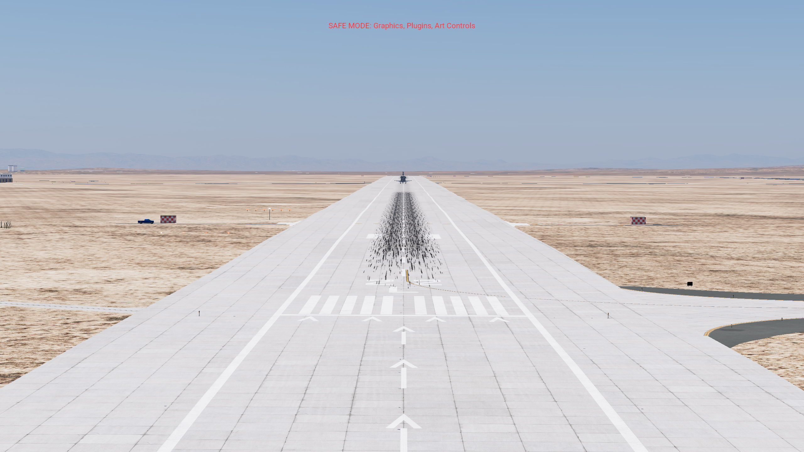
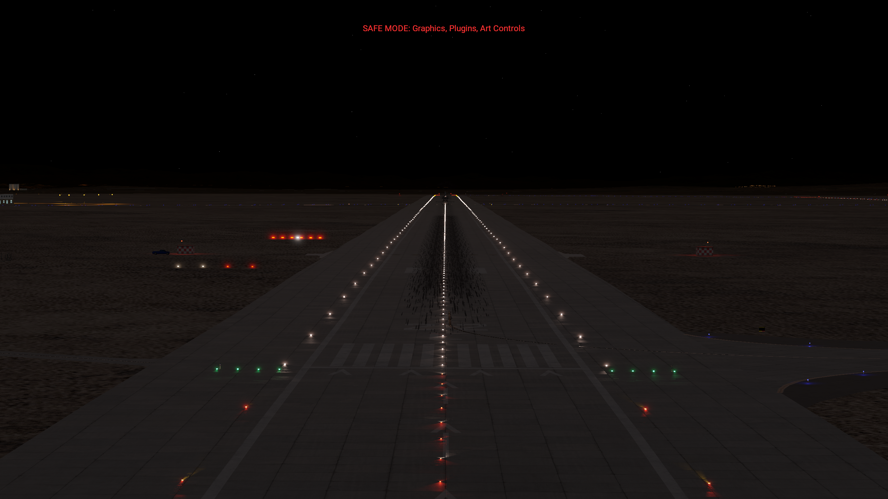
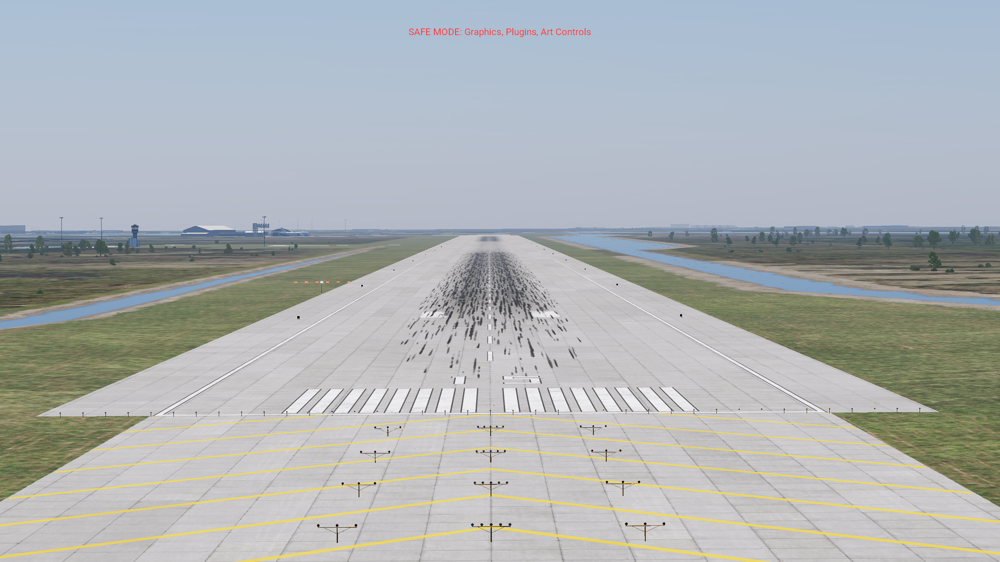
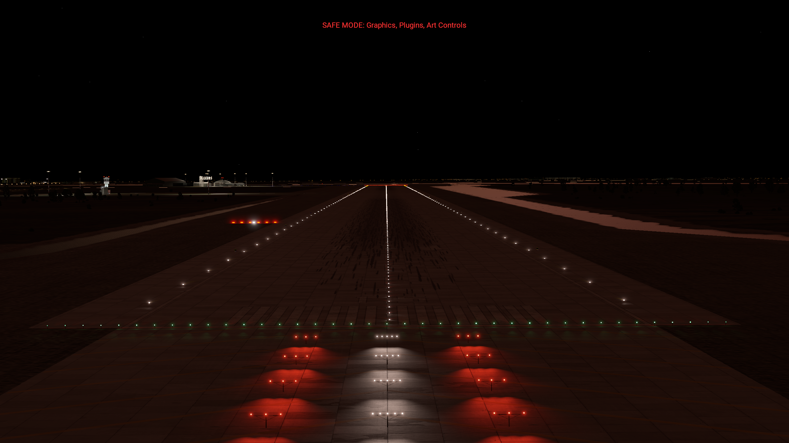

# Flare refinement and ball/bar lights

[Shuttle HUD project](../../../../plugins/shuttle-hud/README.md) ·
[Rust source](../../../../plugins/shuttle-hud/src) · [Current reports](../../README.md)

[Watch the recorded native landing](take-140/Shuttle-refined-flare-landing.mp4)

Release 136 · Native X-Plane 12.4.3 · KEDW 22L · dry runway, zero wind

The reference-weight landing touches down at **200.89 KEAS**, **2.30 ft/s downward**, **2647 ft beyond the displaced threshold**. The native scenery adds the missing ball/bar to KEDW 04R/22L and KTTS 15/33.

The recording shows a continuous native flight with simulator sound, at 1706 × 960 and 50 frames per second. X-Plane recorded 86.27 seconds of wall time into 77.00 seconds of video; captured sound is synchronized at the same 1.1203 playback ratio. Measured flight results below come from simulator telemetry. A separate validation pilot applies ordinary pitch, roll, rudder, speedbrake, gear, chute and brake inputs. It is not installed in the release. Flight position, attitude and velocity are initialized while paused and never overridden in flight.

## Actual callouts

| Displayed R height | Approximate reference | Reference weight: 226,040 lb | Light weight: 184,000 lb |
| --- | --- | --- | --- |
| 50 ft | 250 | 245.7 | 241.7 |
| 40 ft | 240 | 239.1 | 235.4 |
| 30 ft | 230 | 232.8 | 228.3 |
| 20 ft | 220 | 224.0 | 219.4 |
| 10 ft | 210 | 214.4 | 211.3 |
| Touchdown | 195–205 | 200.9 | 196.6 |

Speeds are equivalent knots. Values interpolate actual trace samples; the HUD rounds its display. R height follows terrain below. Guidance height uses main-wheel position above the touchdown-zone datum. The two are not interchangeable on this sloping runway. NASA records STS-125’s landing weight as 226,040 lb; the earlier demonstration used 184,000 lb. The heavy test changes total mass during paused setup, preserving the source CG/inertia model; it is a weight comparison, not a complete STS-125 mission reconstruction.

The previous light landing reached 50 ft main-wheel height at 232.6 KEAS and touched down at 193.1. This revision carries more energy into the final flare, follows a slightly lower inner target, and tapers sink in the last 15 ft. The heavy and light final-flare switches occur at 64.1 and 56.7 ft main-wheel height respectively. The handbook specifies a sink-dependent 30–80 ft band; it does not require a fixed 50 ft switch.

## Ball/bar, rendered in the simulator

The bar has six assemblies of four red lamps at station 2,200 ft. The ball has three white lamps at station 1,700 ft. Both begin 200 ft left of centerline and share the runway centerline elevation at bar station: red lamps 2 ft above it, white lamps 15 ft above it. Assembly spacing is 15 ft. Aim is 4° upward. Housing shape and brightness are visual approximations.

On the ball/bar line: white and red align.

High: white moves below red.

Low: white moves above red.

Night: six red assemblies and the white ball.

These are unaltered native screenshots from a paused, read-only SDK camera in the isolated test aircraft. The four nearer lights are the airport’s existing PAPI. The farther six-light row with the white ball is the new aid. The overlay marks the aid as required at every object-density setting. Native terrain probes verify lamp clearance; scenery coordinates were decoded from the compiled DSFs and checked against the generator.

Kennedy 15: daytime alignment.

Kennedy 15: night lighting.

[Kennedy 33 alignment photograph](lights-KTTS-33-density-on-slope.png) · [Edwards fixture close-up](lights-KEDW-22L-density-red-fixtures.png)

## Landing checks and remaining limits

| Check | Reference weight | Light weight |
| --- | --- | --- |
| Sink at first main-wheel contact | 2.30 ft/s | 1.28 ft/s |
| Touchdown distance | 806.7 m | 684.0 m |
| Centerline displacement | -5.95 m | -5.84 m |
| Gear locked beforehand | 18.0 s | 17.2 s |
| Inner-path transition interval | 2.64 s | 2.99 s |
| Peak native aircraft AGL in first 10 s after contact | 0.687 m | 0.748 m |
| Controlled stop | Pass | Pass |

All defined landing checks pass in flights 140 and 141. The acceptance contract predates the final trials; rejected configurations and traces are retained. The inner-path dwell check was corrected before tuning because the handbook permits a brief or momentary intercept. The touchdown-speed lower bound was tightened from 190 to 195 KEAS for this request.

The final light configuration passed twice: flight 139 at 196.37 KEAS and flight 141 at 196.62 KEAS. The heavy endpoint passed in flight 135 at 200.91 KEAS and in recorded flight 140 at 200.89 KEAS; only the light endpoint changed between those heavy trials. The light flights reached 0.746 and 0.748 m native aircraft AGL after contact, close to the fixed 0.750 m rebound limit. This is a small passing margin. Settings interpolate between the two weights; intermediate weights have not been flight-validated.

Preflare peaks remain 1.66 g heavy and 1.60 g light, above the handbook’s approximate 1.3 g nominal. Heavy outer-path speed remains about 315 KEAS. Small gear rebounds remain. These are flight-model limitations, not exact Shuttle dynamics. This revision does not validate crosswind, wet-runway, emergency, orbital or headset operation, or compatibility with all global plugins.

## Installed result and evidence

Use **Space Shuttle – F-SIM HUD** and **Shift+W** for the cockpit HUD. CSS final flare now blanks the guidance diamond and gamma triangles, while AUTO keeps them. The velocity vector remains visible. Ball/bar lights are separate native scenery and remain visible with the HUD off.

The original aircraft’s 430 files are unchanged. Only the separate derivative and the new landing-aids scenery are installed. The scenery configuration differs from the original only by the landing-aids entry. The validation aircraft and camera probe are retired outside the Aircraft folder after testing. See `completion-current.json`, `audit-final.json`, configuration hashes, traces and native capture verification in this folder.

[Research and primary sources](RESEARCH.md) · [Acceptance contract](CORRECTION_SPEC.md) · [Heavy raw analysis](analysis-140.json) · [Light raw analysis](analysis-141.json) · [Video verification](take-140/video-verification.json)

Repository edition: source, linked media and acceptance evidence are included. The complete development archive, original aircraft, failed screenshots and full simulator logs remain in the original local workspace. See [the repository report index](../../README.md) for scope and provenance.
