# Shuttle HUD, from acquisition to rollout.

[Shuttle HUD project](../../../../plugins/shuttle-hud/README.md) ·
[Rust source](../../../../plugins/shuttle-hud/src) · [Current reports](../../README.md)

Reference-driven symbols, timed cues and contact transitions, checked in the simulator against NASA documentation, F-SIM explanations and recorded Shuttle approaches.

## What changed

Release 142 rebuilds the approach-to-rollout symbology against NASA JSC-23266 Rev B §2.12, the F-SIM HUD brief and inspected STS-125/STS-108 footage. It adds explicit phase sequencing, a five-second flight-director transition and ATT REF cage; distinct outer-path/flare indices; timed GR/GR-DN and flashing GEAR; handbook altitude steps; five-mark speedbrake pointers and mismatch flashing; and separate airborne/ground declutter cycles.

Main-wheel contact latches the rollout format, clears airborne symbols, moves speed beside the boresight and adds the deceleration scale. Nose-wheel contact selects G-prefixed groundspeed and removes pitch references. CSS final flare clears the guidance diamond and gamma triangles while keeping the velocity vector. Low airborne reloads, replay and time discontinuities reset the presentation state.

The native collimated combiner, ACF, cockpit geometry, atlas, landing guidance calibration, validation control laws and landing-aid scenery remain byte-identical to release 136. The source `Shuttle_Init.lua` remains unchanged. Presentation state advances once per simulator frame; drawing reads that state. The aircraft-local plugin owns native display callbacks and the existing temporary chute-area adjustment, and does not command airborne position, attitude, velocity or forces.

[Source comparison and decisions](RESEARCH.md) · [Predeclared display contract](ACCEPTANCE_SPEC.md) · [Detailed acceptance and limits](RESULTS.md)

## Native phase gallery

Original X-Plane screenshots. Flight 206 uses build 142 and records an observed heavy landing; the other cards deliberately initialize display states. Cards with the verified-140 prefix use the same renderer before the low-start reset and version-log corrections. The final flight retains an XPME missing-library notice outside the unobscured HUD area. Click an image to inspect full resolution.

[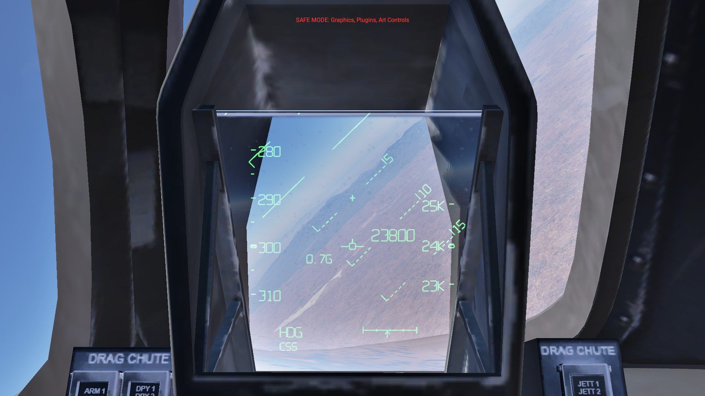](verified-140-hac.png)

### Banked HAC

Initialized card: fixed flight director, rotating pitch references, Nz and limited guidance.

[Phase 1 · 23949 ft · 300.1 KEAS · flags 447 ↗ telemetry](verified-140-hac.json)

[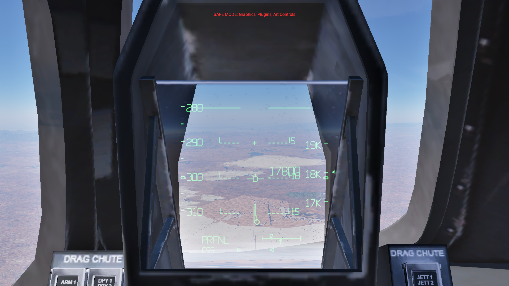](verified-140-fade-mid.png)

### Prefinal transition

Initialized transition: square flight director moves toward the velocity vector over five seconds.

[Phase 2 · 17826 ft · 300.5 KEAS · flags 319 ↗ telemetry](verified-140-fade-mid.json)

[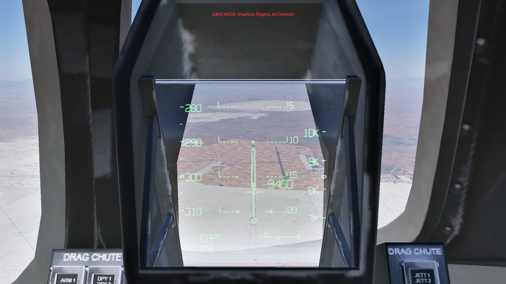](verified-140-capture.png)

### Capture

Initialized card: CAPT, altitude tape and separate guidance.

[Phase 3 · 8437 ft · 300.2 KEAS · flags 319 ↗ telemetry](verified-140-capture.json)

[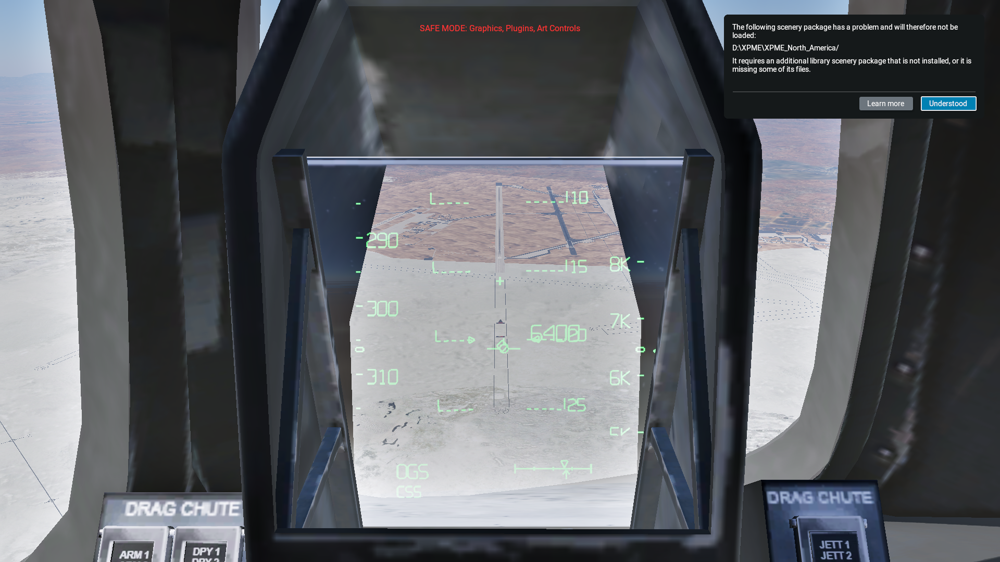](flight-206-ogs.png)

### Outer glide slope

Observed during flight 206; paused for the unaltered screenshot.

[Phase 4 · 6456 ft · 306.4 KEAS · flags 63 ↗ telemetry](flight-206-ogs.json)

[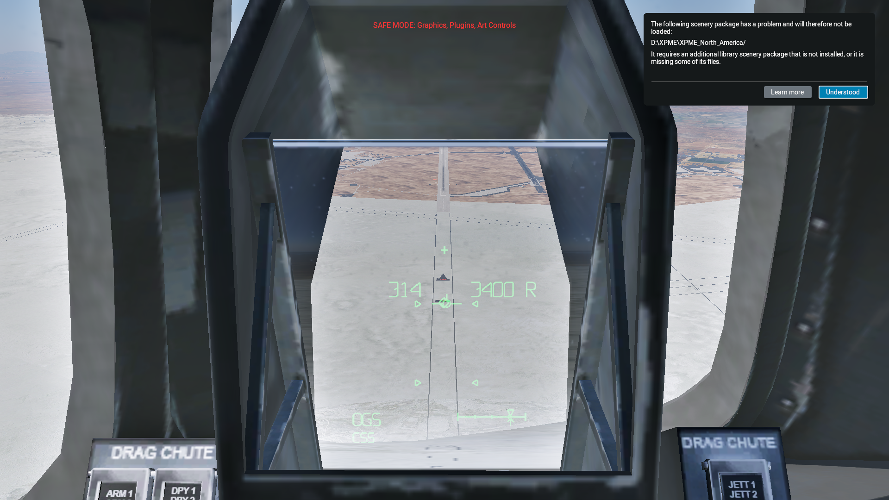](flight-206-flare-preview.png)

### Flare preview

Observed during flight 206: second index pair approaches the OGS pair.

[Phase 4 · 3416 ft · 314.9 KEAS · flags 15 ↗ telemetry](flight-206-flare-preview.json)

[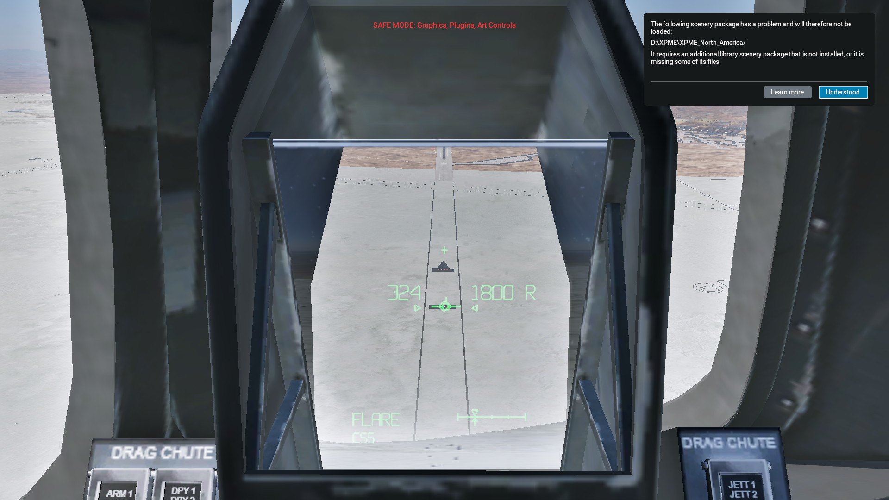](flight-206-preflare.png)

### Preflare

Observed FLARE state during flight 206.

[Phase 5 · 1905 ft · 324.6 KEAS · flags 15 ↗ telemetry](flight-206-preflare.json)

[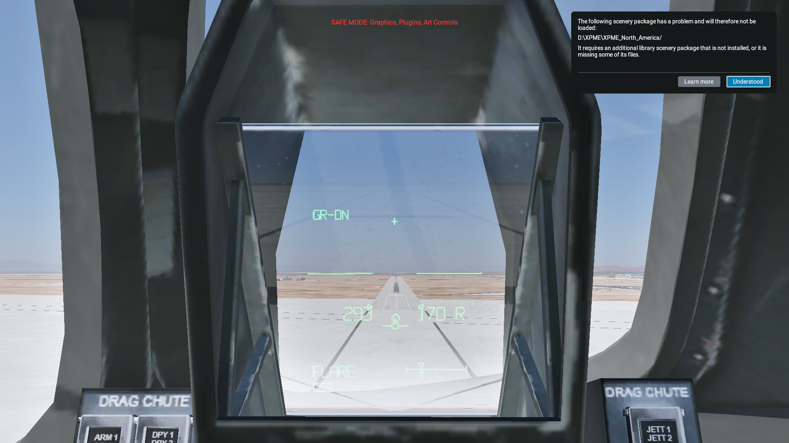](flight-206-inner.png)

### Inner approach

Observed low approach, digital speed/height and nominal flare reference.

[Phase 5 · 165 ft · 293.9 KEAS · flags 15 ↗ telemetry](flight-206-inner.json)

[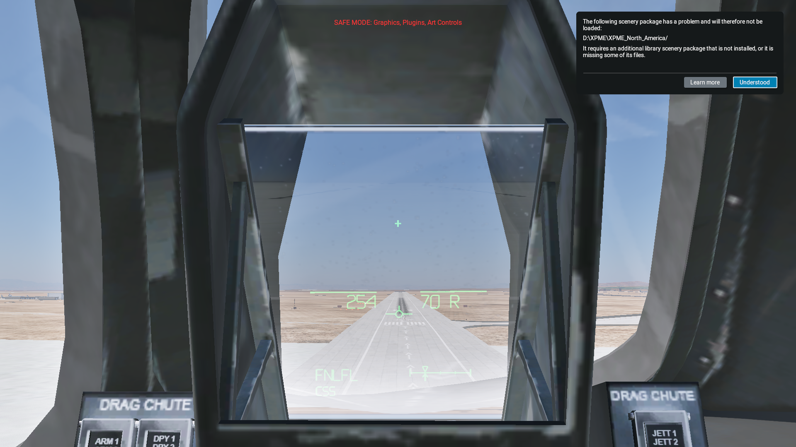](flight-206-css-final-flare.png)

### CSS final flare

Observed FNLFL: VV remains; diamond and gamma indices clear.

[Phase 6 · 64 ft · 254.5 KEAS · flags 11 ↗ telemetry](flight-206-css-final-flare.json)

[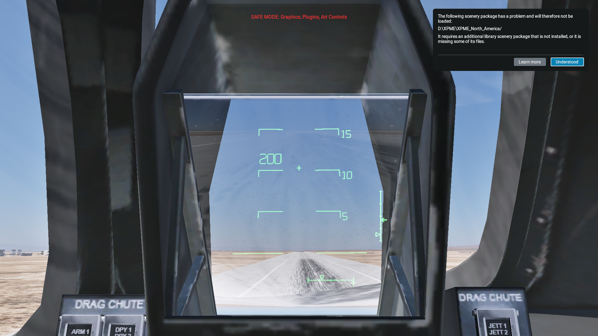](flight-206-main-contact.png)

### Main-wheel contact

Observed contact: speed relocates, attitude returns, deceleration scale appears.

[Phase 6 · 0 ft · 200.2 KEAS · flags 89 ↗ telemetry](flight-206-main-contact.json)

[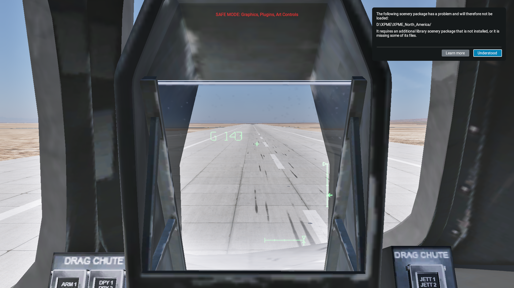](flight-206-nose-contact.png)

### Nose-wheel contact

Observed contact: G groundspeed, pitch references clear.

[Phase 6 · 0 ft · 137.8 KEAS · flags 65 ↗ telemetry](flight-206-nose-contact.json)

[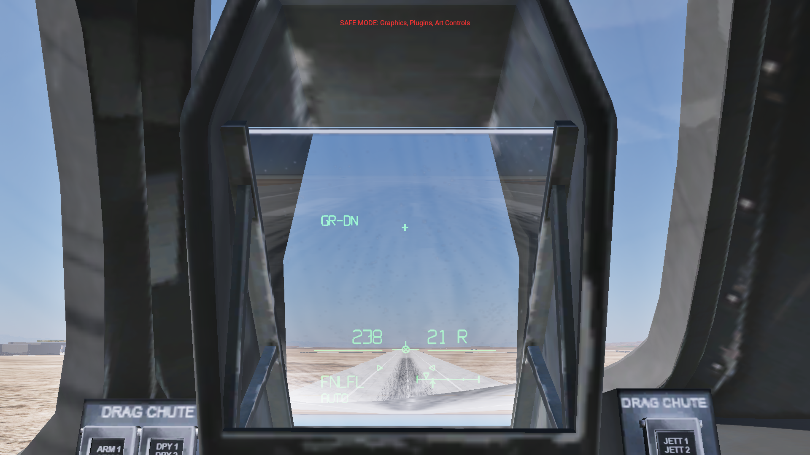](verified-140-auto-final-flare.png)

### AUTO final flare

Initialized native AP/servo mode: guidance remains; this is a display card, not a Shuttle AUTO landing.

[Phase 6 · 20 ft · 238.7 KEAS · flags 15 ↗ telemetry](verified-140-auto-final-flare.json)

### Boresight only

Initialized manual declutter 3.

[Phase 6 · 20 ft · 238.7 KEAS · flags 1 ↗ telemetry](verified-140-air-declutter-3.json)

[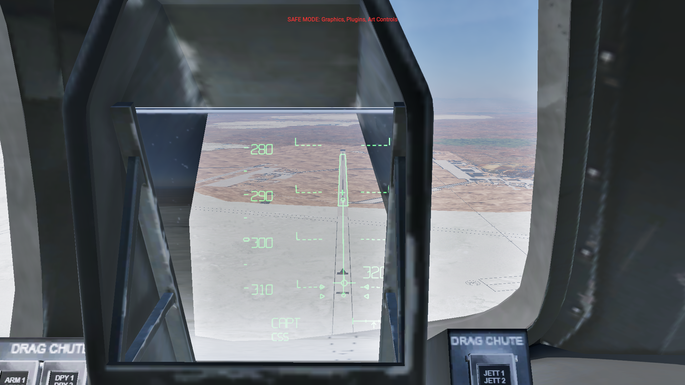](verified-140-native-offaxis.png)

### Off-axis eye

Initialized 6 cm lateral eye shift: native combiner clips the collimated symbology.

[Phase 3 · 3237 ft · 299.6 KEAS · flags 319 ↗ telemetry](verified-140-native-offaxis.json)

[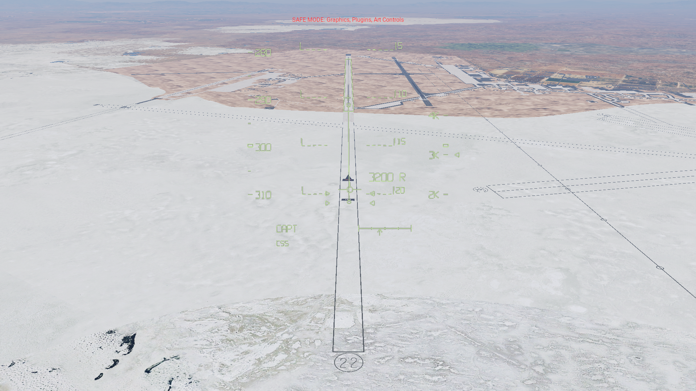](verified-140-fullscreen.png)

### Full-screen view

Same body-referenced symbology with camera projection.

[Phase 3 · 3237 ft · 299.6 KEAS · flags 319 ↗ telemetry](verified-140-fullscreen.json)

[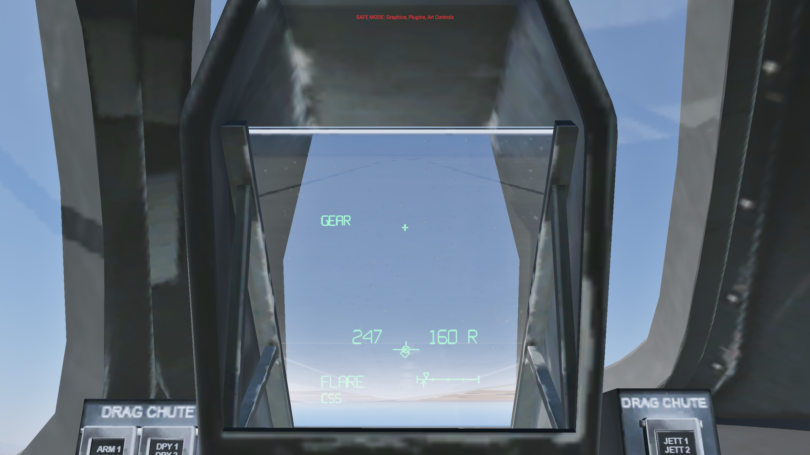](release-142-flash-0.png)

### Gear warning on

Installed release: GEAR and the limited diamond are visible; the VV carries its limiting X.

[Phase 5 · 156 ft · 247.1 KEAS · flags 15 ↗ telemetry](release-142-flash-0.json)

[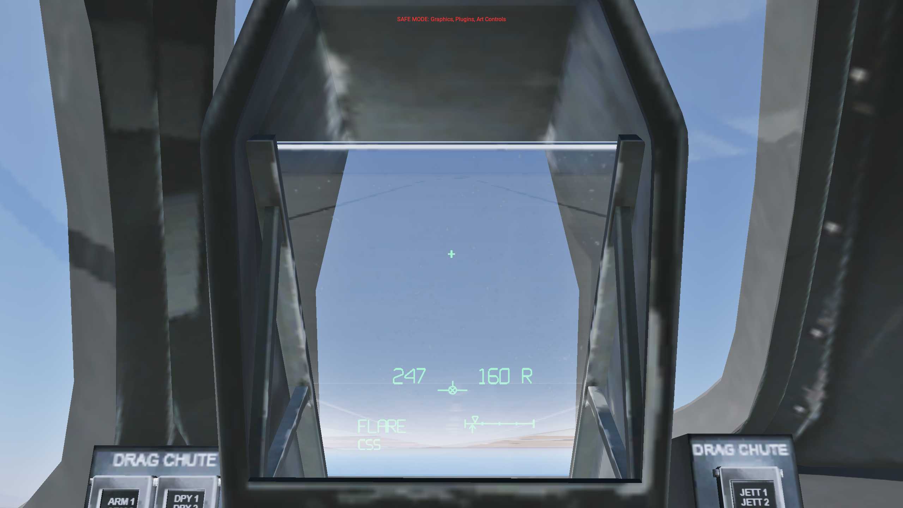](release-142-flash-1.png)

### Gear warning off

Same initialized state, with simulation time advanced into the other half of the flash cycle.

[Phase 5 · 156 ft · 247.1 KEAS · flags 15 ↗ telemetry](release-142-flash-1.json)

[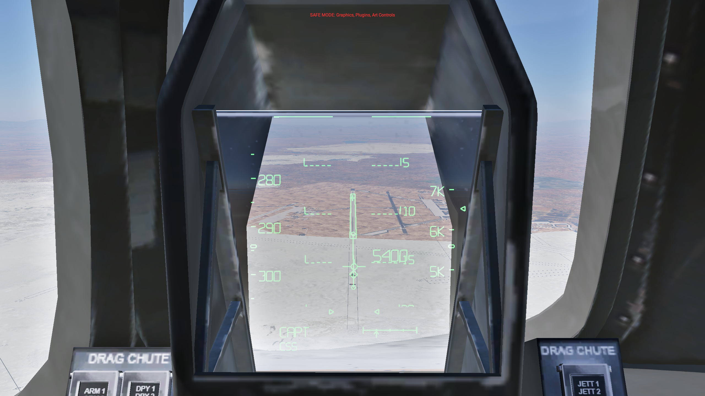](release-142-speedbrake-flash-0.png)

### Speedbrake discrepancy

Installed release: the actual pointer clears during the flash cycle while the command arrow remains.

[Phase 3 · 5587 ft · 294.1 KEAS · flags 319 ↗ telemetry](release-142-speedbrake-flash-0.json)

### Actual pointer returns

Same native speedbrake discrepancy, above the reconstructed 20-degree threshold.

[Phase 3 · 5587 ft · 294.1 KEAS · flags 319 ↗ telemetry](release-142-speedbrake-flash-1.json)

## Landing regression ledger

Native physics with an external validation pilot using normal controls. Distances are beyond the displaced threshold; speed is KEAS. Every measured run is retained. No landing calibration was changed.

| Flight / build | Mass, lb | TD KEAS | TD m | Sink ft/s | Max AGL m | Result |
| --- | --- | --- | --- | --- | --- | --- |
| 201 / 140 | 226,040 | 201.01 | 806.8 | 2.28 | 0.686 | [Pass](analysis-201.json) |
| 202 / 140 | 184,000 | 198.26 | 639.3 | 1.19 | 0.756 | [Rebound limit missed](analysis-202.json) |
| 203 / 140 | 184,000 | 197.77 | 655.4 | 1.14 | 0.755 | [Rebound limit missed](analysis-203.json) |
| 204 / 140 | 184,000 | 196.80 | 685.1 | 1.29 | 0.745 | [Pass](analysis-204.json) |
| 206 / 142 | 226,040 | 200.86 | 804.7 | 2.29 | 0.682 | [Pass](analysis-206.json) |
| 207 / 142 | 184,000 | 198.52 | 632.4 | 1.23 | 0.755 | [Rebound limit missed](analysis-207.json) |

The 0.750 m rebound limit is narrowly repeat-sensitive in the light model. Build-140 flights 202 and 203 fail that check; 204 passes. Final-build light flight 207 also narrowly misses it at 0.755 m. Every light run meets the speed, touchdown location, sink, gear, flare and stopping checks. The rollout display remains latched during the measured rebounds.

## Verification and lifecycle

Final release reloaded, live SDK disable/re-enable verified, and dedicated simulator exited normally. See the linked readbacks and log audit.

- Model and presentation tests: numeric boundaries, projection, guidance, timed cues, declutter, contact and reset transitions.
- Native cards: five-second FD transition, ATT REF cage, CSS/AUTO cue behavior, gear timer, declutter, replay, power, dimming, full-screen and off-axis view.
- Flown contact traces: raw WOW release during rebound does not return the display to airborne format.

[Native view/reset cards](final-cards-140.json) · [Modes, gear and declutter](extended-140.json) · [Contact latch evidence](flight-display-checks.json) · [Installed release readback](release-reload-142.json) · [SDK enable/disable](sdk-lifecycle-142.json) · [Final shutdown](clean-exit-142.json) · [Installation audit](audit-final.json)

Failed setup and reload sessions remain in their own logs. The long build-140 session stalled on a later aircraft/plugin reload and required a bounded, identity-checked termination; it is not clean-shutdown evidence. Its cause is unproven. Failed initialization cards with the `card-` prefix are excluded from the gallery. A build-141 setup stalled before rendering; flight 205 did not reach a valid flight state and is excluded from performance results.

## Source fidelity and limits

The aircraft does not provide Shuttle GPC/TAEM phase words, a full HAC solution, MLS failure states or authentic braking guidance. ACQ/HDG/PRFNL are geometry estimates; CAPT uses the published broad capture gates with a forced transition at 5,000 ft, OGS uses path/gamma capture, FLARE begins at 2,000 ft and FNLFL follows the existing sink-dependent final-flare model. S-TRN and unsupported fault annunciations are not fabricated.

The flare preview uses a continuous local interpolation from the lower display edge at 3,500 ft to the nominal OGS cue at 2,000 ft, then the reconstructed nominal landing profile. The deceleration guide is v²/(2 × remaining stopping distance × g), targeting 1,000 ft before the selected runway end; its 0–0.4 g scale is a local reconstruction. Speedbrake discrepancy uses normalized native deflection × 98.6° as an approximation. Nz clears at PRFNL, an interpretation of the handbook wording corroborated by the absence of Nz in the approach footage. CSS/AUTO follows native autopilot mode plus servo engagement; the test pilot commands ordinary controls in CSS and is not Shuttle AUTO flight software.

Font shape, brightness, compressed-video optics and mission software differences remain approximate. The unchanged flight model has a small rebound: build-140 light repeats ranged from 0.745 to 0.756 m against a 0.750 m native-aircraft-AGL limit, with two failures retained. This metric is not wheel clearance. Heavy preflare still reaches about 1.66 g versus the handbook's approximate 1.3 g nominal. No physics or landing calibration was adjusted for this symbology work. These dry, zero-wind Edwards tests do not establish crosswind, wet-runway, entry/orbital, emergency, VR or full-global-plugin compatibility.

Primary definition: [JSC-23266 Rev B, §2.12 and §5.3.6](https://www.ibiblio.org/apollo/Shuttle/Crew%20Training/Flight%20Procedures%20App%20Land%20Roll.pdf). Simulator explanation: [F-SIM HUD brief](https://fsim.com/help/ios/hud.html) and [landing tutorial](https://fsim.com/help/ios/landing.html). Visual corroboration: [STS-125-labelled HUD footage](https://www.youtube.com/watch?v=JBk6lCikqkQ) and [STS-108 approach footage](https://www.youtube.com/watch?v=jgPR8R28WCo). These video labels identify the posted recordings; measurements come from simulator telemetry.

Local simulation recreation. Original vector lettering; no F-SIM application code or artwork. Not real-flight guidance. Recorded build hashes, initialized cards and failed attempts are retained alongside this report.

Repository edition: source, linked media and acceptance evidence are included. The complete development archive, original aircraft, failed screenshots and full simulator logs remain in the original local workspace. See [the repository report index](../../README.md) for scope and provenance.
