# Runway alignment gallery — Rust 144

All images are unmodified 1920 × 1080 X-Plane captures. Readbacks distinguish initialized display cards from the short native glide. The first image is the retained Rust 143 comparison; all subsequent images use the final tested Rust 144 binary.

## Previous Rust 143 outline

Previous fixed-width, flat-angle rendering, captured before the final binary swap. [Readback](swap-release-143-fullscreen.json).

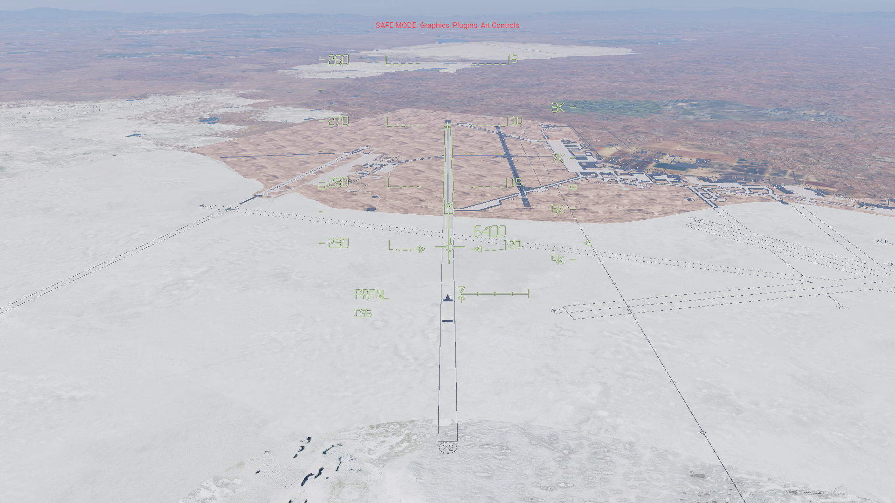

## Corrected Edwards 22L outline

Same initialized approach geometry with the scenery-conformal outline. The landing box starts 542 m beyond the pavement start. [Readback](accepted-144-edwards-fullscreen.json).

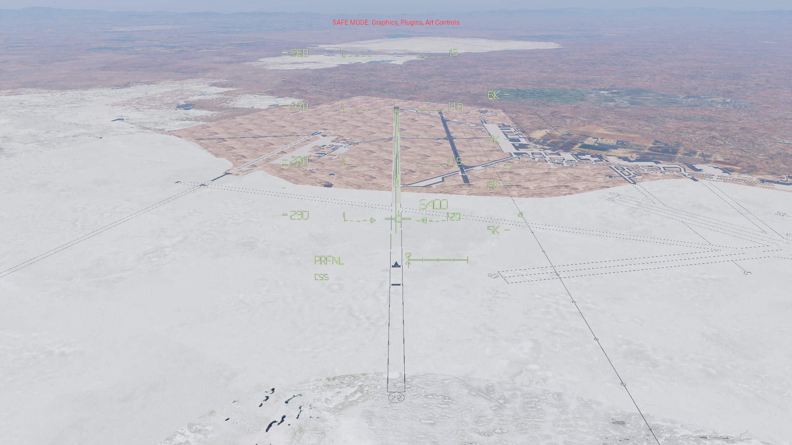

## Installed native cockpit HUD

Final installed aircraft, Rust 144, with the outline anchored to the runway surface. [Readback](installed-144-edwards-cockpit.json).

## Displaced threshold — HUD on

Paused close-up using a 25-degree field of view. The near box edge coincides with the displaced landing threshold; the surrounding pavement is wider than the marked runway. [Readback](installed-144-threshold-zoom-on.json).

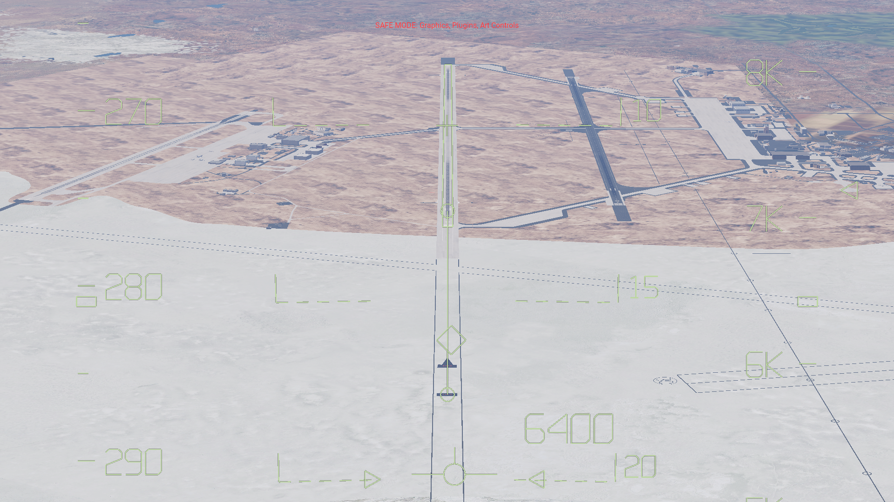

## Displaced threshold — HUD off

The same paused view with the HUD disabled, exposing the threshold paint and marked runway edges. [Readback](installed-144-threshold-zoom-off.json).

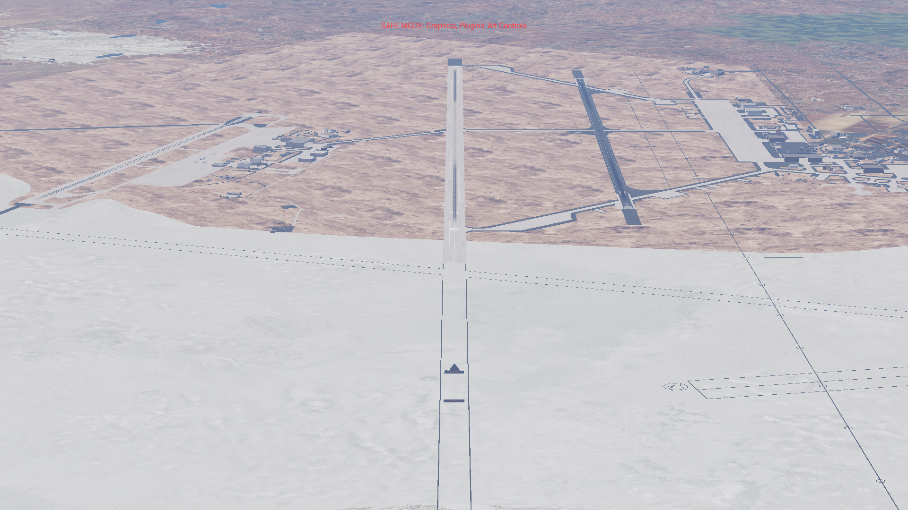

## Closer Edwards approach

Initialized closer approach with manual declutter zero so the outline remains visible. [Readback](accepted-144-edwards-close-cockpit.json).

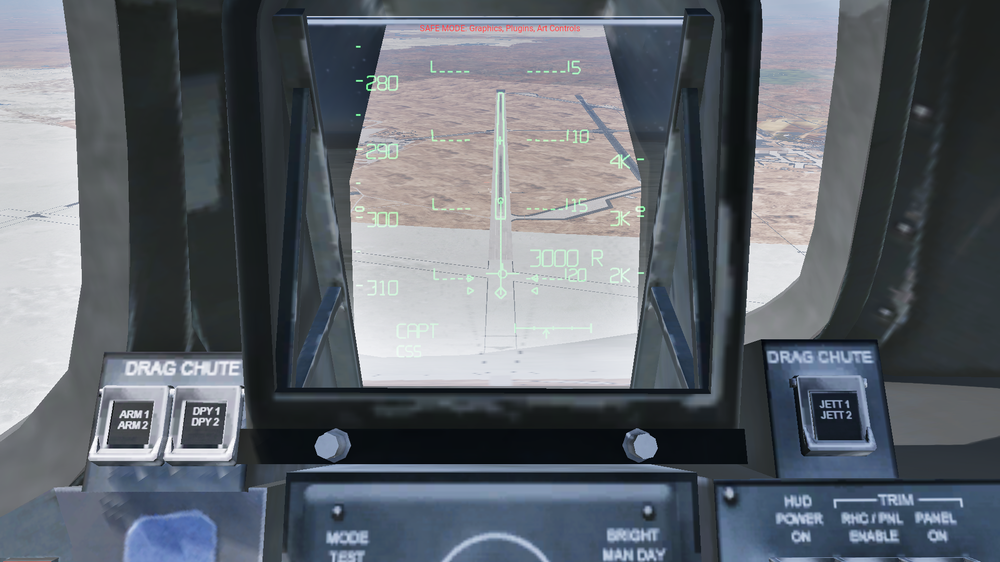

## Offset and banked

Initialized 300 m lateral offset and 10-degree bank; native readback records the achieved state. [Readback](accepted-144-edwards-offset-fullscreen.json).

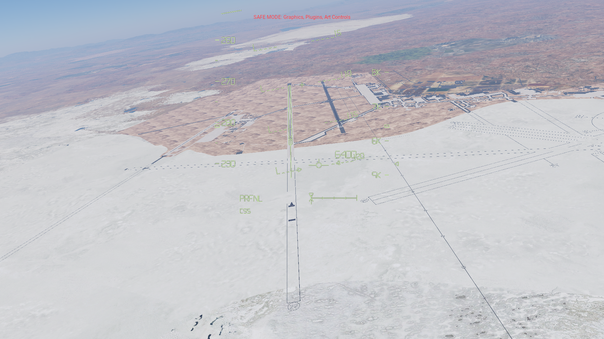

## Edwards 04R reciprocal direction

No near displaced threshold. The box runs from 04R threshold to the opposite physical end. [Readback](accepted-144-edwards-reciprocal-fullscreen.json).

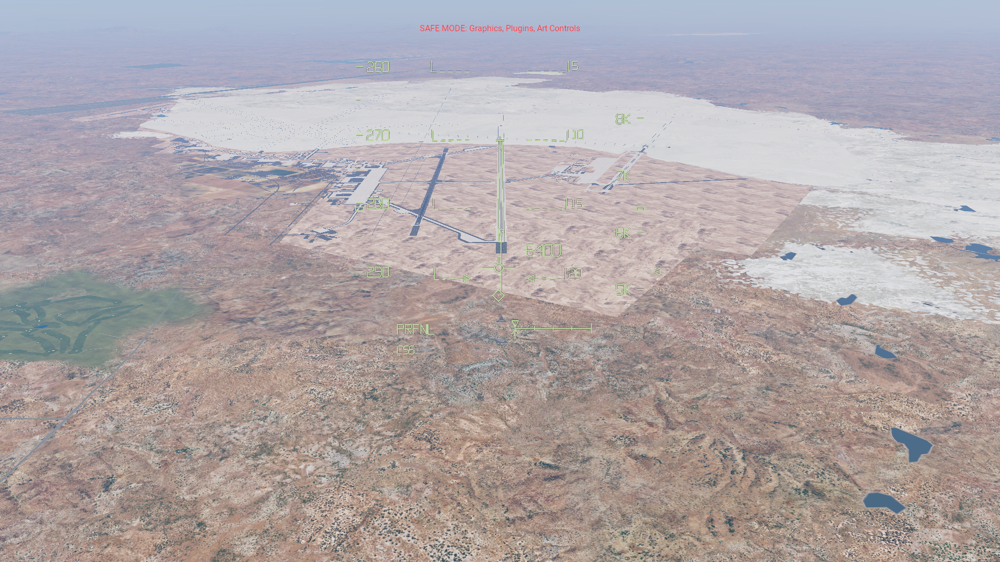

## Kennedy runway 15

Uses the configured 91.44 m runway width and both native endpoints; blast pads are outside the box. [Readback](accepted-144-kennedy-15-cockpit.json).

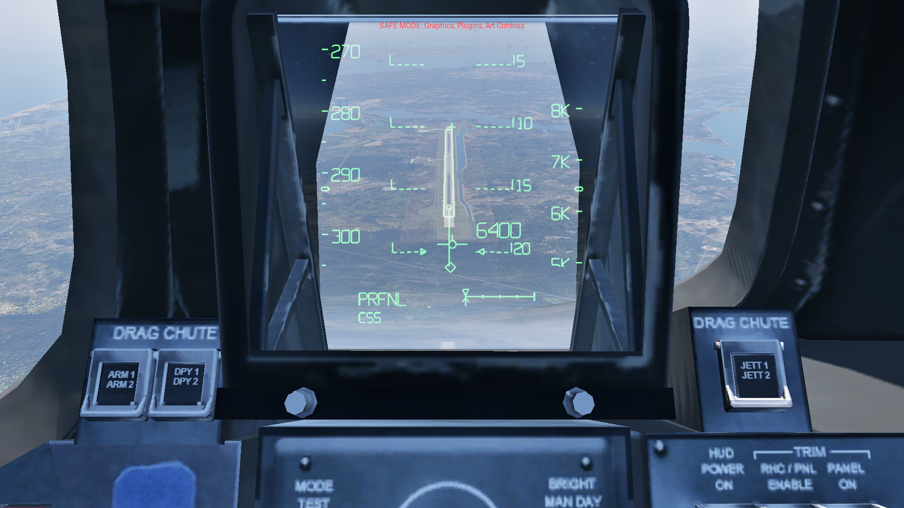

## Kennedy runway 33

Reciprocal view of the same runway with the correct threshold and orientation. [Readback](accepted-144-kennedy-33-cockpit.json).

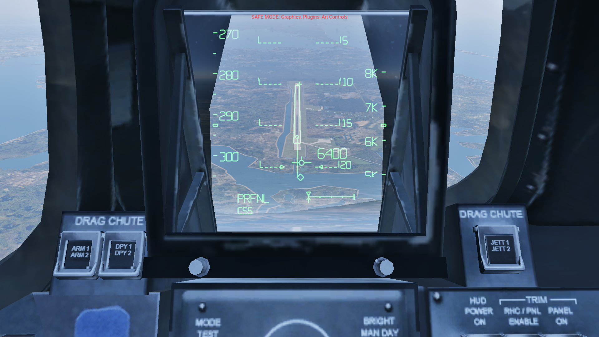

## Off-axis cockpit view

Looking seven degrees right and two degrees down; the runway box stays registered with the scenery. [Readback](accepted-144-offaxis-cockpit.json).

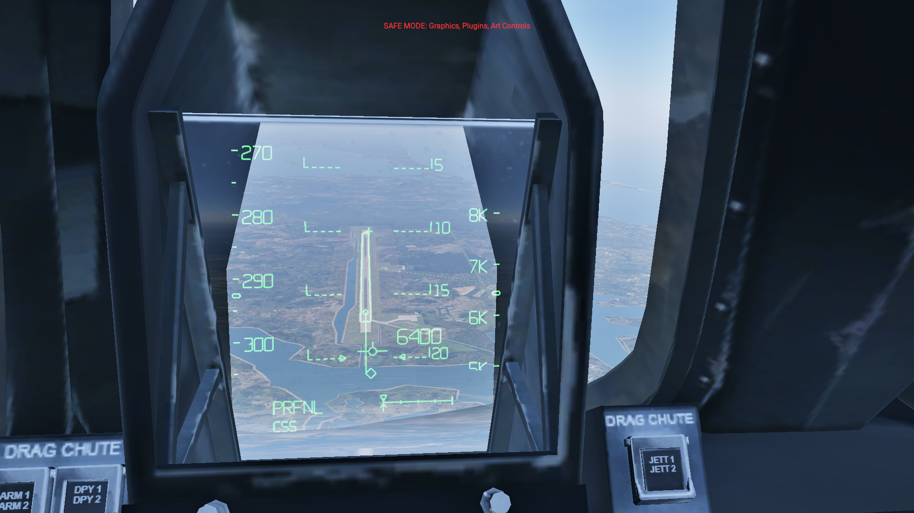

## Declutter level one

The runway outline is cleared by the established declutter rule. [Readback](accepted-144-declutter-1.json).

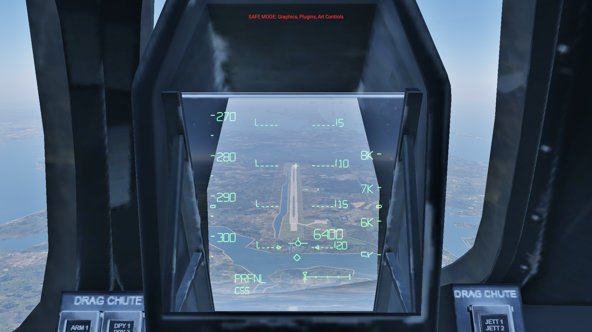

## Native glide

After three one-second native advances. No position, attitude or joystick override is held during the glide. [Readback](accepted-144-moving-2.json).

## Installed Shift+W view

Final installed native cockpit HUD, paused, with both path and joystick overrides clear. [Readback](installed-144-shift-w.json).

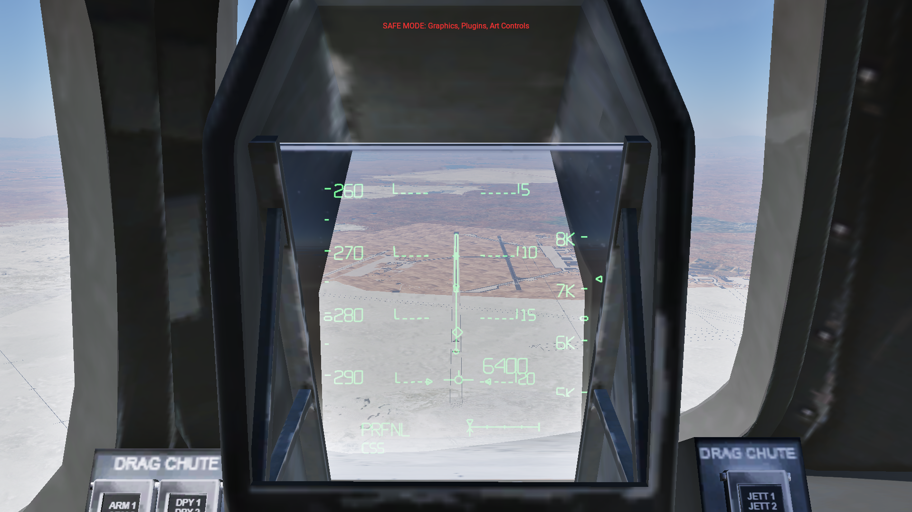
