# Rust 143 native gallery

All images are unmodified X-Plane captures. Every card has a diagnostic readback; initialized states are distinguished from the two full flights. The red banner identifies the session-only graphics/plugins/art-controls safe mode.

## HAC / HDG acquisition

Initialized card: the caged director is square, with banked pitch references. [Diagnostic readback](verified-143-hac.json).

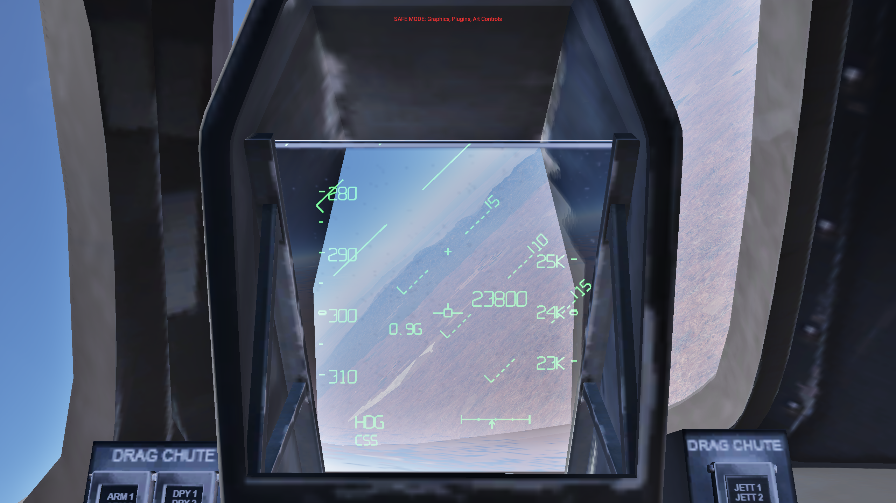

## Prefinal

Initialized card: PRFNL format and uncaged circular director. [Diagnostic readback](verified-143-prefinal.json).

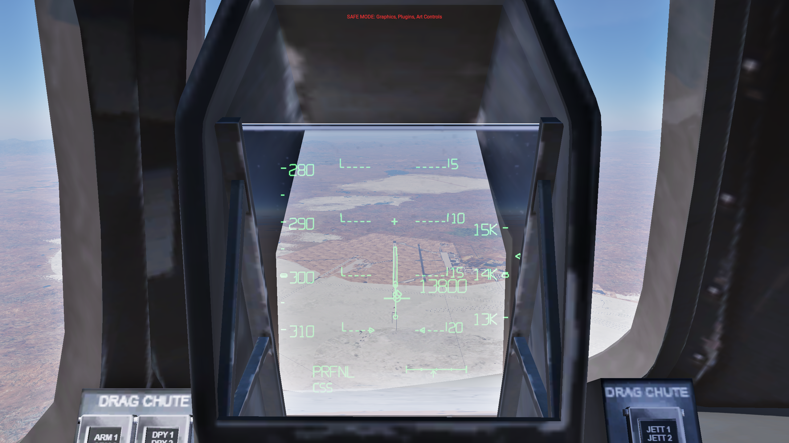

## Director transition

Initialized sequence: an intermediate point in the five-second transition to the velocity vector. [Diagnostic readback](verified-143-fade-mid.json).

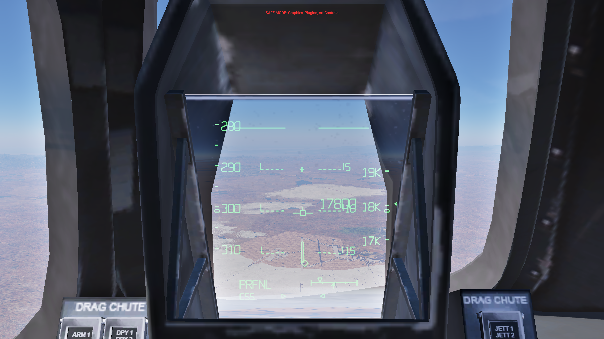

## Outer glide slope

Observed during flight 302: OGS format with the acquired path. [Diagnostic readback](flight-302-ogs.json).

## Flare preview

Observed during flight 302: the separate flare index approaches the outer-path index. [Diagnostic readback](flight-302-flare-preview.json).

## Preflare

Observed during flight 302: FLARE format at the start of the pull-up. [Diagnostic readback](flight-302-preflare.json).

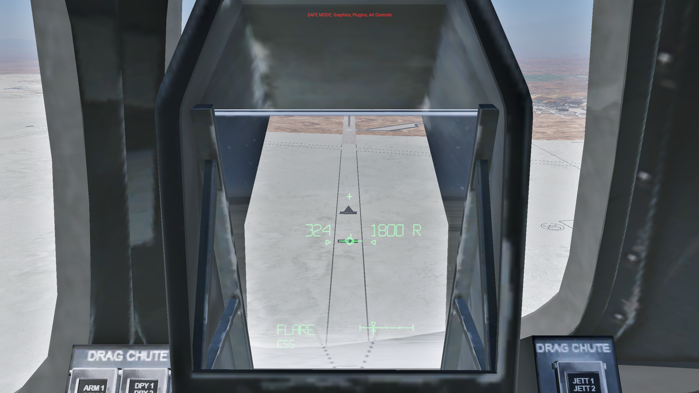

## Inner path and gear

Observed during flight 302: GR-DN, horizon and guidance during the inner-path transition. [Diagnostic readback](flight-302-inner.json).

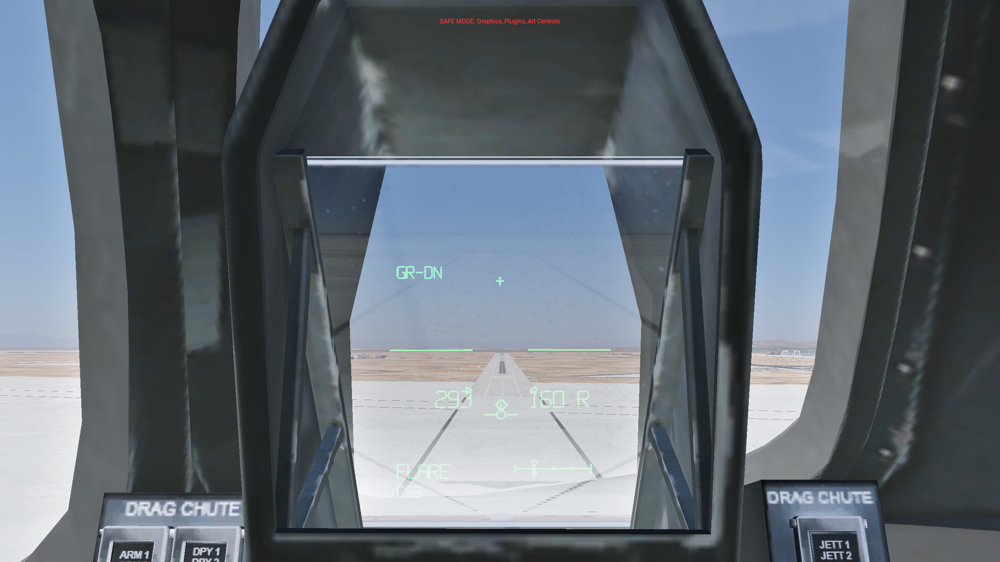

## CSS final flare

Observed during flight 302: the guidance diamond and gamma indices are cleared while the velocity vector remains. [Diagnostic readback](flight-302-css-final-flare.json).

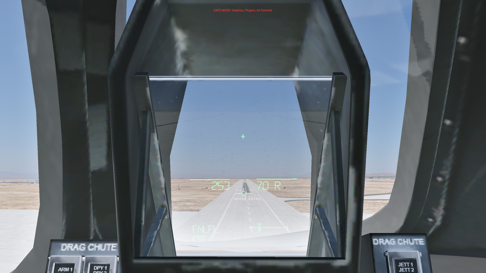

## Main-wheel contact

Observed during flight 302: latched ground format, speed beside the boresight and the deceleration scale. [Diagnostic readback](flight-302-main-contact.json).

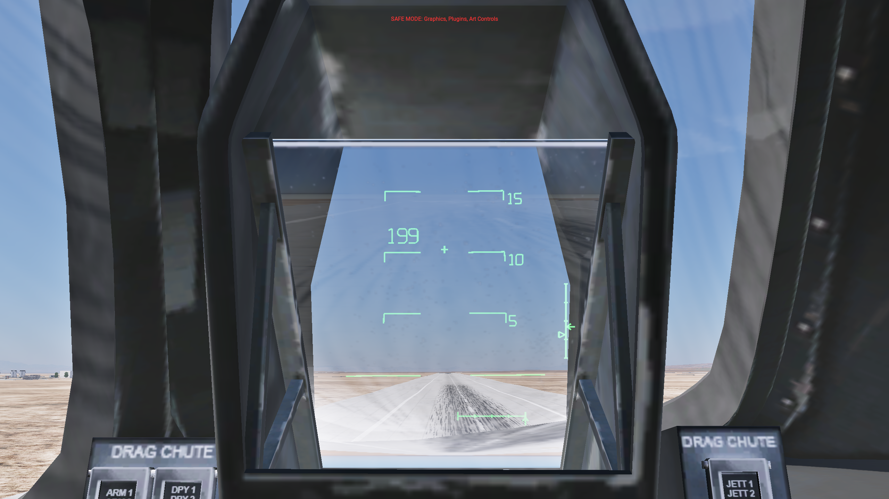

## Nose-wheel contact

Observed during flight 302: G-prefixed groundspeed and removal of pitch references. [Diagnostic readback](flight-302-nose-contact.json).

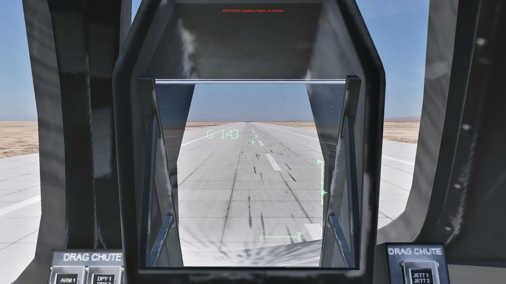

## Stopped

Observed at the end of flight 302: ground format retained through the controlled stop. [Diagnostic readback](flight-302-stopped.json).

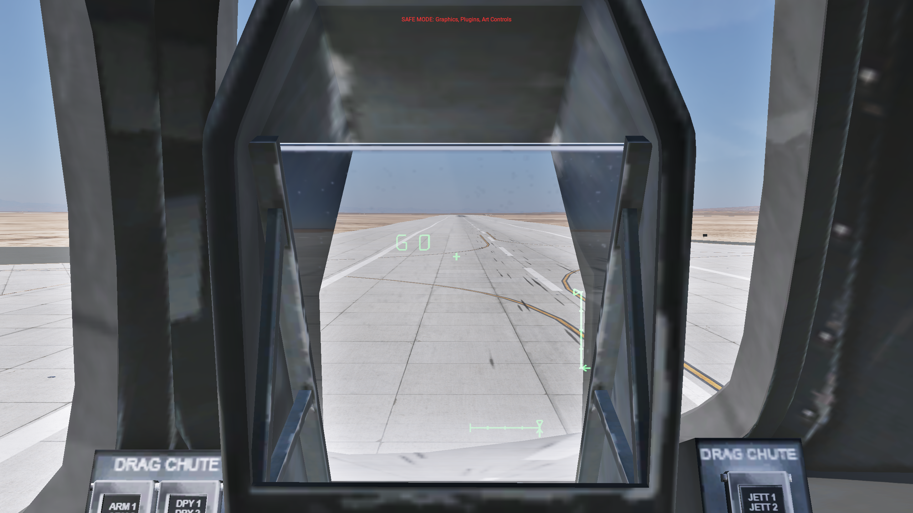

## Gear and limit flash: off

Initialized alert card with placement held. Actual simulator clock phase 0.615; GEAR and the limited-vector diamond are off. [Diagnostic readback](trial-143-flash-0.json).

## Gear and limit flash: on

Same initialized sequence, clock phase 0.241. GEAR and the limited-vector diamond are visible. Placement overrides are cleared after this card sequence. [Diagnostic readback](trial-143-flash-2.json).

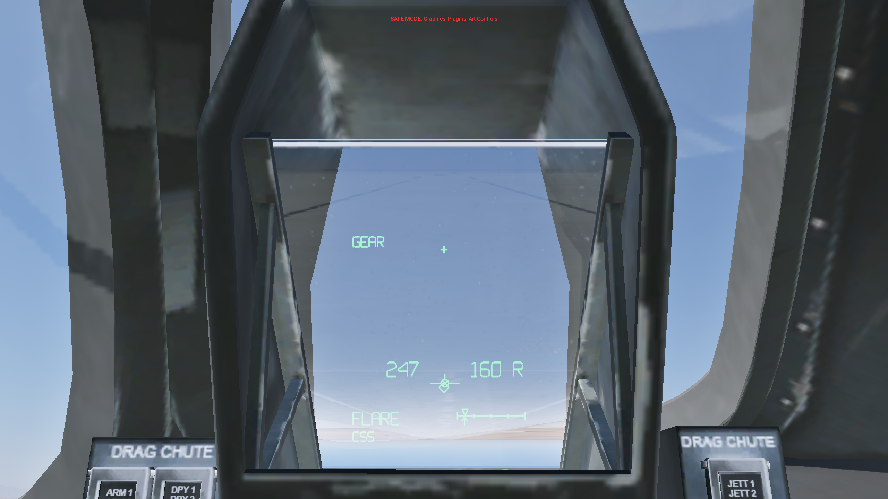

## Full-screen format

Initialized native full-screen display, using the same phase model and vector scene. [Diagnostic readback](verified-143-fullscreen.json).

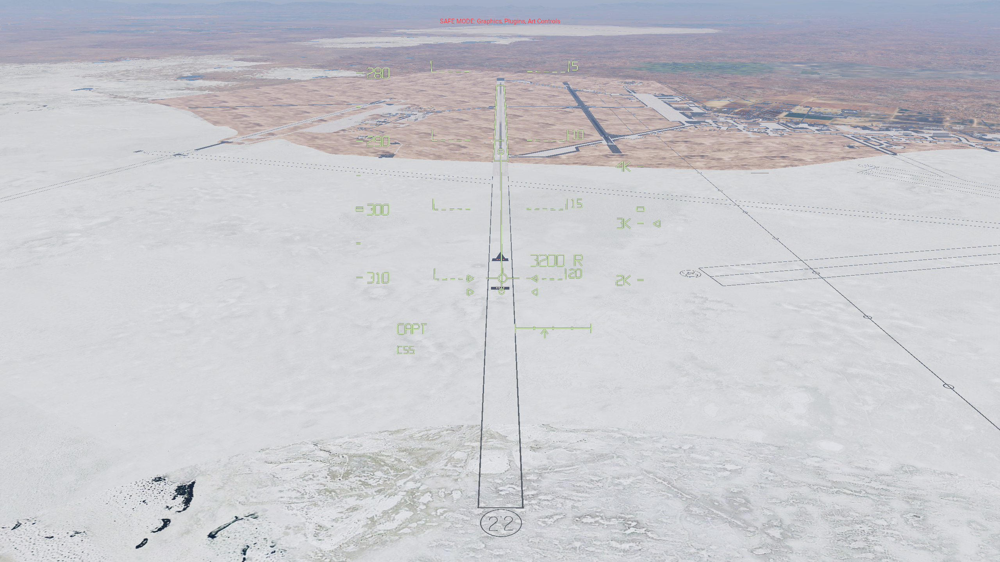

## Native HUD power off

Initialized optical card: native power removes symbology. [Diagnostic readback](verified-143-native-poweroff.json).

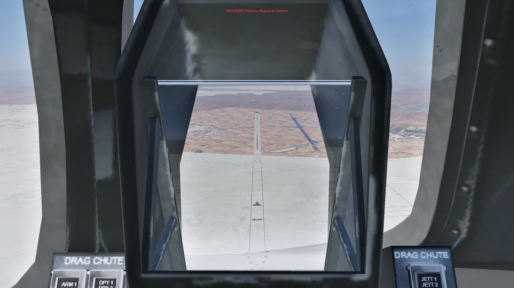

## Off-axis collimation

Initialized optical card: native combiner clipping and collimation with the eye moved off center. [Diagnostic readback](verified-143-native-offaxis.json).

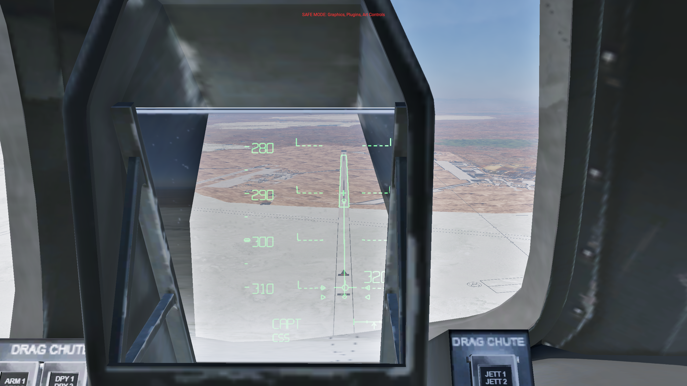

## Actual SDK disable

Plugin Admin checkbox disabled the plugin. Telemetry reads plugin_enabled=0, active=0 and cockpit_active=0; owned view settings were restored. [Diagnostic readback](sdk-143-disabled.json).

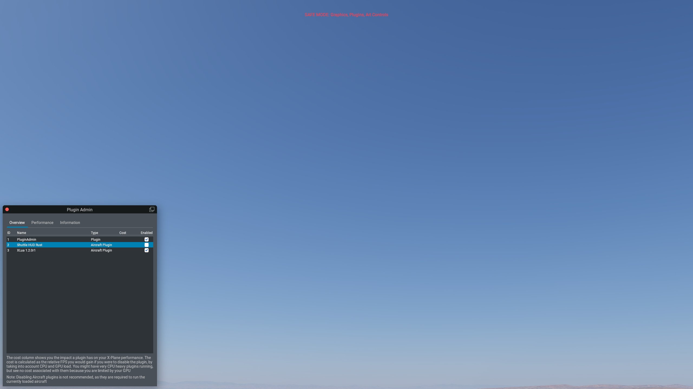

## Installed release

Final release-aircraft readback after the stock Shift+W command: Rust 143, aircraft match 1 and cockpit renderer active. [Diagnostic readback](release-shift-w-143.json).

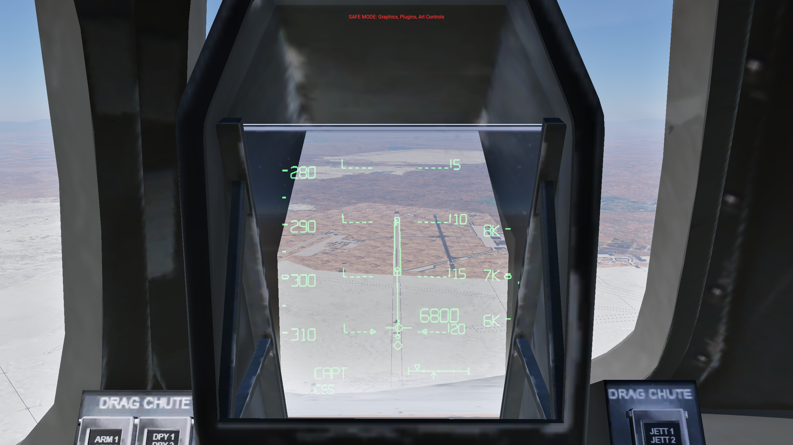
