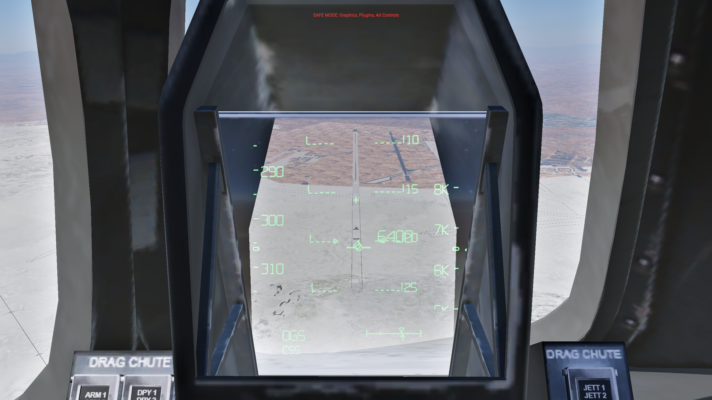

# Shuttle HUD — native validation, release 143

The aircraft-local [Shuttle HUD](../../../plugins/shuttle-hud/README.md) builds in
this project's Rust workspace; its [source](../../../plugins/shuttle-hud/src)
contains the renderer, guidance model and simulator integration.
It uses the shared `xplane-plugin` SDK infrastructure for state, callbacks,
commands, menus, exported datarefs, terrain probing and logging. Release 143 was installed and verified
in X-Plane 12.4.3 on 10 September 2026 (11 September UTC).

This validation session exercised the HUD and established landing behavior.
Workspace tests, project regression fixtures and native display/lifecycle checks passed. The heavy landing
passes all nine checks; the light landing retains the baseline's narrow rebound
failure. The fixed acceptance limit and failed result are preserved.

[Native gallery](GALLERY.md) · [Architecture](ARCHITECTURE.md) ·
[Validation criteria](ACCEPTANCE.md) ·
[Build and install](../../../plugins/shuttle-hud/README.md#build-and-install)

## Implementation and verification

The Rust modules separate configuration, geometry, landing guidance,
presentation, vector scenes, OpenGL submission and simulator integration. New
reusable `DrawCallback`, `OwnedDataRef` and `TerrainProbe` owners release their
SDK resources on drop. Existing thread-local state and callback ownership
utilities are reused. The [architecture note](ARCHITECTURE.md) describes partial
startup cleanup, reentrancy and the exact aircraft-path gate.

| Check | Result and evidence |
|---|---|
| Workspace tests | 37 passed; one existing local-scenery database test ignored. `cargo test --workspace` includes the other native plugins and shared crate. |
| Warnings and release build | `cargo clippy --workspace --all-targets -- -D warnings` and the root `build.ps1 -Plugin shuttle-hud -BuildOnly` passed with Rust/Cargo 1.98.1. |
| Landing-model regression | 3,053 recorded heavy/light frames and the path sweep agree at `1e-8 + abs(expected) * 2e-12`; integer state agrees exactly. |
| Vector-scene regression | All segment topology, endpoints, symbol layers and clipped endpoints agree in 24 cockpit/full-screen scenes. [Fixture provenance](../../../plugins/shuttle-hud/tests/fixtures/PROVENANCE.json). |
| Public controls | All 45 original datarefs retain names, scalar types and writability; all eight commands remain. One diagnostic, `fsim_hud/rust_implementation=1`, is added. [Native catalog](dataref-compatibility.json). |
| Display sequencing | HAC/prefinal, five-second fade, flare/gear cues, airborne/ground declutter, CSS/AUTO, ATT REF, pause/replay and optical controls passed. [Display cards](final-cards-143.json), [extended cards](extended-143.json), [flash sequence](release-flash-143.json), [gallery](GALLERY.md). |
| Chute ownership | Early inflation, 16% reefed plateau and full opening; restoration on pause, replay, jettison and landing-system disable; independence from HUD visibility. [Native readbacks](chute-143.json). |
| SDK lifecycle | Actual Plugin Admin disable/re-enable stopped/restored rendering and restored owned view settings. [Lifecycle readbacks](sdk-lifecycle-143.json). |
| Aircraft gate and reload | Same-directory mismatched ACF remained enabled but inactive, with no chute ownership; correct-aircraft reload resumed the native renderer. [Readbacks](reload-mismatch-143.json). |
| Installed release | Verified Rust 143 in the release aircraft, full-screen display and stock Shift+W interception; final aircraft-path and joystick overrides zero. [Installation readback](release-installed-143.json). |
| Shutdown and restoration | Normal API quit, plugin cleanup and simulator shutdown markers; no forced termination. [Exit record](clean-exit-143.json), [log excerpt](Log-143-clean-exit-excerpt.txt), [installation audit](installation-audit.json). |

The [Rust regression tests](../../../plugins/shuttle-hud/tests/regression.rs)
consume frozen results from this project. The [fixture guide](../../../plugins/shuttle-hud/tests/fixtures/README.md)
documents coverage, units and tolerances. Native simulator checks cover the SDK,
graphics and aircraft integration beyond those offline tests.

## Native landing regressions

Both flights used the established validation pilot, dry Edwards 22L, zero wind,
fixed aircraft/optics/scenery inputs and Rust 143 throughout. Initial placement
overrides were released before flight. All recorded aircraft-path override
elements remained zero during each flown run. The pilot used normal controls
and was confined to the temporary trial aircraft.

| Flight / build | Mass (lb) | Touchdown KEAS | Along runway (m) | Sink (ft/s) | Max native AGL (m) | Result |
|---|---:|---:|---:|---:|---:|---|
| 302 / Rust 143 | 226040 | 200.851 | 804.234 | 2.305 | 0.680006 | 9/9 — pass |
| 303 / Rust 143 | 184000 | 197.796 | 655.129 | 1.143 | 0.755262 | 8/9 — rebound limit missed |

Release 142 heavy flight 206 reached 200.855 KEAS, 804.7 m and 0.682 m maximum native
AGL. Release 142 light flight 207 reached 198.516 KEAS and 0.755323 m maximum native
AGL. These historical results are in the [release-142 report](../reports/shuttle-symbology-20260910/README.md).
The Rust light run's 0.755262 m exceeds the unchanged 0.750 m limit by 0.005262 m.
This preserves the known failure; it is not reclassified as a pass. Native-aircraft
AGL is the chosen regression metric, not wheel clearance.

Full [302 analysis](analysis-302.json), [303 analysis](analysis-303.json), result
readbacks, raw CSV traces and HUD supervision records are retained here. Both
stopped under control. Run `python analyze_trial.py 302` or `303` from this
directory to recompute the flight metrics. Flight 301 was preparation only,
not another landing attempt.

## Installation and restoration

The accepted binary is [build-143/win.xpl](build-143/win.xpl), SHA-256
`815f53e5c6c22ed228be319a5b2ad59728305573afc2fa7116858badf94958ea`. [Build input hashes](build-143/hashes.json) identify the exact tested working-copy bytes;
[LF-normalized source hashes](build-143/source-hashes-lf.json) support comparison across Git line-ending settings.
The installation audit below describes release 143 at the time of testing.
For the current release and installed binary, see the [alignment report](../runway-alignment/README.md).
The original aircraft's 430 recorded files are unchanged. The ACF, geometry,
atlas, optics, runway table, source `Shuttle_Init.lua`, landing pilot and scenery
are fixed; [input hashes](unchanged-inputs.json) and the final audit record this.
No validation controller is installed in the release aircraft.

With X-Plane closed, a verified project binary can be installed as
`plugins/ShuttleHUD/64/win.xpl` in the derivative aircraft. Preserve the installed
binary before changing versions. Selecting the untouched Space Shuttle-FX-V12
returns to the original aircraft. Follow the current [build and installation
instructions](../../../plugins/shuttle-hud/README.md#build-and-install).

## Limits and retained setup issues

These checks use the established flight calibration, display approximations
and simulation scope. It does not establish crosswind,
wet-runway, emergency, entry/orbital, VR or full-global-plugin compatibility.
Startup failure injection and SDK disable during the short active reefing
interval were not separately exercised; cleanup ownership was reviewed and
ordinary SDK disable, pause/replay and unload were exercised natively.

Validation used session-only graphics/plugins/art-controls safe mode and a
temporary XPME scenery exclusion for loading. The exact saved scenery bytes
and protected installation state were restored. The session log retains the
blacklisted SAM notice, airport-frequency errors, missing VR configuration,
third-party texture gamma and graphics/replay warnings. It contains no Lua
stack traceback, already-destroyed avionics warning or crash marker, and ends
with normal shutdown. The full log remains local; its SHA-256 is recorded.

The first Plugin Admin click selected the row without toggling it; the initial
disabled assertion therefore failed. [That selection readback](sdk-143-selection-only.json)
is retained separately from the successful disable. The first mismatch test
incorrectly compared the native chute-area value directly to the ACF's 480;
the native readback was 44.593460, consistent with the area conversion. The
[initial state](mismatch-first-units-assertion.json) is retained. Correcting the
test assertion required no plugin change. Vector tests also established the required f32 rounding for `atan2` and
camera-matrix arithmetic before promotion to f64.

The repository keeps 18 selected original PNGs and all relevant readbacks from
this session. Additional setup/capture images and the retired trial aircraft
remain in the local Output archive. Environment-specific native orchestration
is retained under [validation/rust-port](../../../plugins/shuttle-hud/validation/rust-port).
The aircraft source, meshes, atlas and third-party tools are not redistributed.
No F-SIM code, fonts or artwork is included.
